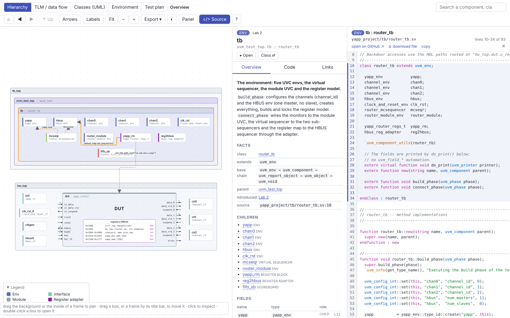
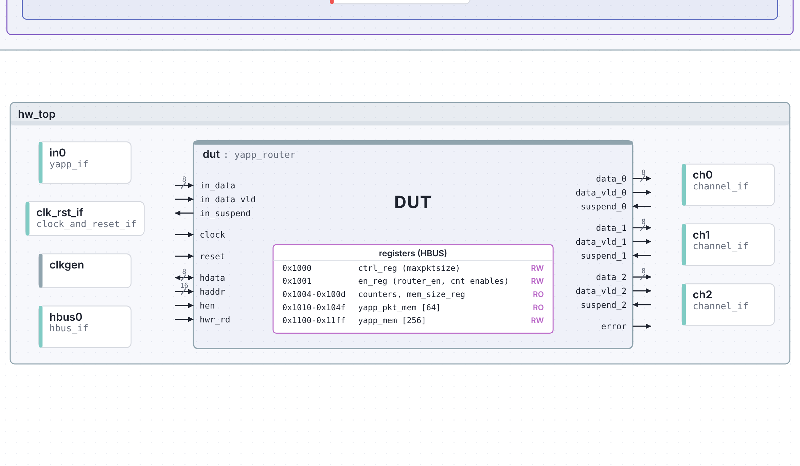
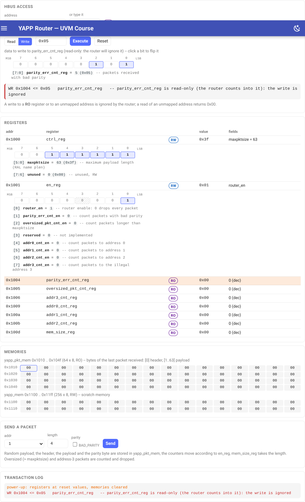
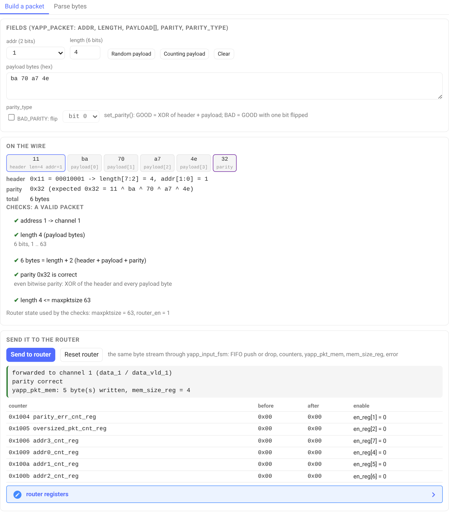
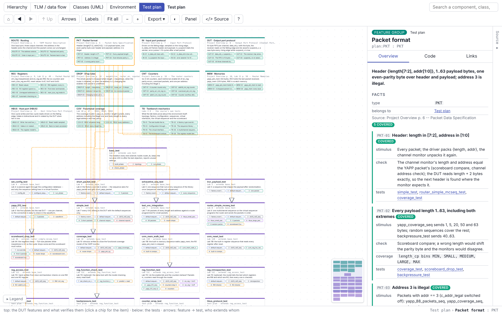

# YAPP Router — SystemVerilog & UVM course

[](https://github.com/tamirgabgab/Qcom-Mentoring/actions/workflows/lint.yml)
[](https://github.com/tamirgabgab/Qcom-Mentoring/actions/workflows/sim.yml)
[](https://github.com/tamirgabgab/Qcom-Mentoring/actions/workflows/docs.yml)
[](https://tamirgabgab.github.io/Qcom-Mentoring/)
[](https://tamirgabgab.github.io/Qcom-Mentoring/project-map/)

A complete, from-scratch reference implementation of the **YAPP packet-router
verification project** (the exercise behind the *SystemVerilog Accelerated
Verification Using UVM* training), written for mentoring. The DUT, the four
UVCs, every lab from 1 to 11C, a teaching site, an interactive map of the whole
project and two small simulators of the router — all in one repository, all
generated and checked from the same source code.

**Start here:** the [course site](https://tamirgabgab.github.io/Qcom-Mentoring/)
· the [project map](https://tamirgabgab.github.io/Qcom-Mentoring/project-map/)
· the [labs](https://tamirgabgab.github.io/Qcom-Mentoring/labs/)

---

## Contents

1. [For students](#for-students)
   - [The project map](#the-project-map)
   - [The DUT and its registers](#the-dut-and-its-registers)
   - [Try it: the register simulator](#try-it-the-register-simulator)
   - [Try it: the packet playground](#try-it-the-packet-playground)
   - [The test plan](#the-test-plan)
   - [The labs](#the-labs)
2. [Quick start](#quick-start)
3. [Repository layout](#repository-layout)
4. [For mentors and contributors](#for-mentors-and-contributors)
   - [Coding style](#coding-style)
   - [Tooling and CI](#tooling-and-ci)
   - [Verification status](#verification-status)

---

## For students

The course builds a UVM testbench for a small packet router, one lab at a time.
Everything you need is on the **course site**: the DUT specification with the
protocol waveforms, one guide per UVM component (packet, driver, sequences,
monitor, agent/env, scoreboard, reference model, virtual sequencer, coverage,
register model), a feature-by-feature test plan, and one page per lab with the full solution,
the expected results and checkpoint questions.

### The project map

The [project map](https://tamirgabgab.github.io/Qcom-Mentoring/project-map/)
is one picture of the whole project that you can look into. Click a box for
its role, its file and the lab that introduces it; double-click to drill
down; the **Source** column on the right opens with the complete file of
whatever is selected (one class per file) and folds away when there is
nothing to show. Five views: **Hierarchy** (who contains
whom), **TLM / data flow** (who talks to whom), **Classes (UML)** (who inherits
from whom, with fields and methods), **Environment** (the course figure of the
whole verification environment, one role line per box) and **Test plan** (the
DUT features with their stimulus, checker, coverage and status on top, one card
per test with its plan below: the stages, what the run is expected to show,
the sequences and overrides it sets up, the plan items it verifies).

Arrows are drawn orthogonally; in the Hierarchy and TLM views they start hidden and
appear for the box under the pointer (the **Arrows** button shows them all). Boxes
can be dragged and the arrows follow: a leaf from anywhere, a frame by its title bar
(dragging inside a frame pans the view, and so do the middle mouse button or
Space + drag from any point). ⌂ returns to the overview, ◀ ▶ walk back and
forward through the views visited, the search box finds any component or class
by name with its full path, the status bar at the bottom shows the path of the
selected item, and the panel and source column can be resized. Every view opens
at a readable zoom (**Fit** then shows the whole picture; zoomed far out only
the names stay, bigger, and a minimap shows where you are); the Classes view has
one tab per package. The [test plan page](https://tamirgabgab.github.io/Qcom-Mentoring/test-plan/#coverage-matrix)
adds a coverage matrix: every plan item against every test.



The same map is one self-contained HTML file,
[`docs/downloads/yapp_project_map.html`](docs/downloads/yapp_project_map.html):
download it and open it in a browser, it works offline and in class.
Every view can be exported to SVG / PNG for slides (the pre-rendered pictures
are in [`docs/assets/project_map/export/`](docs/assets/project_map/export/)).

### The DUT and its registers

The hardware side of the map draws the router like the course figure: the
YAPP input, the clock and the HBUS host interface on the left, the three
output channels on the right, every pin with its direction and bus width
inside the DUT, and the **register map** as a block. Click a block to open it:
the DUT itself splits into the input FSM, the three output channels (each
with its FIFO), the register file and the error timer — one RTL module per
file in [`yapp_project/rtl/`](yapp_project/rtl/).



| Address | Register | Access | Meaning |
|---|---|---|---|
| `0x1000` | `ctrl_reg` | RW | `maxpktsize[5:0]` — maximum payload length (reset `0x3f`) |
| `0x1001` | `en_reg` | RW | `router_en` and the six counter enables (reset `0x01`) |
| `0x1004` … `0x100b` | counters | RO | bad parity, oversized, packets per address 0 … 3 |
| `0x100d` | `mem_size_reg` | RO | payload length of the last packet |
| `0x1010` … `0x104f` | `yapp_pkt_mem` | RO | the 64 bytes of the last packet received |
| `0x1100` … `0x11ff` | `yapp_mem` | RW | 256 bytes of scratch memory |

Every HBUS address holds one byte. The full table with the bit fields is on the
[DUT specification](https://tamirgabgab.github.io/Qcom-Mentoring/dut/spec/) page.

### Try it: the register simulator

A model of the register file that behaves exactly like the RTL. Pick an
address, read or write it, press **Execute**: writes to RW registers land,
writes to RO registers and unmapped addresses are ignored (and the simulator
tells you why), reads of unmapped addresses return `0x00`. **Send a packet**
moves the counters according to the enable bits, fills `yapp_pkt_mem` and
updates `mem_size_reg`, the way the router does at the end of a packet.



The value to write and every register with fields are shown as a bit-field
diagram -- bit 7 (MSB) on the left, bit 0 (LSB) on the right, one line per field
underneath with its bits, name, value and meaning -- and a click on a bit flips it.

Where to find it: on the
[DUT specification](https://tamirgabgab.github.io/Qcom-Mentoring/dut/spec/#try-it-the-register-file)
page, and in the project map — click the registers block inside the DUT, or
the **Simulate** tab on the DUT, `u_regs`, `hbus0` or the register model.

### Try it: the packet playground

Build a YAPP packet field by field (`addr`, `length`, `payload`), watch the byte
stream and the parity the packet gets, flip **BAD_PARITY** to see the error
injection of the course, and read the checks: legal address, length vs.
payload size, parity, `maxpktsize`. **Parse bytes** decodes a packet copied
from a log. **Send to router** pushes the bytes through the same router model
as the register simulator and reports what happened: forwarded or dropped,
which counters moved, what `yapp_pkt_mem` holds.



Where to find it: on the
[packet](https://tamirgabgab.github.io/Qcom-Mentoring/components/packet/#try-it-build-or-check-a-packet)
page, and in the map on `yapp_packet`, `short_yapp_packet`, `channel_packet`,
the YAPP interface and the input FSM. The packet structure itself is drawn in
[`docs/assets/packet_structure.svg`](docs/assets/packet_structure.svg) and
explained next to the code in [`yapp_project/uvc/yapp/README.md`](yapp_project/uvc/yapp/README.md).

### The test plan

The [test plan](https://tamirgabgab.github.io/Qcom-Mentoring/test-plan/) follows the
pages of the course's DUT description: packet format, input and output protocols,
registers, drop rules, counters, memories, the HBUS host port, plus the requirements the
labs add (scoreboard, functional coverage, register tests). It is written as data
(`scripts/project_map/annotations.yaml`, section `plan`): **11 feature groups, 56 items**,
each with its stimulus, its checker, its coverage, the tests that cover it and a status
(55 covered; one excluded on purpose, a change of `router_en` in the middle of a packet,
which the specification leaves undefined).
The same data draws the **Test plan** view of the map and generates the site page, so the
three never disagree.



Nine tests exist only for the plan, in `yapp_project/tb/tests/`, for the features the
course's own tests never checked: `router_disable_test` (a disabled router drops and
counts nothing), `router_filter_test` (lengths around `maxpktsize`, the illegal address,
every counter with its enable on and off), `pkt_mem_test` (`yapp_pkt_mem` and
`mem_size_reg` hold the last packet byte by byte, even a dropped one),
`reg_bit_walk_test` (walking ones and zeros through every RW bit, writes ignored by every
RO register), `hbus_protocol_test` (raw bus cycles, tri-state after a read, unmapped
addresses), `backpressure_test` (slow receivers fill the channel FIFOs, `in_suspend`
stalls the input, no byte is lost), `parity_error_test` (the counter, the `error`
pulse within 1..10 cycles, the packet still delivered), `counter_wrap_test` (an 8-bit
counter wraps from 255 to 0 and keeps counting) and `back_to_back_test` (packets with
0, 1, 2 and 3 idle cycles between them, measured by the monitor and covered by
`yapp_gap_cg`). Writing `backpressure_test` found a real bug in the YAPP driver's
handshake, fixed in `yapp_if.sv`; writing `back_to_back_test` found that the driver
could never send the minimum gap, so `packet_delay` now means the exact number of idle
cycles. The site page ends with a **coverage matrix**: every item against every test,
a dot in the colour of the item's status where the test covers it.

### The labs

| Session | Labs | Theme | You end up with |
|---|---|---|---|
| 1 | [1](https://tamirgabgab.github.io/Qcom-Mentoring/labs/lab01/), [2](https://tamirgabgab.github.io/Qcom-Mentoring/labs/lab02/) | data items, components, phases | a packet class and an empty test / testbench pair |
| 2 | [3](https://tamirgabgab.github.io/Qcom-Mentoring/labs/lab03/), [4](https://tamirgabgab.github.io/Qcom-Mentoring/labs/lab04/) | a UVC skeleton, factory, configuration | the YAPP agent printing packets; tests that reconfigure it |
| 3 | [5](https://tamirgabgab.github.io/Qcom-Mentoring/labs/lab05/) | sequences, objections, randomization | the YAPP sequence library |
| 4 | [6](https://tamirgabgab.github.io/Qcom-Mentoring/labs/lab06/) | interfaces, virtual interfaces, the DUT | packets flowing through the real router |
| 5 | [7](https://tamirgabgab.github.io/Qcom-Mentoring/labs/lab07/), [8](https://tamirgabgab.github.io/Qcom-Mentoring/labs/lab08/) | integrating UVCs, virtual sequencer | the full environment with a system-level sequence |
| 6 | [9A](https://tamirgabgab.github.io/Qcom-Mentoring/labs/lab09a/), [9B](https://tamirgabgab.github.io/Qcom-Mentoring/labs/lab09b/), [9C](https://tamirgabgab.github.io/Qcom-Mentoring/labs/lab09c/), [9D](https://tamirgabgab.github.io/Qcom-Mentoring/labs/lab09d/) | TLM, scoreboard, reference model | self-checking tests |
| 7 | [10](https://tamirgabgab.github.io/Qcom-Mentoring/labs/lab10/) | functional coverage | a coverage model and the stimulus that closes it |
| 8 | [11A](https://tamirgabgab.github.io/Qcom-Mentoring/labs/lab11a/), [11B](https://tamirgabgab.github.io/Qcom-Mentoring/labs/lab11b/), [11C](https://tamirgabgab.github.io/Qcom-Mentoring/labs/lab11c/) | register model (RAL) | register tests through the register model |

Each lab is a complete snapshot under [`labs/`](labs/) with its own `run.f` and
`Makefile`. Labs 1–6 carry their own copy of the YAPP UVC as it grows; from
Lab 7 on, the labs compile the finished UVCs and the DUT from
[`yapp_project/`](yapp_project/). The complete project — the state the course
reaches at the end of Lab 11C — is `yapp_project/` itself.

---

## Quick start

```bash
# install check (Cadence Xcelium)
cd test_install && xrun -f run.f

# run the complete project (any test of yapp_project/tb/tests)
cd yapp_project/tb && make run TEST=reg_function_test
make run-project TEST=backpressure_test     # the same from the root; the test-plan tests start here

# run a lab
cd labs/lab07_integ/tb && make run TEST=simple_test

# no Xcelium? the same labs with Verilator (free): install once, or open a GitHub Codespace
bash scripts/setup_sim.sh
cd yapp_project/tb && make sim TEST=backpressure_test WAVES=1   # PASS / FAIL + waves
make regress                                                    # every lab and test (root)

# lint everything without a simulator (slang + the Accellera UVM source)
pip install pyslang && make lint

# read / build the course site locally
pip install mkdocs-material && make serve

# regenerate the interactive project map after changing the code
pip install pyslang pyyaml jinja2 && make map
```

Simulator target: Cadence Xcelium with `-uvmhome CDNS-1.1d` (or `CDNS-1.2`).
Every `make run` accepts `TEST=<test>` and `XRUN_OPTS="..."`; `make gui` opens
SimVision. Without a licence, `make sim TEST=<test> [WAVES=1] [SEED=n]` runs the
same `run.f` on Verilator 5.052 -- see
[Simulating with Verilator](https://tamirgabgab.github.io/Qcom-Mentoring/appendix/verilator/)
(setup, Codespaces, waves, the differences from Xcelium).

---

## Repository layout

```
yapp_project/                     the complete project — the source of truth
  rtl/                            the DUT, one module per file, in compile order of yapp_router.f
    yapp_router.sv                  top level: wiring only
    yapp_input_fsm.sv               IDLE → PAYLOAD → PARITY; drop rules, parity check, end-of-packet report
    yapp_output_channel.sv          one output channel: FIFO + data_vld / suspend handshake (×3, g_ch[i].u_ch)
    yapp_fifo.sv                    the 16 × 8 synchronous FIFO inside each channel
    yapp_hbus_regs.sv               HBUS slave, registers, counters, yapp_pkt_mem, yapp_mem (INJECT_ERROR lives here)
    yapp_error_timer.sv             the `error` pulse 1..10 cycles after a bad-parity packet
    yapp_router.f                   file list, used as `-F ../rtl/yapp_router.f`
  uvc/                            the verification components, one class per file
    yapp/                           YAPP input UVC: yapp_packet, driver, monitor (+ coverage), sequencer, agent, env, yapp_if
      seqs/                           the sequence library (yapp_base_seq, yapp_012_seq, yapp_coverage_seq, …,
                                      yapp_pkt_seq, yapp_boundary_seq and yapp_gap_seq for the test plan)
      README.md                       the packet structure, next to the code
    hbus/                           HBUS UVC: transaction, master agent, monitor, env, hbus_if, hbus_reg_adapter (RAL)
      seqs/                           write / read / set-default / small / large / enable / disable sequences
    channel/                        Channel UVC: channel_packet, rx agent (driver, monitor, sequencer), env, channel_if
      seqs/                           channel_rx_resp_seq, channel_rx_fast_seq, channel_rx_slow_seq (test plan)
    clock_and_reset/                Clock & Reset UVC: transaction, driver, agent, env, interface, clkgen module
      seqs/                           clk10_rst5_seq, clk_rst_rand_seq
    router/                         router module UVC: router_scoreboard, router_reference, router_module_env,
                                    router_fifo_scoreboard (Lab 9D), packet_compare
  tb/                             the final testbench
    tb_top.sv                       UVM side: publishes the virtual interfaces, run_test()
    hw_top.sv                       hardware side: the DUT, the five interface instances, clkgen
    router_tb.sv                    the environment: five UVC envs, virtual sequencer, module UVC, register model
    router_mcsequencer.sv           the virtual (multichannel) sequencer
    mcseqs/                         router_mcseq_base, router_simple_mcseq
    tests/                          base_test, uvm_reset_test, uvm_mem_walk_test, reg_access_test,
                                    reg_function_test, reg_function_check_test, reg_introspection_test,
                                    and the test-plan tests: router_disable_test, router_filter_test,
                                    pkt_mem_test, reg_bit_walk_test, hbus_protocol_test,
                                    backpressure_test, parity_error_test (+ error_pulse_checker),
                                    counter_wrap_test, back_to_back_test
    reg/                            the register model: one class per register / memory, yapp_regs_c, yapp_router_regs_t
    yapp_router_reg_pkg.sv          the register-model package (includes reg/)
    run.f, Makefile                 `make run TEST=…`
labs/                             one snapshot per lab; `make run` inside <lab>/tb
  lab01_data … lab06_vif/sv         the YAPP UVC as it grows (Labs 1–6 have their own copy)
  lab07_integ … lab11c_rm_sim       compile the UVCs and the DUT from yapp_project/
  lab11a_rm_gen/                    register-model generation: the hand-written model + quicktest.sv
docs/                             the course site (MkDocs Material) — see mkdocs.yml for the navigation
  index.md, getting-started.md      what the project is, how to run it, the conventions
  project-map.md                    the interactive map, embedded
  dut/                              spec.md (protocols, registers, the register simulator), rtl.md (walkthrough)
  uvm/                              the big picture, architecture, phases, factory & config, TLM
  components/                       one guide per component (packet.md hosts the packet playground)
  labs/                             one page per lab + the session plan
  test-plan.md                      GENERATED from annotations.yaml (plan + tests): the feature matrix and the tests
  appendix/                         index tables, concept map, pitfalls, xrun options, Verilator, verification status
  assets/
    wave_*.svg                      protocol waveforms (generated by scripts/gen_waves.py)
    packet_structure.svg            the YAPP packet layout (generated)
    readme/                         the screenshots of this README (make readme-shots)
    project_map/
      app.js, app.css               the map's application (vanilla JS, no libraries)
      sim.js, sim.css               the router model + the two simulators (map and site)
      regmap.js                     GENERATED from scripts/project_map/regmap.yaml
      model.json                    GENERATED model of the project (classes, instances, connections, scenes)
      export/                       GENERATED SVG / PNG of every map view
  downloads/yapp_project_map.html   GENERATED single-file offline map
scripts/
  lint.py                           elaborates a run.f with slang + the UVM source (`make lint`)
  get_uvm.sh                        fetches the Accellera UVM source (2020.3.1) into scripts/uvm_src/ (not committed)
  sim.py                            Verilator flow: compile / run / waves / regress from the same run.f (`make sim`)
  regress.yaml                      every simulation directory and its tests (`make regress`)
  setup_sim.sh                      installs Verilator 5.052 + UVM's DPI code for Verilator (`make setup-sim`)
  sv_style.py                       the code-style checker / fixer (`make style-check`, `make style`)
  gen_waves.py                      renders the waveform SVGs and packet_structure.svg
  readme_shots.mjs                  takes the README screenshots with headless Chromium
  project_map/
    extract.py                      pyslang → classes, methods, modules, ports, connect() calls
    model.py                        + annotations.yaml → nodes, edges, TLM paths, source files
    layout.py                       the geometry of every scene (hierarchy, TLM, UML, the DUT block diagram)
    build.py                        writes model.json, regmap.js and the standalone HTML (`make map`, `--check`)
    test_model.py                   consistency checks, incl. regmap.yaml ⇔ RTL ⇔ register model
    test_sim.mjs                    behavioural checks of sim.js (RouterModel) with node (`make map-check`)
    annotations.yaml                the hand-written half: roles, labs, layout hints, the test plans and the feature plan
    regmap.yaml                     the register map as data (picture, simulator, checks)
    export.mjs                      renders every view to SVG / PNG / PDF (`make map-export`)
common/
  lab.mk                            the Makefile shared by every simulation directory (run / gui / sim / waves / lint)
  uvm_version_compat.svh            UVM 1.1d / 1.2 shim
  rand_util_pkg.sv                  rnd:: -- every random value outside a randomized object (std::randomize)
  verilator/                        public.vlt (RAL backdoor access), vl_waves.sv (+waves=<file>.fst)
test_install/                     the UVM installation check
.github/workflows/
  lint.yml                          style check, slang lint of every run.f, project-map staleness check
  sim.yml                           Verilator regression: one job per simulation directory
  docs.yml                          builds the site and deploys it to GitHub Pages
.devcontainer/                    GitHub Codespaces: Verilator, UVM, a waveform viewer in the browser
Makefile                          lint · style · run · run-project · sim · sim-project · regress · setup-sim · docs · serve · map · …
HANDOFF.md                        working notes for continuing the development (state, decisions, next steps)
CLAUDE.md                         the conventions an AI assistant follows in this repository (points to HANDOFF.md)
```

Files marked GENERATED are committed so that the site and the offline map
never depend on the tooling; CI fails if they are out of date.

---

## For mentors and contributors

### Coding style

The code is written to be read. Conventions, enforced by `make style-check`:

* **One class per file.** The library files of the course (`yapp_tx_seqs.sv`,
  `router_test_lib.sv`, `router_mcseqs_lib.sv`, `yapp_router_reg_pkg.sv`) keep
  their names and only `include` the class files of `seqs/`, `tests/`,
  `mcseqs/`, `reg/`.
* **`extern` prototypes in the class, bodies after `endclass`**
  (`function yapp_packet::set_parity();`), one `//-----` delimiter before every
  body. Read the class to learn what it does, scroll down to see how.
* **Locals at the top of a function**, never in a bare `begin … end` in the
  middle; **`begin … end` around every control body**
  (`if / else / for / foreach / while / repeat`), also a single statement
  (`foreach (p[i]) begin s ^= p[i]; end` over three lines), in the testbench and
  in the RTL alike.
* **Random values come from `rnd::`** (`common/rand_util_pkg.sv`):
  `rnd::get_index(8, "pkt.bad_bit")`, `rnd::get_bytes(n, "pkt.payload")`, never
  a bare `$urandom`. Objects keep their own `randomize() with {...}`.
* **No `uvm_do*` macros.** A sequence writes `create → start_item →
  randomize() with { … } → finish_item` itself and starts a sub-sequence with
  `seq.start(sequencer, this)`.
* **No `uvm_field_*` automation.** `do_print`, `do_copy`, `do_compare`,
  `do_pack`, `do_unpack` and `do_record` are written by hand; a component reads
  its configuration with `uvm_config_int::get` in `build_phase`. What the
  course's macros would hide is on the page.

```bash
make style-check     # what CI runs
make style           # reformat every .sv to the conventions
python3 scripts/sv_style.py --check --diff path/to/file.sv
```

### Tooling and CI

* **Lint without a simulator.** `make lint` fetches the Accellera UVM source
  once and elaborates all 18 `run.f` files with slang (pyslang 12). It catches
  everything a compiler would; it cannot run the testbench.
* **The project map** is generated from the SystemVerilog:
  `make map` (pyslang reads the classes, ports, `connect()` calls and the
  module tree; `annotations.yaml` adds the prose and the layout hints) and
  `make map-check` fails when the committed `model.json`, `regmap.js`,
  standalone HTML or `docs/test-plan.md` no longer match the code — so the map and
  the test plan never drift. After
  changing any `.sv` file, `app.js`, `sim.js` or `regmap.yaml`: `make map` and
  commit the results; `make map-export` refreshes the pictures.
* **The register map** lives once, in `scripts/project_map/regmap.yaml`. It
  draws the registers block in the map, drives the simulators, and
  `test_model.py` checks it against the RTL `localparam`s in
  `yapp_hbus_regs.sv` and the offsets of the register model in
  `yapp_regs_c.sv`.
* **The simulators** (`docs/assets/project_map/sim.js`) are a hand-written
  model of `yapp_hbus_regs.sv` + `yapp_input_fsm.sv`. If the RTL's behaviour
  changes, update `RouterModel` with it (and the reference model, the register
  tests and `docs/dut/spec.md`, which document the same decisions), then update
  `scripts/project_map/test_sim.mjs`: it replays the register policy, the drop
  rules, the counters and the packet helpers against the model and runs as
  part of `make map-check` whenever `node` is installed.
* **Simulation without a licence.** `scripts/sim.py` reads the same `run.f`
  files and builds them with Verilator 5.052 (`make compile / sim / waves` in a
  lab, `make regress` at the root for every lab and test of
  `scripts/regress.yaml`). Verilator is two-state and its solver and coverage
  are younger than Xcelium's; the few places this touches are handled in the
  code and listed in `docs/appendix/verilator.md`. A new test belongs in
  `regress.yaml` too.
* **CI.** `sim.yml` runs the Verilator regression on every push, one job per
  simulation directory, in the official `verilator/verilator` container.
  `lint.yml` runs on every push: style check → slang lint → map
  staleness check (incl. `test_model.py` and `test_sim.mjs`). `docs.yml` builds the site with `mkdocs build --strict`
  and deploys it to GitHub Pages from `main`.
* **The test plan** is data too: `annotations.yaml` holds every feature item and every
  test's plan, `model.py` turns them into feature nodes with *covers* edges to the tests,
  `test_model.py` checks that every test named exists and every test is named by at least
  one item, and `build.py` writes `docs/test-plan.md`. A new test needs a summary, a plan
  and a plan item in the YAML, then `make map`.
* **Screenshots.** `make readme-shots` rebuilds the site and retakes the five
  pictures of this README with headless Chromium (Playwright).

### Verification status

Every lab and every test **runs on Verilator 5.052** and passes: 26 test classes
over 18 benches plus one `INJECT_ERROR` build, 156 runs with two seeds (`make regress`;
the **sim** workflow repeats it on every push, one job per lab). The first runs
found two real bugs that slang could not see -- `set_parity()` left about half of
the "bad parity" packets correct, and an explicit grandparent call in Lab 9's
`scoreboard_drop_test` -- and a handful of Verilator differences that the code
now handles (`docs/appendix/verilator.md`). Highlights: `coverage_test` closes
`yapp_pkt_cg` at 100%, `backpressure_test` matches all packets while `in_suspend`
toggles, `parity_error_test` sees one `error` pulse per bad packet, 2..10 cycles
later.

Cadence Xcelium itself has still not run the code: four-state behaviour (the
`z` on HBUS, `x` before reset), UVM 1.1d compatibility and the IMC coverage
numbers are listed in
[`docs/appendix/unverified.md`](docs/appendix/unverified.md). Please report what
you see.

No Cadence material is included: the DUT, the "provided" UVCs, the interfaces,
the register model and every figure were written for this repository.
