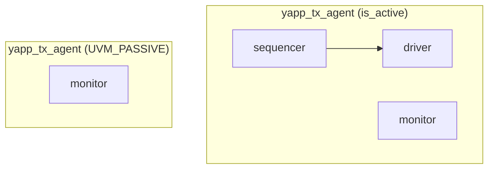
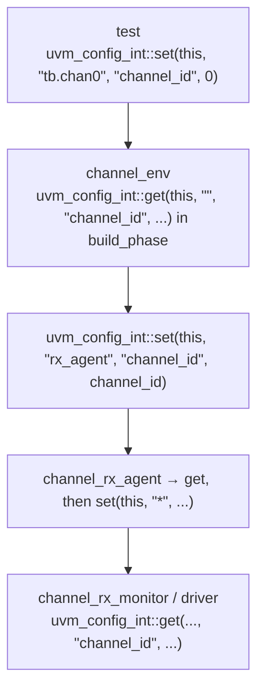

# Agent and env

[Open on the project map →](../project-map.md#view=hierarchy&scene=h:tb.yapp.agent){ .pm-link }


## Agent: one interface, three components

An agent packages everything one interface needs. `is_active` decides whether
it **generates** traffic (driver + sequencer) or only **observes** it.



```systemverilog
--8<-- "yapp_project/uvc/yapp/yapp_tx_agent.sv"
```

* `is_active` is inherited from `uvm_agent`. The first thing `build_phase` does
  after `super.build_phase(phase)` is ask the configuration database for it:
  `uvm_config_int::get(this, "", "is_active", cfg_is_active)`. That is what
  lets `uvm_config_int::set(this, "tb.yapp.agent", "is_active", UVM_PASSIVE)`
  in a test change the agent (Lab 4 `set_config_test`). The course gets the
  same effect from the `` `uvm_field_enum `` macro; here the `get()` is on the
  page, so you can see *when* the value arrives — before the children are
  created, which is why it can decide whether the driver exists.
* `do_print` adds `is_active` to the topology print; without it the agent would
  show up with no fields of its own.
* The monitor is created unconditionally, the driver and the sequencer only
  when active, and the connection only when both exist.

## Env: a group of agents

The UVC's env holds its agents (one here; `hbus_env` has `masters[]` and
`slaves[]`). The testbench env holds the UVC envs plus the analysis components.

```systemverilog
--8<-- "yapp_project/uvc/yapp/yapp_env.sv"
```

## The testbench env: `router_tb`

The final version (Lab 11B) shows every responsibility of a top-level env:

```systemverilog
--8<-- "labs/lab11b_rm_integ/tb/router_tb.sv"
```

| Responsibility | Where |
|---|---|
| configure children **before** creating them | `uvm_config_int::set(this, "chan0", "channel_id", 0)` … |
| create everything through the factory | `type_id::create("name", this)` |
| TLM connections | `connect_phase`: monitor ports → module UVC exports |
| hierarchical handles for the virtual sequencer | `mcseqr.hbus_seqr = hbus.masters[0].sequencer` |
| register model plumbing | `build()`, `lock_model()`, `set_hdl_path_root`, `set_auto_predict`, `set_sequencer` |

## How configuration flows down



Each level reads the value in its own `build_phase` and re-publishes it for its
children. That keeps every component independent of the names above it. The
same pattern gives `hbus_env` its `num_masters` / `num_slaves`.

## Common mistakes

* Creating a child before setting its configuration.
* `new("name", this)` instead of `type_id::create` → overrides do not apply.
* Connecting in `build_phase` — the children do not exist yet when the parent's
  `build_phase` starts; use `connect_phase`.
* Wildcards in hierarchical references: `mcseqr.yapp_seqr = yapp.agent.sequencer`
  is SystemVerilog, not a config string.
