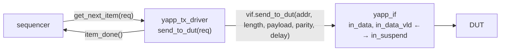

# Driver

The driver pulls transactions from the sequencer and turns them into **pin
activity** through a virtual interface. It is the only component that *drives*
DUT inputs.



## The loop every driver has

```systemverilog
task run_phase(uvm_phase phase);
  reset_signals();                       // idle values while reset is active
  forever begin
    seq_item_port.get_next_item(req);    // blocks until a sequence has an item
    send_to_dut(req);                    // takes time
    seq_item_port.item_done();           // tells the sequence it can continue
  end
endtask
```

Three details that matter:

1. `req` is declared by `uvm_driver #(yapp_packet)` — you do not declare it.
2. `get_next_item` / `item_done` come in pairs. Forgetting `item_done()` hangs
   the sequence forever.
3. The driver **never raises an objection**: it is a slave of the sequences.

## Where the protocol lives: the interface

The course keeps the timing in `yapp_if` tasks and has the driver call them.
That separates *what* (a packet) from *how* (edges and handshake), and the
same task is reusable from a non-UVM testbench.

```systemverilog
--8<-- "yapp/sv/yapp_if.sv"
```

`wait_accept()` is the heart of the handshake: on a falling edge, if
`in_suspend` is low the previous byte was taken at the preceding rising edge
and the next one may be driven; if it is high the byte must be held.

## The reference implementation

```systemverilog
--8<-- "yapp/sv/yapp_tx_driver.sv"
```

## Reset handling

`reset_signals()` drives idle values on the first falling edge and then waits
for `reset` to be low. With the Clock & Reset UVC reset is asserted at time 0
by `clk10_rst5_seq`, so `wait (vif.reset === 1'b0)` holds the driver for the
first five cycles. The same pattern is used by every driver and monitor in the
repository (`@(posedge vif.clock); wait (vif.reset === 1'b0);` in monitors).

## Transaction recording

`begin_tr(req, "Driver_YAPP_Packet")` / `end_tr(req)` give the packet a named
stream in the waveform viewer (`recording_detail` is enabled by `base_test`).
In SimVision, add `Driver_YAPP_Packet` and `Monitor_YAPP_Packet` from the
driver / monitor instances to see packets as bars with their fields.

## Other drivers in the project

| Driver | Transaction → pins |
|---|---|
| `hbus_master_driver` | `hbus_write(addr, data)` or `hbus_read(addr, data)`; the read value is written back into `req.hdata` so the sequence (and the register adapter) can use it |
| `channel_rx_driver` | plays the **receiver**: `receive_packet(delay)` waits for `data_vld`, drops `suspend`, reads `length + 2` bytes |
| `clock_and_reset_driver` | `start_clock_and_reset(period, cycles)` |

## Common mistakes

* Driving on the rising edge: the DUT samples there — race. Drive on the
  falling edge (all `yapp_if` tasks do).
* Changing `in_data` while `in_suspend` is high.
* Not waiting for the parity byte to be accepted before returning → the next
  packet's header overwrites it when the FIFO is full.
* Fetching the virtual interface in `build_phase` of the driver: the test's
  `set()` happens in `tb_top` *before* `run_test()`, so `build_phase` would
  work too, but `connect_phase` is the convention (all handles exist by then).
