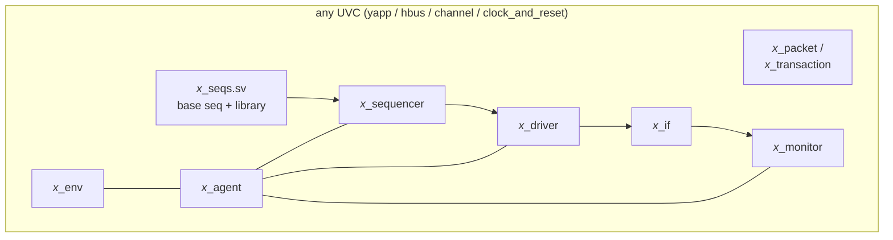

# Component guides

[Open on the project map →](../project-map.md#view=hierarchy&scene=h:tb){ .pm-link }

The lab pages follow the course order. These guides explain the same code by
**role**: open the one for the component you are writing, read what it must do,
look at the reference implementation and the mistakes people make.

| Guide | Reference implementation | Role in one sentence |
|---|---|---|
| [Packet (sequence item)](packet.md) | `yapp/sv/yapp_packet.sv` | the data: fields, constraints, parity |
| [Driver](driver.md) | `yapp/sv/yapp_tx_driver.sv` + `yapp_if.sv` | transaction → pins |
| [Sequencer and sequences](sequences.md) | `yapp/sv/yapp_tx_seqs.sv` | which transactions, in which order |
| [Monitor](monitor.md) | `yapp/sv/yapp_tx_monitor.sv` | pins → transaction, publish, cover |
| [Agent and env](agent-env.md) | `yapp/sv/yapp_tx_agent.sv`, `yapp_env.sv`, `labs/*/tb/router_tb.sv` | structure, configuration, connections |
| [Scoreboard](scoreboard.md) | `router/sv/router_scoreboard.sv` | did the right packet come out of the right channel? |
| [Reference model and module UVC](reference-model.md) | `router/sv/router_reference.sv`, `router_module_env.sv` | which packets *should* come out |
| [Virtual sequencer](virtual-sequencer.md) | `labs/lab08_mcseq/tb/router_mcsequencer.sv`, `router_mcseqs_lib.sv` | coordinate several interfaces |
| [Functional coverage](coverage.md) | covergroup in `yapp_tx_monitor.sv` | did we test everything we meant to? |
| [Register model (RAL)](register-model.md) | `labs/lab11a_rm_gen/yapp_router_reg_pkg.sv`, `hbus/sv/hbus_reg_adapter.sv` | registers as objects: front door, backdoor, prediction |

All four UVCs in this repository have the same shape, so once the YAPP UVC
makes sense the others read like variations:

