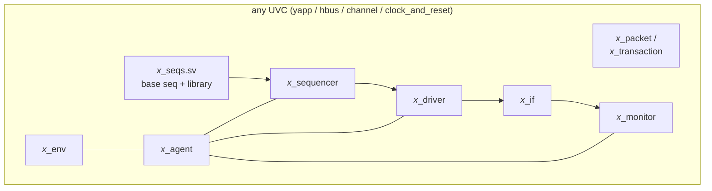

# Component guides

[Open on the project map →](../project-map.md#view=hierarchy&scene=h:tb){ .pm-link }

The lab pages follow the course order. These guides explain the same code by
**role**: open the one for the component you are writing, read what it must do,
look at the reference implementation and the mistakes people make.

| Guide | Reference implementation | Role in one sentence |
|---|---|---|
| [Packet (sequence item)](packet.md) | `yapp_project/uvc/yapp/yapp_packet.sv` | the data: fields, constraints, parity |
| [Driver](driver.md) | `yapp_project/uvc/yapp/yapp_tx_driver.sv` + `yapp_if.sv` | transaction → pins |
| [Sequencer and sequences](sequences.md) | `yapp_project/uvc/yapp/yapp_tx_seqs.sv` | which transactions, in which order |
| [Monitor](monitor.md) | `yapp_project/uvc/yapp/yapp_tx_monitor.sv` | pins → transaction, publish, cover |
| [Agent and env](agent-env.md) | `yapp_project/uvc/yapp/yapp_tx_agent.sv`, `yapp_env.sv`, `labs/*/tb/router_tb.sv` | structure, configuration, connections |
| [Scoreboard](scoreboard.md) | `yapp_project/uvc/router/router_scoreboard.sv` | did the right packet come out of the right channel? |
| [Reference model and module UVC](reference-model.md) | `yapp_project/uvc/router/router_reference.sv`, `router_module_env.sv` | which packets *should* come out |
| [Virtual sequencer](virtual-sequencer.md) | `yapp_project/tb/router_mcsequencer.sv`, `mcseqs/router_simple_mcseq.sv` | coordinate several interfaces |
| [Functional coverage](coverage.md) | covergroup in `yapp_tx_monitor.sv` | did we test everything we meant to? |
| [Register model (RAL)](register-model.md) | `yapp_project/tb/yapp_router_reg_pkg.sv` + `reg/`, `yapp_project/uvc/hbus/hbus_reg_adapter.sv` | registers as objects: front door, backdoor, prediction |

The reference implementations live in `yapp_project/` (the finished project); the lab
pages point at the snapshot where each one first appears.

**How the code is written.** Every class has its own file. The class body holds the
fields, the `utils` macro, the constraints and `extern` prototypes; the method bodies
come after `endclass` (`function yapp_tx_agent::build_phase(...)`). There are no
`uvm_do*` macros — a sequence creates its item, calls `start_item`, randomizes, calls
`finish_item`, and starts a sub-sequence with `seq.start(sequencer, this)` — and no
`uvm_field_*` automation: transactions implement `do_print`, `do_copy`, `do_compare`,
`do_pack`, `do_unpack` and `do_record`; components implement `do_print` and read their
knobs with `uvm_config_int::get` in `build_phase`. The guides below explain the code as
it is written here.

All four UVCs in this repository have the same shape, so once the YAPP UVC
makes sense the others read like variations:

