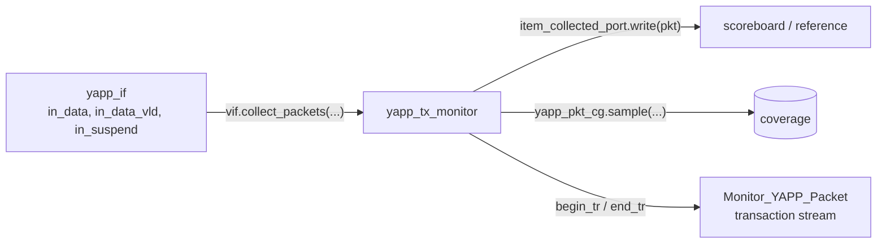

# Monitor

[Open on the project map →](../project-map.md#view=hierarchy&node=tb.yapp.agent.monitor){ .pm-link }


The monitor is the **passive** half of an agent: it watches the interface,
rebuilds transactions and publishes them. It never drives anything, it is
always built (active *and* passive agents), and everything that checks or
measures — scoreboard, reference model, coverage — hangs off it.



## The three jobs

| Job | Code | Lab |
|---|---|---|
| **collect** | `vif.collect_packets(pkt.addr, pkt.length, pkt.payload, pkt.parity, idle_cycles)` on the rising edge; a byte counts when `in_data_vld && !in_suspend`; `idle_cycles` is the gap before the header | 6 (gap: test plan) |
| **publish** | `uvm_analysis_port #(yapp_packet) item_collected_port;` constructed in `new()`, `write(pkt)` after each packet | 9A |
| **cover** | `covergroup yapp_pkt_cg with function sample(...)`, created with `new()` in the constructor, sampled after each packet; `yapp_gap_cg` covers the gap (0, 1, 2, 3+ idle cycles) | 10 (gap: test plan) |

## The reference implementation

```systemverilog
--8<-- "yapp_project/uvc/yapp/yapp_tx_monitor.sv"
```

## Design notes

* **One new object per packet.** `pkt = yapp_packet::type_id::create("pkt", this)`
  is inside the loop. Subscribers receive a handle; if the monitor re-used one
  object, every stored packet would silently change into the latest one. The
  scoreboard clones anyway (belt and braces); analysis FIFOs (Lab 9D) do not.
* **Sampling edge.** The monitor samples on the **rising** edge, where the DUT
  samples. On that edge `in_suspend` still has its pre-edge value (the DUT
  updates it with a non-blocking assignment), so `in_data_vld && !in_suspend`
  is exactly the DUT's own acceptance condition.
* **parity_type is derived**: the monitor recomputes the parity and marks the
  packet `GOOD_PARITY` / `BAD_PARITY`. The channel monitor does the same.
* `num_pkt_col` and `num_bad_parity` are plain counters printed in
  `report_phase`; `reg_function_test` uses `num_bad_parity` to know what the
  DUT's parity counter should read.
* The channel monitor additionally checks that a packet's address matches the
  `channel_id` of the channel it arrived on — a cheap built-in checker.

## The other monitors

| Monitor | Collects | Publishes |
|---|---|---|
| `channel_rx_monitor` | a packet on `data_x` (byte consumed when `data_vld && !suspend` on the rising edge) | `channel_packet` |
| `hbus_monitor` | one read or write (`hen` high; reads take the data on the second rising edge) | `hbus_transaction` |

## Common mistakes

* A type parameter on `uvm_monitor` (there is none).
* Constructing the analysis port in `build_phase` and forgetting it in `new()`
  — either works, but it must exist before `connect_phase`.
* Sampling on the falling edge in the same timestep as the driver's
  non-blocking assignments: you read the *old* values. Sample on the opposite
  edge from the one the signals are driven on.
* Counting the parity byte with `in_data_vld` high — it is driven with
  `in_data_vld` **low**.
