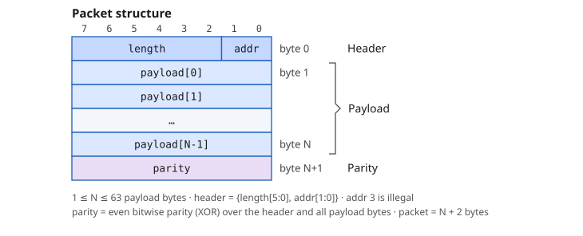

# Packet — the sequence item

[Open on the project map →](../project-map.md#view=classes&node=cls:yapp_packet){ .pm-link }


A sequence item is the **unit of stimulus**: one object that describes one
transaction. For YAPP that is one packet; for HBUS one read or write; for the
channel one "receive a packet with this response delay".

## The packet on the wire

<div class="wave" markdown>

</div>

| Byte | Bits | Content |
|---|---|---|
| 0 (header) | `[7:2]` | `length` — number of payload bytes, 1 … 63 |
|  | `[1:0]` | `addr` — output channel 0, 1 or 2; **3 is illegal** |
| 1 … length | `[7:0]` | `payload[0]` … `payload[length-1]` |
| length + 1 | `[7:0]` | `parity` — even bitwise parity: the XOR of the header and every payload byte |

A packet is `length + 2` bytes long (3 to 65). `yapp_packet` holds exactly these fields plus two
knobs that never reach the wire: `parity_type` (GOOD or BAD, what `set_parity()` writes) and
`packet_delay`. The same figure lives next to the code, in `yapp_project/uvc/yapp/README.md`.

### Try it: build or check a packet

Set the fields and watch the byte stream, the computed parity and the checks (legal address,
length vs. payload size, parity, `maxpktsize`); flip **BAD_PARITY** to see what the error
injection of the course does. **Parse bytes** decodes a packet copied from a log. **Send to
router** pushes it through the same router model as the register simulator on the
[DUT page](../dut/spec.md#try-it-the-register-file).

<div class="yapp-sim" data-sim="packet"></div>

## What a sequence item must have

| Element | `yapp_packet` | Why |
|---|---|---|
| base class `uvm_sequence_item` | ✔ | sequencers and drivers are parameterized with it |
| `` `uvm_object_utils `` | ✔ | factory registration (`type_id::create`, overrides) |
| `do_print`, `do_copy`, `do_compare`, `do_pack` / `do_unpack`, `do_record` | one line per field: `addr`, `length`, `payload`, `parity`, `parity_type`, `packet_delay` | what `print()`, `copy()`, `clone()`, `compare()`, `pack()` and transaction recording do with the fields — written by hand, no `uvm_field_*` automation |
| constructor `new(string name = "...")` | ✔ | objects have a name, no parent |
| `rand` fields + constraints | legal address, length/payload size, parity distribution, delay | random stimulus with the rules of the protocol |
| derived values | `parity` via `set_parity()` in `post_randomize()` | computed from the random fields |
| **control knobs** | `parity_type`, `packet_delay` | not on the wire; steer the driver / the error injection |

## The reference implementation

```systemverilog
--8<-- "yapp_project/uvc/yapp/yapp_packet.sv"
```

## Design notes

* **Named constraints** (`c_addr_legal`, ...) can be switched off:
  `req.c_addr_legal.constraint_mode(0)` is how `yapp_88_packets_seq` sends to
  the illegal address 3.
* `parity` is **not** `rand`: it is a function of the other fields. It is
  recomputed in `post_randomize()`, and `set_parity()` is public so a sequence
  that edits the payload afterwards (`yapp_incr_payload_seq`) can call it.
* `do_compare` leaves `packet_delay` out (the course marks the field
  `UVM_NOCOMPARE`): two packets with the same contents are equal even if they
  were sent with different gaps. `do_copy` and `do_print` do include it.
* The `do_*` methods are the one place where every field is listed. Add a
  field and forget one of them, and `print()` still works but `compare()` is
  silently blind to it — the kind of bug the field macros hide and these
  methods make visible.
* `short_yapp_packet` adds a constraint, nothing else. The factory override in
  the tests turns every packet into a short one.

## Try it (Lab 1)

```systemverilog
pkt.print();                          // table of all fields
$cast(clone_pkt, pkt.clone());        // new object with the same contents
copy_pkt.copy(pkt);                   // into an existing object
pkt.compare(clone_pkt);               // 1 if equal (reports the first difference)
pkt.print(uvm_default_tree_printer);  // same data, other layout
```

## Common mistakes

* Forgetting `payload.size() == length` in the constraint → random array size.
* Making `parity` `rand` → the parity is wrong *unless* you add a constraint,
  and then you cannot inject errors.
* Declaring `parity_type_e` inside the class → sequences cannot name
  `GOOD_PARITY` / `BAD_PARITY` (the inline `randomize() with { … }` constraints
  reference them).
* `$cast` missing in `do_copy` / `do_compare`: `rhs` arrives as a `uvm_object`;
  without the cast you cannot reach the fields.
* Using `new()` instead of `type_id::create()` in sequences → the factory
  override of Lab 4 never applies.
