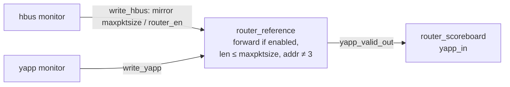

# Reference model and the router module UVC

## Why a reference model

The scoreboard of Lab 9A expects **every** packet to come out. The router
drops packets — when disabled, when oversized, when addressed to 3 — and the
rules depend on registers written over the HBUS. Something has to know those
rules and the current register values: the **reference model**.



```systemverilog
--8<-- "router/sv/router_reference.sv"
```

The model is deliberately tiny: it mirrors two register fields from the bus
traffic and re-implements the one decision the RTL makes when a header
arrives. It must agree with the DUT on the corner cases listed in the
[specification](../dut/spec.md#decisions-where-the-specification-is-silent).

## Interface UVC vs module UVC

| | Interface UVC (yapp, hbus, channel, clock) | Module UVC (router) |
|---|---|---|
| talks to | pins, through an interface | transactions, through TLM |
| contains | driver, sequencer, monitor | reference model, scoreboard, coverage |
| generates stimulus? | yes | no |
| reusable across | any design with that interface | any testbench of **this** design |

`router_module_env` is the module UVC: an `uvm_env` that builds the reference
and the scoreboard, connects them, and (Lab 9C) exposes **exports** so the
testbench never reaches inside.

```systemverilog
--8<-- "router/sv/router_module_env.sv"
```

```systemverilog
--8<-- "router/sv/router_module_pkg.sv"
```

## The analysis-FIFO variant (Lab 9D)

The same checking written as a **process** instead of callbacks:
`router_fifo_scoreboard` pulls packets from `uvm_tlm_analysis_fifo`s with
blocking `get()` calls, keeps the register mirror in a parallel thread and
checks in `check_phase` that every FIFO is empty.

```systemverilog
--8<-- "router/sv/router_fifo_scoreboard.sv"
```

| | imp / callback style (9A–9C) | FIFO / process style (9D) |
|---|---|---|
| reacts | immediately, in the monitor's thread | whenever the checking process gets to it |
| can block / wait | no (functions) | yes (tasks) |
| storage | your own queues | the FIFOs |
| cloning | you clone | FIFOs store handles: monitors must create new objects |
| end-of-test check | queue sizes in `report_phase` | `fifo.used()` in `check_phase` |
