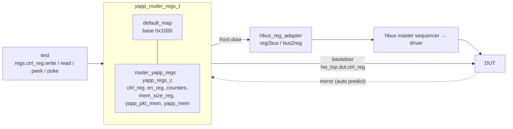

# Register model (RAL)

The UVM register layer models the DUT's registers as **objects**: a test writes
`regs.ctrl_reg.write(status, 8'h14)` and never spells out an HBUS cycle. The
same call can go through the **front door** (real bus transactions, via an
adapter and a sequencer) or the **backdoor** (direct access to the RTL
variables through their HDL paths).



## The model (Lab 11A)

Written by hand here (the course generates it with Cadence `reg_verifier` from
an IP-XACT file). Three layers:

| Layer | Class | Holds |
|---|---|---|
| field | `uvm_reg_field` | bits, access policy (`RW`/`RO`), reset value |
| register | `ctrl_reg_c`, `en_reg_c`, `*_cnt_reg_c`, `mem_size_reg_c` | fields, `build()` |
| block | `yapp_regs_c` | registers, memories, a map with offsets and HDL paths |
| top block | `yapp_router_regs_t` | the sub-block at base `0x1000`, `default_map` |

```systemverilog
--8<-- "labs/lab11a_rm_gen/yapp_router_reg_pkg.sv"
```

## The adapter (HBUS UVC)

```systemverilog
--8<-- "hbus/sv/hbus_reg_adapter.sv"
```

`provides_responses = 0` because the HBUS driver writes the read data straight
into the request item: the map reads it back from the same object after
`finish_item()`.

## Integration (Lab 11B)

```systemverilog
// router_tb::build_phase
yapp_rm = yapp_router_regs_t::type_id::create("yapp_rm");
yapp_rm.build();                               // registers, fields, maps
yapp_rm.lock_model();                          // freeze and compute addresses
yapp_rm.set_hdl_path_root("hw_top.dut");       // backdoor root
yapp_rm.default_map.set_auto_predict(1);       // mirror follows every access
reg2hbus = hbus_reg_adapter::type_id::create("reg2hbus");

// router_tb::connect_phase
yapp_rm.default_map.set_sequencer(hbus.masters[0].sequencer, reg2hbus);
```

## The access API (Lab 11C)

| Call | Path | Bus traffic | Mirror |
|---|---|---|---|
| `write(status, value)` | front door | yes | updated (auto predict) |
| `read(status, value)` | front door | yes | updated; **checked** if `set_check_on_read(1)` |
| `poke(status, value)` | backdoor | no | updated |
| `peek(status, value)` | backdoor | no | updated |
| `predict(value)` | — | no | set by hand |
| `mirror(status, UVM_CHECK)` | front door | yes | compared |

Backdoor access needs `-access +rwc` on the `xrun` command line.

## Built-in sequences

| Sequence | What it does | Expected on the YAPP router |
|---|---|---|
| `uvm_reg_hw_reset_seq` | reads every register and compares with the reset value | no errors right after reset |
| `uvm_mem_walk_seq` | walking-ones through every RW memory | `yapp_mem`: 511 writes, 255 reads; `-define INJECT_ERROR` makes it fail at `0x112a` |

Both are started with `seq.model = tb.yapp_rm; seq.start(null);` — the map
knows which sequencer to use.

## Introspection

```systemverilog
uvm_reg q[$];
tb.yapp_rm.get_registers(q);
rw_q = q.find(r) with (r.get_rights() == "RW");
```

`reg_introspection_test` builds RW and RO queues this way and runs the access
checks over every register instead of two hand-picked ones.

## Things that bite

* Register names in the model **must** equal the RTL variable names for the
  backdoor to resolve (`hw_top.dut.ctrl_reg`).
* Reserved / unused bits: `en_reg[3]` and `ctrl_reg[7:6]` are RW in the DUT
  here, so round trips are clean; on another DUT they might read as 0.
* `mem_size_reg` only receives 6 bits from the packet logic, but `poke` writes
  all 8 of the variable — expect `0x5a` back, not `0x1a`.
* Writing an RO register through the front door *does* create a bus write.
  The DUT ignores it, the mirror keeps its value, and the model may warn.
