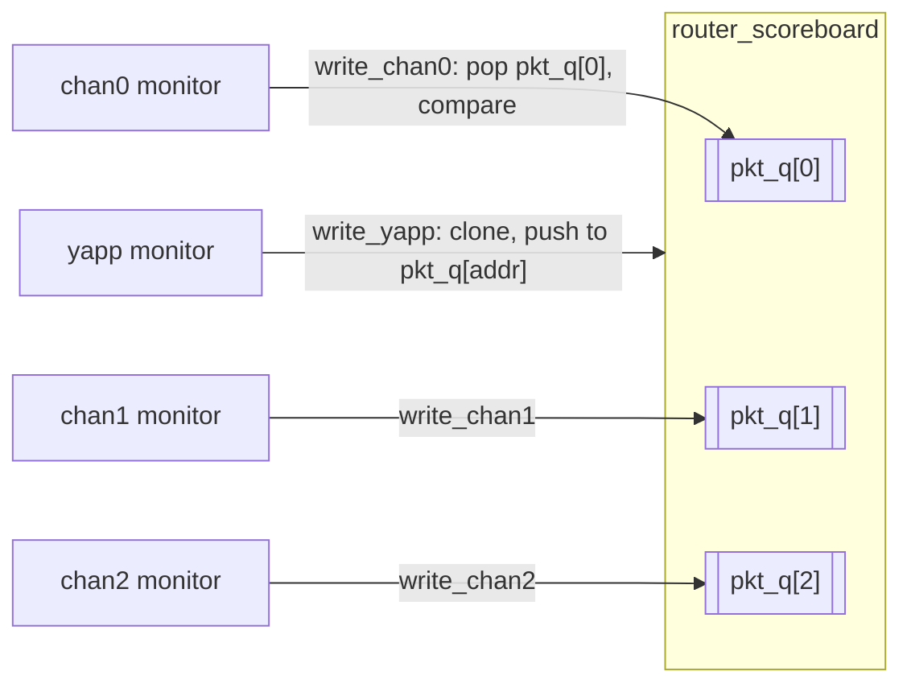

# Scoreboard

The scoreboard answers one question: **did the right packet come out of the
right channel, in order?** It receives what went *in* (YAPP monitor) and what
came *out* (three channel monitors) and compares.



## Design

| Decision | Reason |
|---|---|
| one **queue per channel** | packets to different channels may overtake each other; within a channel the order is preserved |
| **clone** on the YAPP side | the monitor hands over a handle and moves on |
| **pop and compare** on the channel side | FIFO semantics: the oldest expected packet is the one that must appear |
| a custom compare function | `yapp_packet` and `channel_packet` are different classes, so `uvm_object::compare()` does not apply |
| counters + `report_phase` | received = matched + mismatched + left in queues (+ address 3): if the equation does not hold, something was lost |

## The reference implementation

```systemverilog
--8<-- "router/sv/router_scoreboard.sv"
```

The comparison functions (`` `include``d into the class body):

```systemverilog
--8<-- "router/sv/packet_compare.sv"
```

## What a failure looks like

Run `scoreboard_drop_test` (Lab 9A, no short-packet override, `maxpktsize` =
20). The RTL prints `ROUTER DROPS PACKET`, the scoreboard raises
`UVM_ERROR … MISMATCH` for the next packet on that channel, and the report
shows packets left in a queue. Then run `router_simple_mcseq_test`: 12
received, 12 matched, 0 left.

## Alternatives in this repository

* **Lab 9B** puts a [reference model](reference-model.md) in front of the
  scoreboard so that dropped packets are never expected.
* **Lab 9D** rewrites the scoreboard around analysis FIFOs and blocking
  `get()` calls (`router_fifo_scoreboard`).

## Common mistakes

* Storing the handle instead of a clone.
* Comparing `packet_delay` or other non-wire fields.
* Declaring the `` `uvm_analysis_imp_decl `` macros inside the class (they
  define classes; they belong at package scope, once per suffix).
* Reporting only mismatches: a scoreboard that never saw a packet is "green"
  too — always print the counts.
