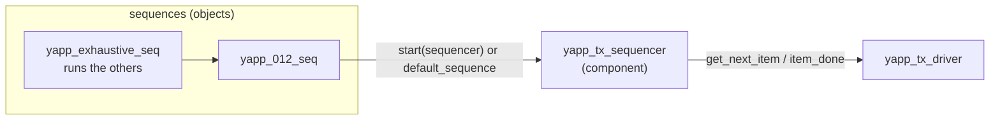

# Sequencer and sequences

[Open on the project map →](../project-map.md#view=classes&node=cls:yapp_base_seq){ .pm-link }


The **sequencer** is the traffic controller of an agent: sequences run *on* it,
it arbitrates between them and hands one item at a time to the driver. The
**sequences** are where the stimulus is actually described.



## The sequencer

Nothing to write beyond the boilerplate — the base class does all the work:

```systemverilog
--8<-- "yapp/sv/yapp_tx_sequencer.sv"
```

## Anatomy of a sequence

```systemverilog
class yapp_1_seq extends yapp_base_seq;        // 1. base class with objections
  `uvm_object_utils(yapp_1_seq)                // 2. factory registration (object, not component!)
  function new(string name = "yapp_1_seq");    // 3. object constructor: name only
    super.new(name);
  endfunction
  task body();                                 // 4. the stimulus
    `uvm_info(get_type_name(), "Executing yapp_1_seq sequence", UVM_LOW)
    `uvm_do_with(req, { req.addr == 2'd1; })
  endtask
endclass
```

`req` is declared by `uvm_sequence #(yapp_packet)`. The macros expand to the
four-step protocol every item goes through:

| Step | Macro | Long form |
|---|---|---|
| create through the factory | `` `uvm_create(req) `` | `req = yapp_packet::type_id::create("req")` |
| wait for the sequencer's grant | | `start_item(req)` |
| randomize (with constraints) | | `req.randomize() with { ... }` |
| send to the driver, wait for `item_done` | `` `uvm_send(req) `` | `finish_item(req)` |
| all four | `` `uvm_do(req) `` / `` `uvm_do_with(req, {...}) `` | |

`yapp_incr_payload_seq` shows why the split form exists: it needs to edit the
payload *after* randomization and *before* sending.

## The library

```systemverilog
--8<-- "yapp/sv/yapp_tx_seqs.sv"
```

## Patterns worth copying

| Pattern | Where | Note |
|---|---|---|
| objection in `pre_body` / `post_body` | `yapp_base_seq` | only root sequences have a starting phase; sub-sequences see `null` |
| constraint in the call | `yapp_012_seq` | `` `uvm_do_with(req, { req.addr == 2'd0; }) `` |
| nested sequence | `yapp_111_seq` | `` `uvm_do(seq_1) `` works for sequences too |
| random **sequence** property | `yapp_repeat_addr_seq` | `rand bit [1:0] seq_addr;` randomized when the sequence is — two items share it |
| create / modify / send | `yapp_incr_payload_seq` | `` `uvm_create `` … `` `uvm_send `` |
| constrained nesting | `six_yapp_seq` | `` `uvm_do_with(rnd_seq, { rnd_seq.count == 6; }) `` |
| switching a constraint off | `yapp_88_packets_seq`, `yapp_coverage_seq` | `req.c_addr_legal.constraint_mode(0)` to reach address 3 |
| run everything | `yapp_exhaustive_seq` | the cheapest regression of a library |

## Starting a sequence

=== "Default sequence (from a test)"

    ```systemverilog
    uvm_config_wrapper::set(this, "tb.yapp.agent.sequencer.run_phase",
                            "default_sequence", yapp_012_seq::get_type());
    ```
    The sequencer creates and starts it when `run_phase` begins. Set it in the
    test's `build_phase`, before the testbench is built.

=== "Explicitly (from a test or another sequence)"

    ```systemverilog
    yapp_012_seq seq = yapp_012_seq::type_id::create("seq");
    seq.start(tb.yapp.agent.sequencer);          // blocks until body() returns
    ```
    Used by `reg_function_test` (Lab 11C). Remember to raise an objection in
    the test around it.

=== "From a virtual sequence"

    ```systemverilog
    `uvm_do_on(yapp_012, p_sequencer.yapp_seqr)
    ```
    See the [virtual sequencer](virtual-sequencer.md) guide.

## Randomization failures (Lab 5)

A `` `uvm_do_with `` constraint that contradicts a constraint of the item makes
`randomize()` **fail**: a warning is printed, the item keeps its old values and
is still sent. In batch mode the simulation does not stop. That is what
happened in Lab 5 when `short_yapp_packet` forbade address 2 while
`yapp_012_seq` asked for it. Debug with `-gui -access rwc` (SimVision stops
on the failure and opens the constraint manager) or simply read the warning:
it names the conflicting constraints.

## Common mistakes

* `` `uvm_component_utils `` on a sequence (it is an object).
* A constructor with a `parent` argument.
* Forgetting `super.new(name)`.
* Raising an objection in a sub-sequence without the `null` check (`starting_phase` is `null` there).
* A `forever` sequence (`channel_rx_resp_seq`) **with** an objection: the test never ends.
