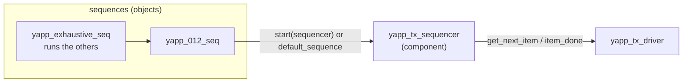

# Sequencer and sequences

[Open on the project map →](../project-map.md#view=classes&node=cls:yapp_base_seq){ .pm-link }


The **sequencer** is the traffic controller of an agent: sequences run *on* it,
it arbitrates between them and hands one item at a time to the driver. The
**sequences** are where the stimulus is actually described.



## The sequencer

Nothing to write beyond the boilerplate — the base class does all the work:

```systemverilog
--8<-- "yapp_project/uvc/yapp/yapp_tx_sequencer.sv"
```

## Anatomy of a sequence

```systemverilog
class yapp_1_seq extends yapp_base_seq;        // 1. base class with objections
  `uvm_object_utils(yapp_1_seq)                // 2. factory registration (object, not component!)
  extern function new(string name = "yapp_1_seq");   // 3. object constructor: name only
  extern task body();                                // 4. the stimulus
endclass : yapp_1_seq

function yapp_1_seq::new(string name = "yapp_1_seq");
  super.new(name);
endfunction : new

task yapp_1_seq::body();
  `uvm_info(get_type_name(), "Executing yapp_1_seq sequence", UVM_LOW)
  req = yapp_packet::type_id::create("req");           // create through the factory
  start_item(req);                                     // wait for the sequencer's grant
  if (!req.randomize() with { req.addr == 2'd1; })     // randomize, with constraints
    `uvm_error(get_type_name(), "req.randomize() failed")
  finish_item(req);                                    // to the driver; returns after item_done
endtask : body
```

`req` is declared by `uvm_sequence #(yapp_packet)`. Every item goes through the
same four steps; the course material hides them behind a macro, this repository
writes them out so you see what the macro does:

| Step | Here | Course macro |
|---|---|---|
| create through the factory | `req = yapp_packet::type_id::create("req")` | `` `uvm_create(req) `` |
| wait for the sequencer's grant | `start_item(req)` | |
| randomize (with constraints), check the result | `` if (!req.randomize() with { ... }) `uvm_error(...) `` | |
| send to the driver, wait for `item_done` | `finish_item(req)` | `` `uvm_send(req) `` |
| all four | the four lines above | `` `uvm_do(req) `` / `` `uvm_do_with(req, {...}) `` |

Between `start_item` and `finish_item` the sequence holds the sequencer, so keep
that window short: no delays, no waiting for the DUT. `yapp_incr_payload_seq`
moves the randomization *before* `start_item`, because it needs to edit the
payload and recompute the parity before the driver sees the packet.

A **nested sequence** is created the same way and started on the current
sequencer, with the parent as the second argument so the sequencer sees the
relationship (`` `uvm_do(seq_1) `` in the course):

```systemverilog
seq_1 = yapp_1_seq::type_id::create("seq_1");
if (!seq_1.randomize())
  `uvm_error(get_type_name(), "seq_1.randomize() failed")
seq_1.start(m_sequencer, this);       // blocks until seq_1.body() returns
```

## The library

```systemverilog
--8<-- "yapp_project/uvc/yapp/yapp_tx_seqs.sv"
--8<-- "yapp_project/uvc/yapp/seqs/yapp_base_seq.sv"
--8<-- "yapp_project/uvc/yapp/seqs/yapp_5_packets.sv"
--8<-- "yapp_project/uvc/yapp/seqs/yapp_1_seq.sv"
--8<-- "yapp_project/uvc/yapp/seqs/yapp_012_seq.sv"
--8<-- "yapp_project/uvc/yapp/seqs/yapp_111_seq.sv"
--8<-- "yapp_project/uvc/yapp/seqs/yapp_repeat_addr_seq.sv"
--8<-- "yapp_project/uvc/yapp/seqs/yapp_incr_payload_seq.sv"
--8<-- "yapp_project/uvc/yapp/seqs/yapp_rnd_seq.sv"
--8<-- "yapp_project/uvc/yapp/seqs/six_yapp_seq.sv"
--8<-- "yapp_project/uvc/yapp/seqs/yapp_exhaustive_seq.sv"
--8<-- "yapp_project/uvc/yapp/seqs/yapp_coverage_seq.sv"
--8<-- "yapp_project/uvc/yapp/seqs/yapp_88_packets_seq.sv"
```

## Patterns worth copying

| Pattern | Where | Note |
|---|---|---|
| objection in `pre_body` / `post_body` | `yapp_base_seq` | only root sequences have a starting phase; sub-sequences see `null` |
| inline constraint | `yapp_012_seq` | `req.randomize() with { req.addr == 2'd0; }` |
| nested sequence | `yapp_111_seq` | `seq_1.start(m_sequencer, this)` three times |
| random **sequence** property | `yapp_repeat_addr_seq` | `rand bit [1:0] seq_addr;` randomized when the sequence is — two items share it |
| create / modify / send | `yapp_incr_payload_seq` | `randomize()`, edit, `set_parity()`, then `start_item` / `finish_item` |
| constrained nesting | `six_yapp_seq` | `rnd_seq.randomize() with { rnd_seq.count == 6; }` before `rnd_seq.start(...)` |
| switching a constraint off | `yapp_88_packets_seq`, `yapp_coverage_seq` | `req.c_addr_legal.constraint_mode(0)` to reach address 3 |
| run everything | `yapp_exhaustive_seq` | the cheapest regression of a library |

## Starting a sequence

=== "Default sequence (from a test)"

    ```systemverilog
    uvm_config_wrapper::set(this, "tb.yapp.agent.sequencer.run_phase",
                            "default_sequence", yapp_012_seq::get_type());
    ```
    The sequencer creates and starts it when `run_phase` begins. Set it in the
    test's `build_phase`, before the testbench is built.

=== "Explicitly (from a test or another sequence)"

    ```systemverilog
    yapp_012_seq seq = yapp_012_seq::type_id::create("seq");
    seq.start(tb.yapp.agent.sequencer);          // blocks until body() returns
    ```
    Used by `reg_function_test` (Lab 11C). Remember to raise an objection in
    the test around it.

=== "From a virtual sequence"

    ```systemverilog
    yapp_012 = yapp_012_seq::type_id::create("yapp_012");
    if (!yapp_012.randomize()) `uvm_error(get_type_name(), "yapp_012.randomize() failed")
    yapp_012.start(p_sequencer.yapp_seqr, this);   // `uvm_do_on in the course
    ```
    The target is a handle of the virtual sequencer, not `m_sequencer`.
    See the [virtual sequencer](virtual-sequencer.md) guide.

## Randomization failures (Lab 5)

An inline constraint that contradicts a constraint of the item makes
`randomize()` **fail**: it returns 0, the sequence reports `req.randomize()
failed`, the item keeps its old values and `finish_item` still sends it. In
batch mode the simulation does not stop. That is what
happened in Lab 5 when `short_yapp_packet` forbade address 2 while
`yapp_012_seq` asked for it. Debug with `-gui -access rwc` (SimVision stops
on the failure and opens the constraint manager) or simply read the warning:
it names the conflicting constraints.

## Common mistakes

* `` `uvm_component_utils `` on a sequence (it is an object).
* A constructor with a `parent` argument.
* Forgetting `super.new(name)`.
* Ignoring the return value of `randomize()`: the item is sent with stale values and nobody notices.
* Calling `finish_item` without `start_item` (or `start_item` on a different handle than `finish_item`).
* Raising an objection in a sub-sequence without the `null` check (`starting_phase` is `null` there).
* A `forever` sequence (`channel_rx_resp_seq`) **with** an objection: the test never ends.
