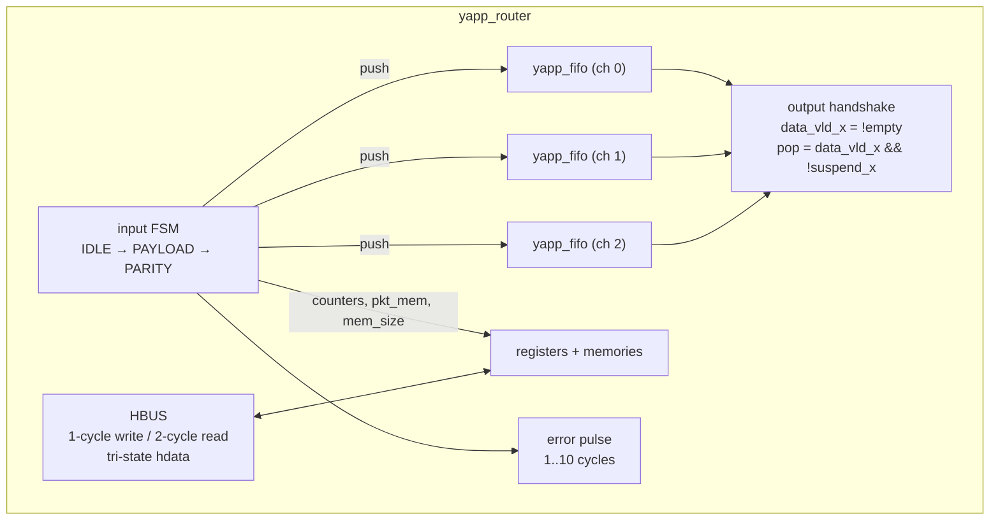
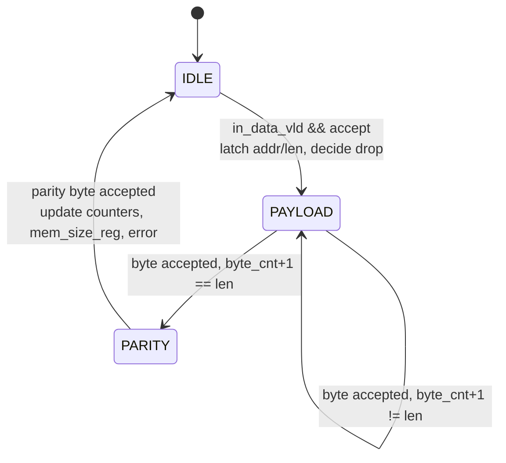

# RTL walkthrough — `router_rtl/yapp_router.sv`

[Open on the project map →](../project-map.md#view=hierarchy&scene=h:hw_top.dut){ .pm-link }


The DUT is written to be readable from top to bottom in one sitting: one file,
two modules, no vendor features. This page follows that order.

## Structure



## `yapp_fifo`

A plain synchronous FIFO: `count` tells `empty`/`full`, `dout` always shows the
head (`mem[rd_ptr]`), `push`/`pop` move the pointers. Three instances are
created in a `generate` loop, one per channel.

## Input FSM



The decision to **drop** is taken when the header arrives:

```systemverilog
wire hdr_drop = !router_en || (hdr_len > maxpktsize) || (hdr_addr == 2'd3);
```

`in_suspend` is asserted only for packets that will be forwarded and whose
target FIFO is full; a dropped packet is swallowed without using FIFO space,
so it can never stall the input.

```systemverilog
always_comb begin
  case (state)
    IDLE:    in_suspend = in_data_vld && !hdr_drop && fifo_full[hdr_addr];
    default: in_suspend = !cur_drop && fifo_full[cur_addr];
  endcase
end
wire accept = !in_suspend;
```

!!! tip "Why this matters for the testbench"
    The driver (`yapp_if.send_to_dut`) holds a byte while `in_suspend` is high
    and the monitor (`yapp_if.collect_packets`) counts a byte only when
    `in_data_vld && !in_suspend` on a rising edge. DUT, driver and monitor
    agree on **one** rule: *a byte is accepted at a rising edge where
    `in_suspend` is low*.

## Output handshake

```systemverilog
assign data_vld_0 = !fifo_empty[0];
assign data_0     = fifo_dout[0];
fifo_pop[i]       = !fifo_empty[i] && !suspend[i];
```

Nothing is registered on the output side: the FIFO head is on the bus as long
as the FIFO is not empty, and the receiver's `suspend_x` directly gates the
pop. That gives exactly the specified behaviour: new byte on every rising edge
while `suspend_x` is low.

## Counters, memories and `error`

All of it happens in the `PARITY` state, when the parity byte is accepted:

* `in_data != parity_acc` → parity error → `parity_err_cnt_reg++` (if enabled)
  and the error timer is loaded with a 1..10 cycle delay taken from a free
  running counter;
* `cur_oversized` → `oversized_pkt_cnt_reg++`;
* `cur_addr` → one of `addr0..3_cnt_reg++`;
* `mem_size_reg <= cur_len`; the bytes were written to `yapp_pkt_mem` as they
  arrived;
* `$display("... ROUTER DROPS PACKET ...")` for dropped packets — Lab 9A looks
  for this line in the log.

## HBUS

```systemverilog
assign hdata = hdata_oe ? hdata_out : 8'bz;

always_ff @(posedge clock) begin
  hdata_oe <= hen && !hwr_rd;         // drive during the second read cycle
  if (hen && !hwr_rd) hdata_out <= rd_mux;
  if (hen &&  hwr_rd) ...             // single-cycle write
end
```

`rd_mux` is a combinational decoder of `haddr` over the registers, the packet
memory (`0x1010..0x104f`) and the scratch memory (`0x1100..0x11ff`). Writes
reach only `ctrl_reg`, `en_reg` and `yapp_mem`.

```systemverilog
`ifdef INJECT_ERROR
  if (haddr[7:0] == 8'h2a) rd_mux[3] = ~rd_mux[3];   // Lab 11B: make the memory test fail
`endif
```

## The whole file

??? example "router_rtl/yapp_router.sv"
    ```systemverilog
    --8<-- "router_rtl/yapp_router.sv"
    ```
