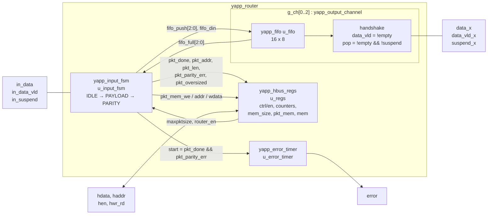
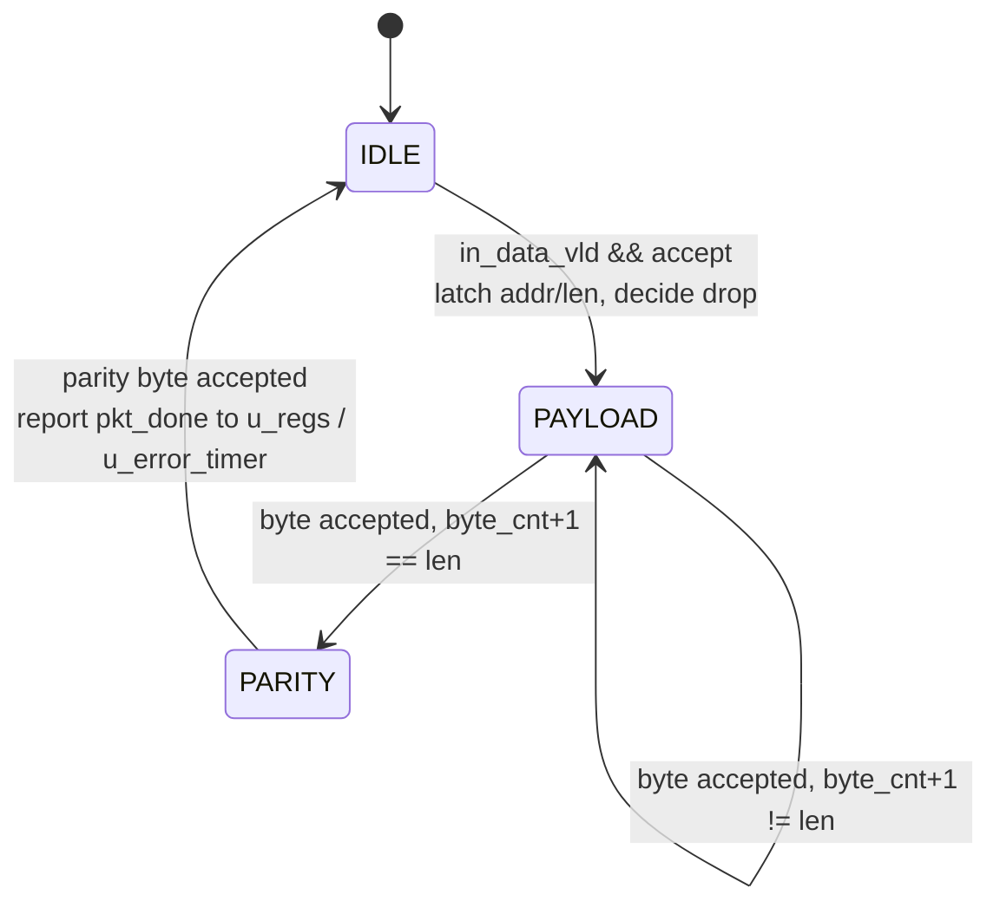

# RTL walkthrough — `yapp_project/rtl/`

[Open on the project map →](../project-map.md#view=hierarchy&scene=h:hw_top.dut){ .pm-link }


The DUT is written to be readable from top to bottom in one sitting: no vendor
features, and **one module per file**, cut along the functional blocks of the
router. `yapp_router.sv` is the top level and contains nothing but wiring; the
behaviour lives in four sub-modules (plus the FIFO they share). This page
follows the data: input port → output channels, then the register side.

| File | Module | Instance in `yapp_router` | Job |
|------|--------|---------------------------|-----|
| `yapp_router.sv` | `yapp_router` | — (top) | ports of the DUT, wiring only |
| `yapp_input_fsm.sv` | `yapp_input_fsm` | `u_input_fsm` | IDLE/PAYLOAD/PARITY FSM, drop decision, `in_suspend`, FIFO push, parity |
| `yapp_output_channel.sv` | `yapp_output_channel` | `g_ch[0..2].u_ch` | one channel = FIFO + output handshake |
| `yapp_fifo.sv` | `yapp_fifo` | `g_ch[x].u_ch.u_fifo` | 16-byte synchronous FIFO |
| `yapp_hbus_regs.sv` | `yapp_hbus_regs` | `u_regs` | every register and memory, HBUS read/write |
| `yapp_error_timer.sv` | `yapp_error_timer` | `u_error_timer` | `error` pulse 1..10 cycles after bad parity |

The file list `yapp_project/rtl/yapp_router.f` compiles them in dependency
order (`-F ../rtl/yapp_router.f` from the testbench directory).

## Structure



Two things to notice in the wiring:

* the register block and the FSM are a loop: `u_regs` publishes the live
  `maxpktsize`/`router_en` fields, the FSM reports back what happened to the
  packet;
* everything the FSM sends to `u_regs` and `u_error_timer` is **combinational**
  (`pkt_done` is a decoded condition, not a flop), so the counters and the error
  timer update at the very same clock edge as in the original single-module
  design — the split moved code, not timing.

## `yapp_router` — the top

```systemverilog
yapp_input_fsm      u_input_fsm   (...);
generate for (ch = 0; ch < 3; ch++) begin : g_ch
  yapp_output_channel u_ch (.push(fifo_push[ch]), .din(fifo_din), .suspend(suspend[ch]),
                            .data(ch_data[ch]), .data_vld(ch_data_vld[ch]), .full(fifo_full[ch]), ...);
end endgenerate
yapp_hbus_regs      u_regs        (...);
yapp_error_timer    u_error_timer (.start(pkt_done && pkt_parity_err), .error(error), ...);
```

The port list is the one the testbench has always seen (`clock`, `reset`, the
YAPP input port, `data_x/data_vld_x/suspend_x` for `x = 0..2`, the HBUS port,
`error`). Only the `suspend_x` inputs are packed into a 3-bit vector and the
channel outputs unpacked again; there is no logic here.

## `yapp_input_fsm` — the input port



The decision to **drop** is taken when the header arrives, from the live
register fields that `u_regs` exports:

```systemverilog
wire hdr_drop = !router_en || (hdr_len > maxpktsize) || (hdr_addr == 2'd3);
```

`in_suspend` is asserted only for packets that will be forwarded and whose
target FIFO is full; a dropped packet is swallowed without using FIFO space,
so it can never stall the input.

```systemverilog
always_comb begin
  case (state)
    IDLE:    in_suspend = in_data_vld && !hdr_drop && fifo_full[hdr_addr];
    default: in_suspend = !cur_drop && fifo_full[cur_addr];
  endcase
end
wire accept = !in_suspend;
```

!!! tip "Why this matters for the testbench"
    The driver (`yapp_if.send_to_dut`) holds a byte while `in_suspend` is high
    and the monitor (`yapp_if.collect_packets`) counts a byte only when
    `in_data_vld && !in_suspend` on a rising edge. DUT, driver and monitor
    agree on **one** rule: *a byte is accepted at a rising edge where
    `in_suspend` is low*.

The FSM pushes accepted bytes of a forwarded packet into the FIFO of
`cur_addr` (`fifo_push[cur_addr] = 1` with `fifo_din = in_data`), accumulates
the XOR of header and payload in `parity_acc`, and at the parity byte reports
the packet to the register block:

```systemverilog
assign pkt_done       = (state == PARITY) && accept && cur_enabled;
assign pkt_addr       = cur_addr;
assign pkt_len        = cur_len;
assign pkt_parity_err = (in_data != parity_acc);
assign pkt_oversized  = cur_oversized;
```

`cur_enabled` is `router_en` as it was when the header was accepted: a packet
received while the router is disabled is tracked (so the FSM stays in sync)
but never reported, forwarded or stored. The two
`$display("... ROUTER DROPS PACKET ...")` lines that Lab 9A looks for in the
log are printed here, in the `PARITY` state.

The bytes of the packet also leave the FSM through a small write port for the
packet memory — the header to address 0 (if `router_en`), payload byte *n* to
address *n* (if `cur_enabled`):

```systemverilog
IDLE:    if (in_data_vld && accept && router_en)   begin pkt_mem_we = 1; pkt_mem_addr = 6'd0;           end
PAYLOAD: if (in_data_vld && accept && cur_enabled) begin pkt_mem_we = 1; pkt_mem_addr = byte_cnt + 6'd1; end
```

## `yapp_output_channel` and `yapp_fifo` — the output side

One channel is one FIFO plus three lines of handshake:

```systemverilog
yapp_fifo #(.DEPTH(16), .WIDTH(8)) u_fifo (.push, .din, .pop, .dout(data), .empty, .full, ...);
assign data_vld = !empty;
assign pop      = !empty && !suspend;
```

Nothing is registered on the output side: the FIFO head is on the bus as long
as the FIFO is not empty, and the receiver's `suspend_x` directly gates the
pop. That gives exactly the specified behaviour: new byte on every rising edge
while `suspend_x` is low. `full` goes back to the FSM as `fifo_full[x]` and is
what makes `in_suspend` rise.

`yapp_fifo` is a plain synchronous FIFO: `count` tells `empty`/`full`, `dout`
always shows the head (`mem[rd_ptr]`), `push`/`pop` move the pointers. The
three channels are created in a `generate` loop `g_ch[0..2]` in the top.

## `yapp_hbus_regs` — registers, memories and HBUS

All registers and memories live here, under the names the register model's
backdoor paths use (`hw_top.dut.u_regs.ctrl_reg`, `...u_regs.yapp_mem`, …):
`ctrl_reg`, `en_reg`, the six counters, `mem_size_reg`, `yapp_pkt_mem[0:63]`
and `yapp_mem[0:255]`. The decoded fields go back to the FSM:

```systemverilog
assign maxpktsize = ctrl_reg[5:0];
assign router_en  = en_reg[0];
```

Counters and `mem_size_reg` are updated from the FSM's end-of-packet report,
i.e. in the cycle the parity byte is accepted and only for packets received
with `router_en` set (`pkt_done` already includes that):

```systemverilog
if (pkt_mem_we) begin
  yapp_pkt_mem[pkt_mem_addr] <= pkt_mem_wdata;
end
if (pkt_done) begin
  mem_size_reg <= {2'b00, pkt_len};
  if (pkt_parity_err && parity_err_cnt_en) begin
    parity_err_cnt_reg <= parity_err_cnt_reg + 8'd1;
  end
  if (pkt_oversized && oversized_pkt_cnt_en) begin
    oversized_pkt_cnt_reg <= oversized_pkt_cnt_reg + 8'd1;
  end
  case (pkt_addr)  // one of addr0..3_cnt_reg++, each behind its en_reg bit
```

Dropped packets are still fully received, so an oversized packet to address 3
increments **both** `oversized_pkt_cnt_reg` and `addr3_cnt_reg`.

The HBUS side is a one-cycle write and a two-cycle read with a tri-stated data
bus:

```systemverilog
assign hdata = hdata_oe ? hdata_out : 8'bz;

always_ff @(posedge clock) begin
  hdata_oe <= hen && !hwr_rd;         // drive during the second read cycle
  if (hen && !hwr_rd) begin
    hdata_out <= rd_mux;
  end
  if (hen && hwr_rd) begin
    ...                               // single-cycle write
  end
end
```

`rd_mux` is a combinational decoder of `haddr` over the registers, the packet
memory (`0x1010..0x104f`) and the scratch memory (`0x1100..0x11ff`). Writes
reach only `ctrl_reg`, `en_reg` and `yapp_mem`.

```systemverilog
`ifdef INJECT_ERROR
  if (haddr[7:0] == 8'h2a) begin
    rd_mux[3] = ~rd_mux[3];   // Lab 11B: make the memory test fail
  end
`endif
```

## `yapp_error_timer` — the `error` pulse

A free-running 4-bit counter picks a 1..10 cycle delay; `start`
(`pkt_done && pkt_parity_err`, i.e. a bad-parity packet accepted while the
router was enabled) loads it into `err_timer`, and `error` is high for one
cycle when the timer reaches zero.

```systemverilog
wire [3:0] err_delay = (rnd_cnt % 4'd10) + 4'd1;

error <= 1'b0;
if (err_timer != 4'd0) begin
  err_timer <= err_timer - 4'd1;
  if (err_timer == 4'd1) begin
    error <= 1'b1;
  end
end
if (start) begin
  err_timer <= err_delay;   // a new bad packet re-arms the timer (load wins over decrement)
end
```

## The files

??? note "yapp_project/rtl/yapp_router.sv"
    ```systemverilog
    --8<-- "yapp_project/rtl/yapp_router.sv"
    ```

??? note "yapp_project/rtl/yapp_input_fsm.sv"
    ```systemverilog
    --8<-- "yapp_project/rtl/yapp_input_fsm.sv"
    ```

??? note "yapp_project/rtl/yapp_output_channel.sv"
    ```systemverilog
    --8<-- "yapp_project/rtl/yapp_output_channel.sv"
    ```

??? note "yapp_project/rtl/yapp_fifo.sv"
    ```systemverilog
    --8<-- "yapp_project/rtl/yapp_fifo.sv"
    ```

??? note "yapp_project/rtl/yapp_hbus_regs.sv"
    ```systemverilog
    --8<-- "yapp_project/rtl/yapp_hbus_regs.sv"
    ```

??? note "yapp_project/rtl/yapp_error_timer.sv"
    ```systemverilog
    --8<-- "yapp_project/rtl/yapp_error_timer.sv"
    ```

??? note "yapp_project/rtl/yapp_router.f"
    ```text
    --8<-- "yapp_project/rtl/yapp_router.f"
    ```
