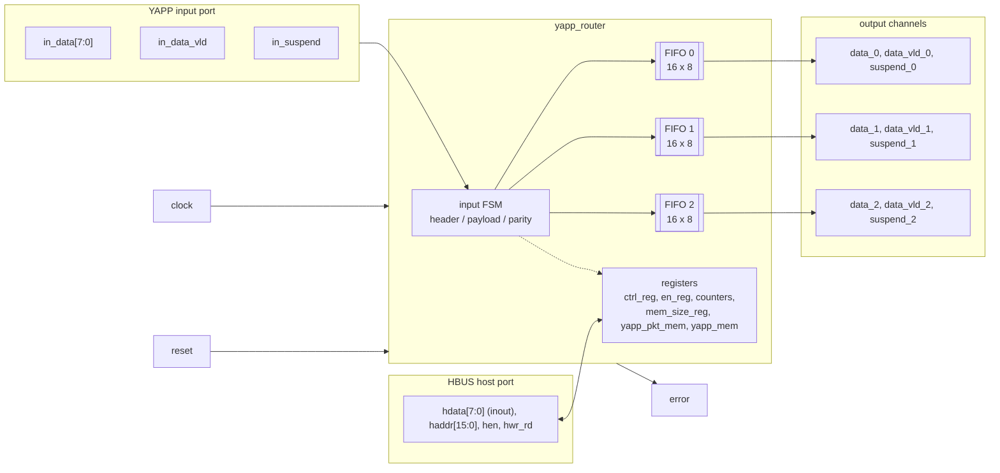
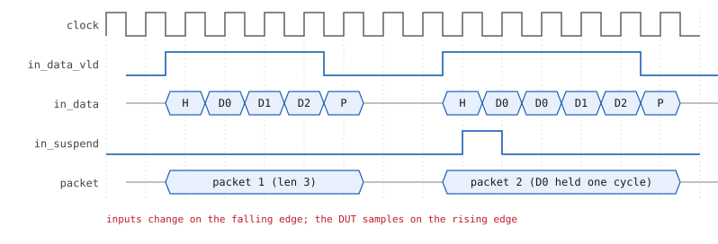
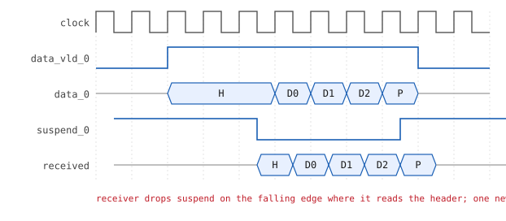
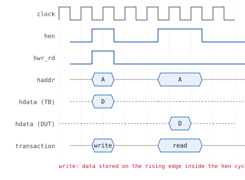

# The YAPP router — specification

**YAPP** stands for *Yet Another Packet Protocol*. The router accepts packets on
**one input port** and forwards each one to **one of three output channels**,
chosen by the address in the packet header. A **host bus (HBUS)** programs the
router's registers and reads its counters and memories.

## Ports

| Port | Dir | Width | Description |
|---|---|---|---|
| `clock`, `reset` | in | 1 | reset is active high |
| `in_data` | in | 8 | packet bytes |
| `in_data_vld` | in | 1 | high for header and payload bytes, low for the parity byte |
| `in_suspend` | out | 1 | DUT asks the sender to hold the current byte (target FIFO full) |
| `data_x` | out | 8 | channel *x* data (x = 0, 1, 2) |
| `data_vld_x` | out | 1 | a byte is presented on `data_x` |
| `suspend_x` | in | 1 | receiver not ready; low = read the byte |
| `hdata` | inout | 8 | host data bus (tri-state) |
| `haddr` | in | 16 | host address |
| `hen` | in | 1 | host access enable |
| `hwr_rd` | in | 1 | 1 = write, 0 = read |
| `error` | out | 1 | pulses after a packet with bad parity |

## Packet format

| Byte | Bits | Content |
|---|---|---|
| 0 (header) | `[7:2]` | `length` — number of payload bytes, 1 … 63 |
|  | `[1:0]` | `addr` — output channel 0, 1 or 2; **3 is illegal** |
| 1 … length | `[7:0]` | payload |
| length + 1 | `[7:0]` | `parity` — bitwise XOR of the header and all payload bytes (even parity) |

A packet is therefore `length + 2` bytes long, from 3 to 65 bytes.

## Input port protocol

* All inputs are active high and **driven on the falling edge** of the clock;
  the router samples them on the rising edge.
* `in_data_vld` goes high together with the **header** byte. Each following
  falling edge carries the next payload byte.
* On the falling edge after the last payload byte, `in_data_vld` goes **low**
  and the **parity** byte is driven.
* `in_suspend` high means "the FIFO is full": the input data must **hold its
  value** until it drops. A byte is accepted at a rising edge only when
  `in_suspend` is low.
* `error` pulses high for one cycle, **1 to 10 cycles** after a packet with bad
  parity has been received.

## Output channel protocol

* Each channel has an internal **16-byte FIFO**.
* The router raises `data_vld_x` when a byte is on `data_x`. The receiver reads
  the byte on a **falling edge** and de-asserts `suspend_x` on that same edge.
* While `suspend_x` stays low, the router presents a **new byte on every rising
  edge**. The receiver re-asserts `suspend_x` on the falling edge where it reads
  the parity byte.
* The receiver learns how many bytes to read from the header (`length + 2`).

## HBUS host protocol

* Inputs are driven on the falling edge, sampled on the rising edge.
* **Write — 1 cycle.** `hen = 1`, `hwr_rd = 1`, `haddr` and `hdata` valid.
  The register is written on the rising edge; `hen` returns to 0 in the next
  cycle.
* **Read — 2 cycles.** `hen = 1`, `hwr_rd = 0`. The DUT samples `haddr` on the
  first rising edge and drives `hdata` during the second cycle. When `hen`
  drops, the DUT tri-states `hdata`.
* Because `hdata` is bidirectional, the testbench must drive it only during a
  write and must connect the DUT to a **wire** (`hbus_if.hdata_w`), not to a
  logic variable.

## Registers

| Address | Register | Reset | Bits | Field | Access | Meaning |
|---|---|---|---|---|---|---|
| `0x1000` | `ctrl_reg` | `0x3f` | `[5:0]` | `maxpktsize` (RAL name `plen`) | RW | maximum payload length |
|  |  |  | `[7:6]` | unused | RW | — |
| `0x1001` | `en_reg` | `0x01` | `[0]` | `router_en` | RW | router enable |
|  |  |  | `[1]` | `parity_err_cnt_en` | RW | enable the parity-error counter |
|  |  |  | `[2]` | `oversized_pkt_cnt_en` | RW | enable the oversized-packet counter |
|  |  |  | `[3]` | reserved | RW | not implemented |
|  |  |  | `[4]` … `[7]` | `addr0_cnt_en` … `addr3_cnt_en` | RW | enable the per-address counters |
| `0x1004` | `parity_err_cnt_reg` | `0x00` | `[7:0]` |  | RO | packets with bad parity |
| `0x1005` | `oversized_pkt_cnt_reg` | `0x00` | `[7:0]` |  | RO | packets longer than `maxpktsize` |
| `0x1006` | `addr3_cnt_reg` | `0x00` | `[7:0]` |  | RO | packets to the illegal address 3 |
| `0x1009` | `addr0_cnt_reg` | `0x00` | `[7:0]` |  | RO | packets to address 0 |
| `0x100a` | `addr1_cnt_reg` | `0x00` | `[7:0]` |  | RO | packets to address 1 |
| `0x100b` | `addr2_cnt_reg` | `0x00` | `[7:0]` |  | RO | packets to address 2 |
| `0x100d` | `mem_size_reg` | `0x00` | `[7:0]` |  | RO | length of the last packet (only `[5:0]` are used) |

### Memories

| Start | Name | Size | Access | Meaning |
|---|---|---|---|---|
| `0x1010` | `yapp_pkt_mem` | 64 × 8 | RO | bytes of the last packet received |
| `0x1100` | `yapp_mem` | 256 × 8 | RW | scratch memory |

## Behaviour rules

* `length > maxpktsize` → the **whole packet is dropped**.
* `router_en = 0` → **all packets are dropped**. Changing it in the middle of a
  packet is undefined.
* Changing the counter-enable bits in the middle of a packet is undefined.
* A counter only counts while its enable bit is set.

### Decisions where the specification is silent

The exercise text leaves a few corner cases open. The DUT, the reference model
and the register tests in this repository all follow the same choices:

| Question | Decision |
|---|---|
| Does a dropped packet update `yapp_pkt_mem` / `mem_size_reg`? | **Yes** — the packet was *received*, just not forwarded. |
| Is parity checked / counted and `error` raised for a dropped packet? | **Yes** (oversized or address 3). |
| What happens when `router_en = 0`? | The input is "deaf": the FSM tracks the bytes to stay in sync, but nothing is forwarded, counted or stored. |
| An oversized packet to address 3? | Counts in **both** `oversized_pkt_cnt_reg` and `addr3_cnt_reg` (each condition is evaluated independently). |
| Do the address counters count dropped packets? | **Yes** — `addrN_cnt_reg` counts every packet received *with* address N while the router is enabled. |
| Writing to a read-only register over the HBUS? | Ignored. Writes to `ctrl_reg[7:6]` and `en_reg[3]` are stored and read back (they are declared RW). |
