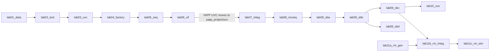

# YAPP Router — SystemVerilog & UVM Course

!!! tip "New: the interactive project map"
    [Open the project map](project-map.md) — one picture of the whole testbench and DUT you can
    drill into (hierarchy, TLM data flow, UML classes), generated from the source. Also
    available as a [single offline HTML file](downloads/yapp_project_map.html).


This site is the companion to the **YAPP packet-router verification project**: a
complete UVM environment built from scratch over eleven labs, exactly the way a
verification engineer would build one at work — one component at a time, each
one tested before the next is added.

Everything here is a **reference solution**: the DUT, every UVM verification
component (UVC), every lab in its finished state, the register model, the
coverage model and the tests. The code is written to be read: short files,
one idea per class, comments that say *why*.

<div class="grid cards" markdown>

-   :material-chip:{ .lg .middle } **The DUT**

    ---

    The YAPP router: one packet input, three output channels, a host bus and a
    handful of registers. Small enough to understand completely, rich enough
    to need a real environment.

    [:octicons-arrow-right-24: Specification](dut/spec.md)

-   :material-sitemap:{ .lg .middle } **UVM, the big picture**

    ---

    Tests, environments, agents, sequences, TLM, the factory and the
    configuration database — what each piece is for and how they fit.

    [:octicons-arrow-right-24: Architecture](uvm/big-picture.md)

-   :material-puzzle:{ .lg .middle } **Component guides**

    ---

    One page per building block: packet, driver, sequencer, monitor, agent,
    scoreboard, reference model, virtual sequencer, coverage, register model.

    [:octicons-arrow-right-24: Guides](components/index.md)

-   :material-flask:{ .lg .middle } **The labs**

    ---

    Labs 1 to 11C, each with objective, concepts, diagrams, the full solution,
    the tests to run, checkpoint questions with answers and the expected result.

    [:octicons-arrow-right-24: Labs](labs/index.md)

</div>

## How to use this site

=== "Students"

    1. Read [Getting started](getting-started.md) once and run `test_install`.
    2. Read the [DUT specification](dut/spec.md): every lab assumes you know
       the packet format and the three port protocols.
    3. Work through the [labs](labs/index.md) in order. Each lab page tells you
       what to build, why, and what the simulation must show when you are done.
       Try to write the code yourself first; the solution is there when you get
       stuck or want to compare.
    4. Use the [component guides](components/index.md) when a piece of UVM
       does not click: they explain the same code from the "what is a driver"
       angle instead of the "lab step 4" angle.

=== "Mentors"

    * The [labs overview](labs/index.md) has the session plan, the dependency
      chain and what each lab adds.
    * Every lab page ends with **checkpoint questions**; the answers are in
      collapsible boxes so you can use them for reviews.
    * `labs/<lab>/` is a complete snapshot of the code at the end of that lab.
      `diff -r labs/lab04_factory labs/lab05_seq` shows exactly what a lab adds.
    * The [test plan](test-plan.md) maps DUT features to tests and checkers, and
      the [unverified items](appendix/unverified.md) page lists what still needs
      a run on a real simulator.

## Course roadmap

| Lab | Title | What you build | Key UVM / SV concepts |
|---|---|---|---|
| [1](labs/lab01.md) | Creating a stimulus model | `yapp_packet` | `uvm_sequence_item`, `do_print`/`do_copy`/`do_compare`, constraints, `post_randomize` |
| [2](labs/lab02.md) | Test and testbench components | `router_tb`, `base_test` | `uvm_env`, `uvm_test`, `build_phase`, `run_test()`, verbosity |
| [3](labs/lab03.md) | A simple UVC | driver, sequencer, monitor, agent, env | `uvm_driver`, `seq_item_port`, `is_active`, default sequence |
| [4](labs/lab04.md) | Factories | `short_yapp_packet`, config tests | `type_id::create`, type overrides, `uvm_config_int`, `check_config_usage` |
| [5](labs/lab05.md) | Sequences | the YAPP sequence library | `uvm_sequence`, `start_item`/`finish_item`, nesting, objections, randomization debug |
| [6](labs/lab06.md) | Virtual interfaces and the DUT | `yapp_if`, `hw_top`, `tb_top` | `interface`, `virtual interface`, `uvm_config_db`, drain time |
| [7](labs/lab07.md) | Integrating UVCs | HBUS, Channel, Clock & Reset in `router_tb` | reuse, configuration, multiple interfaces |
| [8](labs/lab08.md) | Multichannel sequences | `router_mcsequencer`, `router_simple_mcseq` | virtual sequencer, `` `uvm_declare_p_sequencer `` |
| [9A](labs/lab09a.md) | Scoreboard | `router_scoreboard` | analysis ports / imps, `clone()` |
| [9B](labs/lab09b.md) | Router module UVC | `router_reference`, `router_module_env` | reference model, module UVC |
| [9C](labs/lab09c.md) | TLM exports *(optional)* | exports on the env | `uvm_analysis_export` |
| [9D](labs/lab09d.md) | Analysis FIFOs *(optional)* | `router_fifo_scoreboard` | `uvm_tlm_analysis_fifo`, blocking `get` |
| [10](labs/lab10.md) | Functional coverage *(optional)* | covergroup in the monitor | coverpoints, bins, cross |
| [11A](labs/lab11a.md) | Register model generation | `yapp_router_reg_pkg` | `uvm_reg`, `uvm_reg_block`, maps |
| [11B](labs/lab11b.md) | Register model integration | adapter, `set_sequencer`, built-in sequences | front door, backdoor, auto-predict |
| [11C](labs/lab11c.md) | Register tests | `reg_access_test`, `reg_function_test` | `write/read/peek/poke`, `predict`, introspection |



## What is in the repository

```
yapp_project/                the complete project, the state after Lab 11C (source of truth)
├── rtl/                     the DUT, one module per file (yapp_router.sv + yapp_router.f)
├── uvc/yapp/                YAPP input UVC   -- built in Labs 1-6, final state
├── uvc/hbus/                HBUS UVC         -- "provided"
├── uvc/channel/             Channel UVC      -- "provided"
├── uvc/clock_and_reset/     Clock & Reset UVC-- "provided"
├── uvc/router/              router module UVC (scoreboard, reference model) -- Labs 9A-9D
└── tb/                      the final testbench: tests/, mcseqs/, reg/, run.f, Makefile
labs/<lab>/                  one snapshot per lab (sv/ in Labs 1-6, tb/, run.f, Makefile);
                             Labs 7+ compile the UVCs and the DUT from yapp_project/
test_install/                does the simulator find UVM?
scripts/                     lint harness (slang), project-map generator, waveform generator
docs/                        this site
```

!!! note "About the original material"
    The project follows the structure of the Cadence *SystemVerilog Accelerated
    Verification Using UVM* training. No Cadence files are used: the DUT, the
    "provided" UVCs, the interfaces and the register model were all written for
    this repository from the public specification of the exercise.
