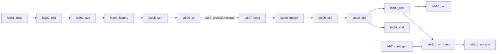

# The labs

Eleven labs, one environment. Every lab page has the same layout so you always
know where to look:

**Objective → Concepts → Diagram → Solution, step by step → Tests and expected
result → Checkpoint questions → Optional → What changed since the previous lab**

## Session plan

| Session | Labs | Theme | Deliverable at the end |
|---|---|---|---|
| 1 | [1](lab01.md), [2](lab02.md) | data items, components, phases | a packet class and an empty test/testbench pair |
| 2 | [3](lab03.md), [4](lab04.md) | a UVC skeleton, factory, configuration | the YAPP agent printing packets; tests that reconfigure it |
| 3 | [5](lab05.md) | sequences, objections, randomization debug | the YAPP sequence library |
| 4 | [6](lab06.md) | interfaces, virtual interfaces, the DUT | packets flowing through the real router |
| 5 | [7](lab07.md), [8](lab08.md) | integrating UVCs, virtual sequencer | the full environment with a system-level sequence |
| 6 | [9A](lab09a.md), [9B](lab09b.md) (+ [9C](lab09c.md), [9D](lab09d.md)) | TLM, scoreboard, reference model | self-checking tests |
| 7 | [10](lab10.md) | functional coverage | a coverage model and the stimulus that closes it |
| 8 | [11A](lab11a.md), [11B](lab11b.md), [11C](lab11c.md) | register model | register tests through the RAL |

## Dependency chain



Labs 1–6 carry their own copy of the YAPP UVC in `labs/<lab>/sv`. From Lab 7
on, the finished UVC lives in `yapp_project/uvc/yapp` and the labs only contain the
testbench (`tb/`); their `run.f` compiles the UVCs from `yapp_project/uvc/` and the
DUT from `yapp_project/rtl/yapp_router.f`. The router module UVC built in 9A–9D ends
up in `yapp_project/uvc/router`; the register model built in 11A is copied into the
`tb/` of 11B and 11C, as the course does. The end of the chain, with every UVC, the
virtual sequencer and the register model, is `yapp_project/tb/`
(see [Getting started](../getting-started.md#the-complete-project-yapp_project)).

## Comparing two labs

The snapshots are made to be diffed:

```bash
diff -r labs/lab04_factory labs/lab05_seq
diff labs/lab09_sbb/sv/router_module_env.sv labs/lab09_sbc/sv/router_module_env.sv
```

## Running a lab

```bash
cd labs/lab07_integ/tb
make run TEST=simple_test
make gui TEST=simple_test            # SimVision
make lint                            # slang elaboration check, no simulator
```

!!! info "What the original manual does not give you"
    The course manual lists tasks, not code: "create a driver with a
    `run_phase` that uses `get_next_item`…". These pages give the finished code
    *and* explain each decision, so a student can attempt the task, compare,
    and understand the difference.
