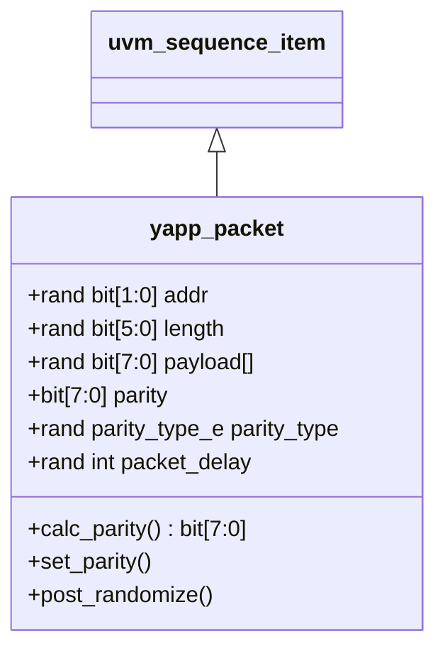

# Lab 1 — Creating a stimulus model

**Directory:** `labs/lab01_data` · **Files:** `sv/yapp_packet.sv`, `sv/yapp_pkg.sv`, `tb/top.sv`, `tb/run.f`

## Objective

Model the YAPP packet as a UVM data item and explore the automation you get for
free: printing, copying, cloning, comparing.

## Concepts

`uvm_sequence_item` · `` `uvm_object_utils_begin/end `` · field macros · `rand` and
constraints · `dist` · `post_randomize()` · control knobs · packages

## The packet and its knobs



| Field | On the wire? | Constraint |
|---|---|---|
| `addr` | yes (header `[1:0]`) | `!= 3` |
| `length` | yes (header `[7:2]`) | `1..63`, `payload.size() == length` |
| `payload[]` | yes | — |
| `parity` | yes | computed by `set_parity()` |
| `parity_type` | no — knob | `GOOD_PARITY : BAD_PARITY = 5 : 1` |
| `packet_delay` | no — knob | `1..20` |

## Solution

### 1. `sv/yapp_packet.sv`

```systemverilog
--8<-- "labs/lab01_data/sv/yapp_packet.sv"
```

Points worth a second look:

* **`parity_type_e` is declared outside the class** so that tests and sequences
  can write `GOOD_PARITY` without a scope prefix.
* **`parity` is not `rand`.** It is derived: `post_randomize()` calls
  `set_parity()`, which uses `calc_parity()` for a good packet and flips one
  bit for a bad one.
* **Named constraints** can be disabled later (`c_addr_legal.constraint_mode(0)`).
* `UVM_NOCOMPARE` on `packet_delay`: two identical packets sent with different
  gaps still compare equal.

### 2. `sv/yapp_pkg.sv`

```systemverilog
--8<-- "labs/lab01_data/sv/yapp_pkg.sv"
```

### 3. `tb/top.sv`

```systemverilog
--8<-- "labs/lab01_data/tb/top.sv"
```

### 4. `tb/run.f`

```
--8<-- "labs/lab01_data/tb/run.f"
```

## Run

```bash
cd labs/lab01_data/tb && make run
```

**Expected:** five packet tables. Every `addr` is 0, 1 or 2; `payload` has
exactly `length` entries; about one packet in six shows `BAD_PARITY` with a
parity byte that differs from the XOR of the other bytes. Then the optional
section prints `copy compare -> 1`, `clone compare -> 1`, a miscompare
message for the modified clone, and the same packet in table and tree layout.

## Checkpoint questions

??? question "Why does `parity` not have the `rand` qualifier?"
    Because its value is a *function* of the other fields. If it were random it
    would be wrong most of the time, and if you then constrained it to be
    correct you could no longer inject parity errors. A derived value is
    computed in `post_randomize()`.

??? question "What does `payload.size() == length` do during randomization?"
    The solver sizes the dynamic array to match `length`; the elements are then
    randomized. Without it the array keeps whatever size it had (0 at first).

??? question "What is the difference between `copy()` and `clone()`?"
    `copy()` copies the fields *into an existing object*. `clone()` allocates a
    *new* object (through the factory), copies into it and returns it as a
    `uvm_object`, hence the `$cast`.

??? question "Where does `print()` get the field names and formats from?"
    From the `` `uvm_field_* `` macros between `` `uvm_object_utils_begin `` and
    `` `uvm_object_utils_end ``. `UVM_DEC` prints `length` in decimal, the
    default radix is hex.

## Optional

`copy()`, `clone()`, `compare()`, table vs tree printer — all in `top.sv` above.

## What changed since the previous lab

This is the first lab. Lab 2 removes the randomize-and-print loop from `top.sv`
and replaces it with `run_test()`.
