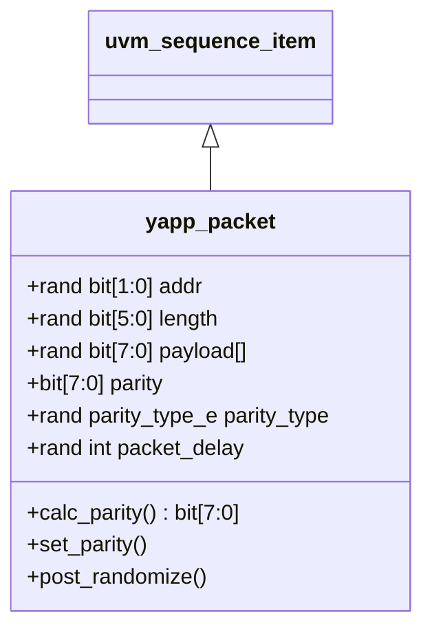

# Lab 1 — Creating a stimulus model

[Open on the project map →](../project-map.md#view=classes&node=cls:yapp_packet){ .pm-link }


**Directory:** `labs/lab01_data` · **Files:** `sv/yapp_packet.sv`, `sv/yapp_pkg.sv`, `tb/top.sv`, `tb/run.f`

## Objective

Model the YAPP packet as a UVM data item and explore what the base class gives
you once the item describes its fields: printing, copying, cloning, comparing.

## Concepts

`uvm_sequence_item` · `` `uvm_object_utils `` · `do_print` / `do_copy` / `do_compare` /
`do_pack` / `do_unpack` / `do_record` · `rand` and constraints · `dist` · `post_randomize()` ·
control knobs · packages

!!! note "No `uvm_field_*` macros here"
    The course material lists the fields between `` `uvm_object_utils_begin `` and
    `` `uvm_object_utils_end `` with `` `uvm_field_int(addr, UVM_ALL_ON) `` and so on, and
    the macros generate `print`, `copy`, `compare`, `pack` and `record` for you. This
    repository writes those methods out (`do_print` uses `printer.print_field`,
    `do_compare` uses `comparer.compare_field_int`, …) so you see what each `pkt.print()`
    or `pkt.compare()` actually does — and what it costs to add a field.

## The packet and its knobs



| Field | On the wire? | Constraint |
|---|---|---|
| `addr` | yes (header `[1:0]`) | `!= 3` |
| `length` | yes (header `[7:2]`) | `1..63`, `payload.size() == length` |
| `payload[]` | yes | — |
| `parity` | yes | computed by `set_parity()` |
| `parity_type` | no — knob | `GOOD_PARITY : BAD_PARITY = 5 : 1` |
| `packet_delay` | no — knob | `1..20` |

## Solution

### 1. `sv/yapp_packet.sv`

```systemverilog
--8<-- "labs/lab01_data/sv/yapp_packet.sv"
```

Points worth a second look:

* **`parity_type_e` is declared outside the class** so that tests and sequences
  can write `GOOD_PARITY` without a scope prefix.
* **`parity` is not `rand`.** It is derived: `post_randomize()` calls
  `set_parity()`, which uses `calc_parity()` for a good packet and flips one
  bit for a bad one -- with **one** `$urandom_range` call:
  `parity ^= 8'h01 << $urandom_range(7, 0);`. Writing
  `parity[$urandom_range(7,0)] = ~parity[$urandom_range(7,0)]` picks two different
  bits and leaves the parity correct about half of the time (a real bug, found by
  the first simulation of this code).
* **Named constraints** can be disabled later (`c_addr_legal.constraint_mode(0)`).
* `do_compare` does not look at `packet_delay` (the course's `UVM_NOCOMPARE`):
  two identical packets sent with different gaps still compare equal.
* The class body only *declares* the methods (`extern`); their bodies follow
  `endclass` as `function yapp_packet::set_parity();`. Read the class to learn
  what a packet can do, read below it to learn how.

### 2. `sv/yapp_pkg.sv`

```systemverilog
--8<-- "labs/lab01_data/sv/yapp_pkg.sv"
```

### 3. `tb/top.sv`

```systemverilog
--8<-- "labs/lab01_data/tb/top.sv"
```

### 4. `tb/run.f`

```
--8<-- "labs/lab01_data/tb/run.f"
```

## Run

```bash
cd labs/lab01_data/tb && make run
```

**Expected:** five packet tables. Every `addr` is 0, 1 or 2; `payload` has
exactly `length` entries; about one packet in six shows `BAD_PARITY` with a
parity byte that differs from the XOR of the other bytes. Then the optional
section prints `copy compare -> 1`, `clone compare -> 1`, a miscompare
message for the modified clone, and the same packet in table and tree layout.

## Checkpoint questions

??? question "Why does `parity` not have the `rand` qualifier?"
    Because its value is a *function* of the other fields. If it were random it
    would be wrong most of the time, and if you then constrained it to be
    correct you could no longer inject parity errors. A derived value is
    computed in `post_randomize()`.

??? question "What does `payload.size() == length` do during randomization?"
    The solver sizes the dynamic array to match `length`; the elements are then
    randomized. Without it the array keeps whatever size it had (0 at first).

??? question "What is the difference between `copy()` and `clone()`?"
    `copy()` copies the fields *into an existing object*. `clone()` allocates a
    *new* object (through the factory), copies into it and returns it as a
    `uvm_object`, hence the `$cast`.

??? question "Where does `print()` get the field names and formats from?"
    From `yapp_packet::do_print`: one `printer.print_field("length", length,
    $bits(length), UVM_DEC)` per field (`UVM_DEC` prints `length` in decimal,
    the others use hex), `print_array_header/footer` around the payload and
    `print_generic` for the enum. `print()` itself belongs to `uvm_object`; it
    picks the printer (table or tree) and calls `do_print`.

## Optional

`copy()`, `clone()`, `compare()`, table vs tree printer — all in `top.sv` above.

## What changed since the previous lab

This is the first lab. Lab 2 removes the randomize-and-print loop from `top.sv`
and replaces it with `run_test()`.
