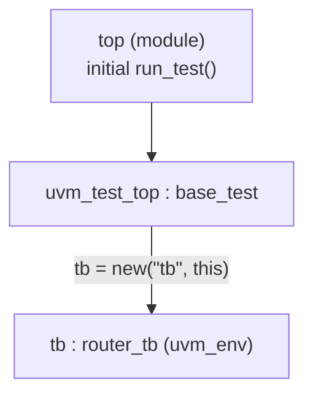

# Lab 2 — Creating test and testbench components

[Open on the project map →](../project-map.md#view=classes&node=cls:base_test){ .pm-link }


**Directory:** `labs/lab02_test` · **New files:** `tb/router_tb.sv`, `tb/router_test_lib.sv`

## Objective

Start the UVM component hierarchy: a test that owns a testbench, started by
`run_test()`, with the phases doing the work.

## Concepts

`uvm_env` · `uvm_test` · `` `uvm_component_utils `` · component constructor
`(name, parent)` · `build_phase` · `end_of_elaboration_phase` ·
`uvm_top.print_topology()` · `run_test()` · `+UVM_TESTNAME` · verbosity



## Solution

### 1. `tb/router_tb.sv`

```systemverilog
--8<-- "labs/lab02_test/tb/router_tb.sv"
```

### 2. `tb/router_test_lib.sv`

```systemverilog
--8<-- "labs/lab02_test/tb/router_test_lib.sv"
```

The testbench is constructed **after** `super.build_phase(phase)`: the base
implementation applies configuration to the test's own fields first.

### 3. `tb/top.sv`

```systemverilog
--8<-- "labs/lab02_test/tb/top.sv"
```

The order of the two `` `include``s matters: `base_test` has a `router_tb`
handle, so `router_tb` must be declared first.

### 4. `tb/run.f`

```
--8<-- "labs/lab02_test/tb/run.f"
```

## Run

```bash
make run                                   # +UVM_TESTNAME=base_test +UVM_VERBOSITY=UVM_HIGH from run.f
make run TEST=test2
make run XRUN_OPTS=+UVM_VERBOSITY=UVM_LOW   # overrides the run.f setting, no recompile
```

**Expected (UVM_HIGH):**

```
UVM_INFO ... [RNTST] Running test base_test...
UVM_INFO ... [base_test] Executing the build phase of the test
UVM_INFO ... [router_tb] Executing the build phase of the testbench
UVM_INFO ... [UVMTOP] UVM testbench topology:
--------------------------------
Name           Type        Size  Value
--------------------------------
uvm_test_top   base_test   -     @...
  tb           router_tb   -     @...
--------------------------------
```

With `UVM_LOW` the two "Executing the build phase" lines disappear; the
topology stays (it is printed at `UVM_NONE`).

## Checkpoint questions

??? question "Does the printed topology match the hierarchy you expected?"
    Yes: `uvm_test_top` (the test, always named so by `run_test`) with one
    child `tb` of type `router_tb`.

??? question "Which test class is being executed?"
    The one named by `+UVM_TESTNAME`; `run_test()` looks it up in the factory.
    Without the plusarg `run_test()` would need the name as an argument.

??? question "Do you see build-phase reports from both test and testbench?"
    At `UVM_HIGH`, yes, test first (build is top-down). At `UVM_LOW`, neither.

??? question "What is the *minimum* code for `test2`?"
    The utility macro and the constructor. Everything else — the testbench
    handle, `build_phase`, the topology print — is inherited.

## Optional

`test2` is in the solution. Switch between tests with `+UVM_TESTNAME` only.

## What changed since the previous lab

```bash
diff -r labs/lab01_data labs/lab02_test
```

* `tb/top.sv`: the randomize/print loop is gone; `run_test()` and the two includes are in.
* new `tb/router_tb.sv`, `tb/router_test_lib.sv`.
* `tb/run.f`: `+UVM_TESTNAME`, `+UVM_VERBOSITY`.
