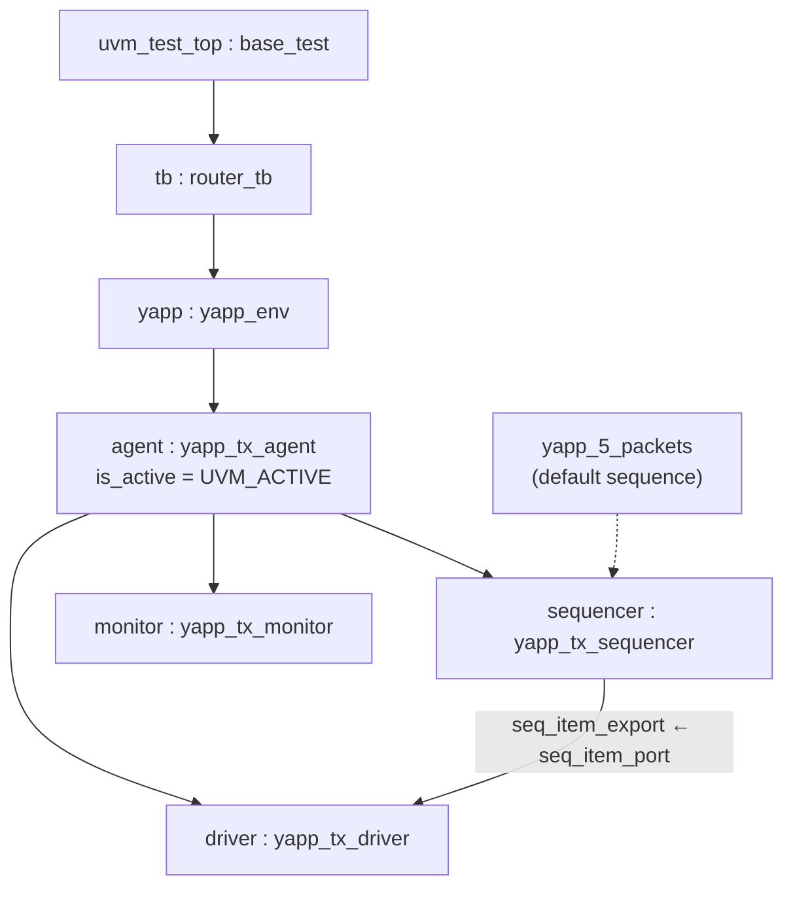

# Lab 3 — Creating a simple UVC

[Open on the project map →](../project-map.md#view=hierarchy&scene=h:tb.yapp.agent){ .pm-link }


**Directory:** `labs/lab03_uvc` · **New files:** `sv/yapp_tx_driver.sv`, `yapp_tx_sequencer.sv`,
`yapp_tx_monitor.sv`, `yapp_tx_agent.sv`, `yapp_env.sv`, `yapp_tx_seqs.sv`

## Objective

Build the front end of the YAPP input UVC — driver, sequencer, monitor, agent,
env — and watch the component phases run.

## Concepts

`uvm_driver #(T)` · `uvm_sequencer #(T)` · `uvm_monitor` · `uvm_agent` ·
`is_active` · `seq_item_port` / `seq_item_export` · `get_next_item()` /
`item_done()` · `sprint()` · default sequence through `uvm_config_wrapper` ·
phase order



## Solution

### 1. Driver — `sv/yapp_tx_driver.sv`

For now the driver only prints the packet; pins arrive in Lab 6.

```systemverilog
--8<-- "labs/lab03_uvc/sv/yapp_tx_driver.sv"
```

### 2. Sequencer — `sv/yapp_tx_sequencer.sv`

```systemverilog
--8<-- "labs/lab03_uvc/sv/yapp_tx_sequencer.sv"
```

### 3. Monitor — `sv/yapp_tx_monitor.sv`

```systemverilog
--8<-- "labs/lab03_uvc/sv/yapp_tx_monitor.sv"
```

### 4. Agent — `sv/yapp_tx_agent.sv`

```systemverilog
--8<-- "labs/lab03_uvc/sv/yapp_tx_agent.sv"
```

### 5. Env — `sv/yapp_env.sv`

```systemverilog
--8<-- "labs/lab03_uvc/sv/yapp_env.sv"
```

### 6. The provided sequences — `sv/yapp_tx_seqs.sv`

```systemverilog
--8<-- "labs/lab03_uvc/sv/yapp_tx_seqs.sv"
--8<-- "labs/lab03_uvc/sv/seqs/yapp_base_seq.sv"
--8<-- "labs/lab03_uvc/sv/seqs/yapp_5_packets.sv"
```

### 7. Package include order — `sv/yapp_pkg.sv`

```systemverilog
--8<-- "labs/lab03_uvc/sv/yapp_pkg.sv"
```

### 8. Testbench and test

`router_tb` gets a `yapp_env yapp` handle built in `build_phase`. `base_test`
sets the **default sequence** of the sequencer *before* building the testbench:

```systemverilog
uvm_config_wrapper::set(this, "tb.yapp.agent.sequencer.run_phase",
                        "default_sequence", yapp_5_packets::get_type());
tb = new("tb", this);
```

The path `tb.yapp.agent.sequencer` is the one you read off the topology
report when you ran `base_test` before adding the sequence.

## Run

```bash
make run                                        # base_test, 5 packets
make run XRUN_OPTS="+SVSEED=random"             # different packets
make run XRUM_OPTS="+UVM_VERBOSITY=UVM_HIGH"    # see the start_of_simulation messages
```

**Expected:** the topology now shows `tb.yapp.agent.{driver,monitor,sequencer}`
with `is_active UVM_ACTIVE`; then `Executing yapp_5_packets sequence`, the
monitor's "Inside the monitor run_phase", and five `Packet is` tables from
the driver, 10 ns apart.

## Checkpoint questions

??? question "Full hierarchical path from the test to the sequencer?"
    `uvm_test_top.tb.yapp.agent.sequencer` — in configuration calls made from
    the test, `tb.yapp.agent.sequencer` (relative to `this`).

??? question "What value does `is_active` have in the topology print?"
    `UVM_ACTIVE` (the default of `uvm_agent`). It shows because of the
    `` `uvm_field_enum `` macro in the agent's utils block.

??? question "Which `start_of_simulation_phase` runs first, which last, why?"
    First the leaves (`driver`, `monitor`, `sequencer` — siblings in
    declaration order), last `uvm_test_top`. The phase is **bottom-up**; only
    `build_phase` is top-down, because a parent has to exist before it can
    create its children.

??? question "Why `monitor` unconditionally but `driver`/`sequencer` only when active?"
    A passive agent still *observes* the bus (for checking and coverage) but
    must not *drive* it — e.g. when the real traffic comes from another block.

## Optional

`start_of_simulation_phase()` is present in every component of this lab
(removed again from Lab 4 on, to keep the code lean).

## What changed since the previous lab

```bash
diff -r labs/lab02_test labs/lab03_uvc
```

* six new files in `sv/`, included by `yapp_pkg.sv` in dependency order
* `router_tb` builds `yapp_env`; `base_test` sets the default sequence
* `run.f`: `-incdir ../../../common` (the `starting_phase` shim) and `+SVSEED=random`
