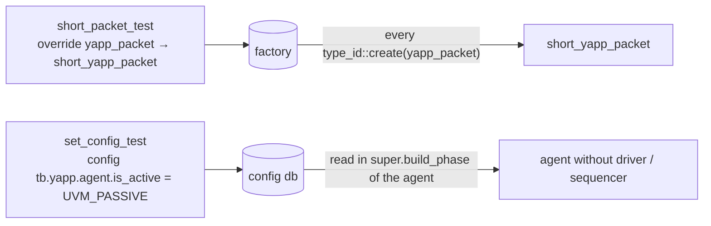

# Lab 4 — Using factories

**Directory:** `labs/lab04_factory` · **Changed:** every `new()` of a component → `type_id::create()`;
`sv/yapp_packet.sv` (+ `short_yapp_packet`); `tb/router_test_lib.sv` (+ 2 tests)

## Objective

Create components and data through the factory so that a test can replace
types and change configuration without touching the UVC.

## Concepts

`type_id::create()` · `set_type_override_by_type()` · `uvm_config_int::set()` ·
`check_config_usage()` · `recording_detail`



## Solution

### 1. `new()` → `type_id::create()`

In `router_test_lib.sv`, `router_tb.sv`, `yapp_env.sv`, `yapp_tx_agent.sv`:

```systemverilog
tb        = router_tb::type_id::create("tb", this);
yapp      = yapp_env::type_id::create("yapp", this);
agent     = yapp_tx_agent::type_id::create("agent", this);
monitor   = yapp_tx_monitor::type_id::create("monitor", this);
```

### 2. `short_yapp_packet` — end of `sv/yapp_packet.sv`

```systemverilog
class short_yapp_packet extends yapp_packet;
  `uvm_object_utils(short_yapp_packet)
  constraint c_short_length { length < 15; }
  constraint c_no_addr2     { addr != 2'd2; }     // removed again in Lab 5!
  function new(string name = "short_yapp_packet");
    super.new(name);
  endfunction
endclass
```

### 3. The tests — `tb/router_test_lib.sv`

```systemverilog
--8<-- "labs/lab04_factory/tb/router_test_lib.sv"
```

### 4. The testbench — `tb/router_tb.sv`

```systemverilog
--8<-- "labs/lab04_factory/tb/router_tb.sv"
```

## Run

```bash
make run                            # base_test: 5 packets, same as Lab 3
make run TEST=short_packet_test     # 5 packets of type short_yapp_packet
make run TEST=set_config_test       # passive agent, nothing runs
```

**Expected:**

* `short_packet_test`: each `Packet is` table starts with
  `short_yapp_packet`, `length` < 15, no `addr = 2`.
* `set_config_test`: topology shows `tb.yapp.agent` with `is_active
  UVM_PASSIVE` and only a `monitor` below it. **No** configuration-usage
  report at the end.

## The configuration-usage question

If `base_test` set the default sequence unconditionally (as Lab 3 did),
`set_config_test` would print:

```
UVM_INFO ... [CFGNRD] ::: The following resources have at least one write and no reads :::
default_sequence [/^uvm_test_top\.tb\.yapp\.agent\.sequencer\.run_phase$/] : (class uvm_pkg::uvm_object_wrapper) ...
```

The sequencer does not exist in a passive agent, so nobody reads the setting.
The fix here: `base_test` puts its sequence configuration into a **virtual
function** `configure_sequences()`; `set_config_test` overrides it with an
empty body. Every test from now on uses the same hook to choose its sequences.

## Checkpoint questions

??? question "Why did `check_config_usage()` report an unused setting in `set_config_test`?"
    The test set `is_active = UVM_PASSIVE`, so the agent built no sequencer,
    so the `default_sequence` entry written for `tb.yapp.agent.sequencer.run_phase`
    was never read.

??? question "Why must the override / configuration be set *before* `super.build_phase(phase)`?"
    `super.build_phase` of the test creates the testbench, which creates the
    env, agent, and packets' users. The factory consults overrides at
    `create()` time and the agent reads `is_active` in *its* `build_phase`;
    both have already happened once `super.build_phase` returns.

??? question "What is `recording_detail` for?"
    `uvm_config_int::set(this, "*", "recording_detail", 1)` turns on
    transaction recording in every component, so `begin_tr`/`end_tr` calls
    (Lab 6) produce transaction streams you can see in the waveform viewer.

## What changed since the previous lab

```bash
diff -r labs/lab03_uvc labs/lab04_factory
```

* `type_id::create()` everywhere, `start_of_simulation_phase` experiments removed
* `short_yapp_packet`
* `base_test`: `recording_detail`, `configure_sequences()`, `check_phase`
* `short_packet_test`, `set_config_test`
