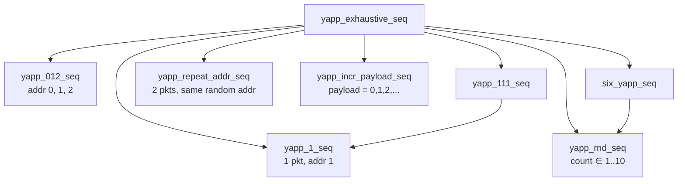

# Lab 5 — Generating UVM sequences

**Directory:** `labs/lab05_seq` · **Changed:** `sv/yapp_tx_seqs.sv` (the library),
`sv/yapp_packet.sv` (constraint fix), `tb/router_test_lib.sv` (+ 2 tests)

## Objective

Write a library of sequences, control which one runs from the test, and
understand objections and randomization failures.

## Concepts

`uvm_sequence #(T)` · `body()` · `` `uvm_do `` / `` `uvm_do_with `` ·
`` `uvm_create `` / `` `uvm_send `` · nested sequences · random sequence
properties · objections (`yapp_base_seq`) · randomization debugging



## Solution

### 1. The library — `sv/yapp_tx_seqs.sv`

```systemverilog
--8<-- "labs/lab05_seq/sv/yapp_tx_seqs.sv"
```

| Sequence | Technique |
|---|---|
| `yapp_1_seq` | `` `uvm_do_with(req, { req.addr == 2'd1; }) `` |
| `yapp_012_seq` | three `` `uvm_do_with `` with different constraints |
| `yapp_111_seq` | nested: `` `uvm_do(seq_1) `` three times |
| `yapp_repeat_addr_seq` | `rand bit [1:0] seq_addr` with `!= 3`; both items use it |
| `yapp_incr_payload_seq` | `` `uvm_create `` → `randomize()` → edit payload → `set_parity()` → `` `uvm_send `` |
| `yapp_rnd_seq` | `rand int count` in 1..10, printed in the info message |
| `six_yapp_seq` | `` `uvm_do_with(rnd_seq, { rnd_seq.count == 6; }) `` |
| `yapp_exhaustive_seq` | runs all of the above, with named handles |

### 2. The tests

```systemverilog
class incr_payload_test extends base_test;
  ...
  function void build_phase(uvm_phase phase);
    set_type_override_by_type(yapp_packet::get_type(), short_yapp_packet::get_type());
    super.build_phase(phase);
  endfunction
  function void configure_sequences();
    uvm_config_wrapper::set(this, "tb.yapp.agent.sequencer.run_phase",
                            "default_sequence", yapp_incr_payload_seq::get_type());
  endfunction
endclass
```

`exhaustive_seq_test` is identical with `yapp_exhaustive_seq`.

## Run

```bash
make run TEST=incr_payload_test XRUN_OPTS=+UVM_VERBOSITY=UVM_FULL
make run TEST=exhaustive_seq_test
make gui TEST=exhaustive_seq_test        # SimVision: -gui -access rwc
```

**Expected:** `incr_payload_test` prints one short packet whose payload reads
`0 1 2 3 …`; at `UVM_FULL` you can see `Starting default sequence
yapp_incr_payload_seq`. `exhaustive_seq_test` prints one `Executing …` line
per sequence and 1 + 3 + 3 + 2 + 1 + *count* + 6 packets, no warnings.

## The planned failure

With the Lab 4 version of `short_yapp_packet` (`addr != 2`) the run shows:

```
UVM_WARNING ... [RNDFLD] Randomization failed in uvm_do_with action
```

for every `` `uvm_do_with(req, { req.addr == 2'd2; }) ``: the inline constraint
wants address 2 and the class constraint forbids it. The simulation **does not
stop** in batch mode; the packet keeps its previous values and is still sent.

In the GUI (`-gui -access rwc`) the simulation stops at the failure and the
*Constraints Manager* lists the two conflicting constraints —
`short_yapp_packet::c_no_addr2` and the inline `req.addr == 2'b10`.

**Fix:** short packets must go to every address, so the `addr != 2`
constraint is removed from `short_yapp_packet` (that is the version in this
lab's `sv/yapp_packet.sv`). Do this before Lab 6.

## Checkpoint questions

??? question "Why do you get randomization violations?"
    Two constraints on `addr` cannot both hold: `c_no_addr2` (`addr != 2`) from
    `short_yapp_packet`, and `req.addr == 2` from `yapp_012_seq`.

??? question "What happens to the packet when a constraint violation is found?"
    `randomize()` returns 0; UVM prints a warning; the fields keep their
    previous (or default) values; the item is still handed to the driver.

??? question "How do objections keep the simulation alive here?"
    `yapp_base_seq::pre_body()` raises an objection on the sequence's
    starting phase and `post_body()` drops it. The default sequence is a root
    sequence, so its `starting_phase` is set; nested sequences see `null` and
    skip the calls.

??? question "Why is `` `uvm_create `` + `` `uvm_send `` needed for the incrementing payload?"
    `` `uvm_do `` randomizes and sends in one go. To change the payload *after*
    randomization and *before* the driver sees it you need the two halves.

## Optional

`yapp_rnd_seq` and `six_yapp_seq` are in the library and part of
`yapp_exhaustive_seq`.

## What changed since the previous lab

```bash
diff -r labs/lab04_factory labs/lab05_seq
```

* `yapp_tx_seqs.sv`: the whole library
* `yapp_packet.sv`: `c_no_addr2` removed from `short_yapp_packet`
* `incr_payload_test`, `exhaustive_seq_test`
