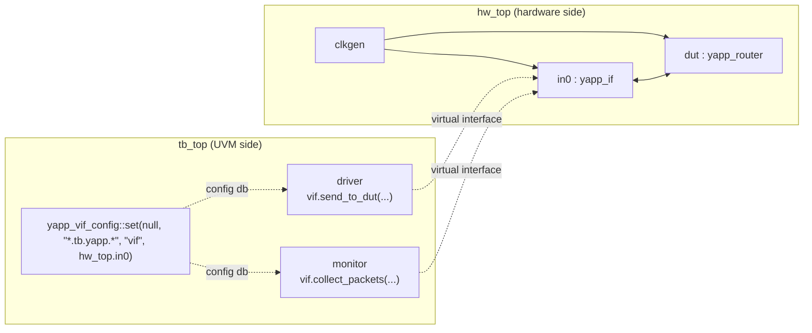

# Lab 6 — Connecting to the DUT using virtual interfaces

[Open on the project map →](../project-map.md#view=hierarchy&node=hw_top.in0){ .pm-link }


**Directory:** `labs/lab06_vif` · **New:** `sv/yapp_if.sv`, `tb/hw_top.sv`, `tb/clkgen.sv`,
`tb/tb_top.sv` (was `top.sv`), `tb/yapp_router_instance.txt` ·
**Changed:** monitor, driver, `yapp_pkg.sv`, tests, `run.f`

## Objective

Connect the YAPP UVC to the router's input port: an interface in the hardware
world, a virtual interface handle in the class world, the configuration
database between them.

## Concepts

SystemVerilog `interface` with tasks · `virtual interface` ·
`uvm_config_db #(virtual yapp_if)` · `connect_phase` `get()` · drain time ·
`hw_top` / `tb_top` split · transaction recording



## Solution

### 1. The interface — `sv/yapp_if.sv`

```systemverilog
--8<-- "labs/lab06_vif/sv/yapp_if.sv"
```

### 2. The typedef — `sv/yapp_pkg.sv`

```systemverilog
typedef uvm_config_db #(virtual yapp_if) yapp_vif_config;
```

placed before the includes so the driver, the monitor and `tb_top` can use it.

### 3. Monitor — `sv/yapp_tx_monitor.sv`

```systemverilog
--8<-- "labs/lab06_vif/sv/yapp_tx_monitor.sv"
```

### 4. Driver — `sv/yapp_tx_driver.sv`

```systemverilog
--8<-- "labs/lab06_vif/sv/yapp_tx_driver.sv"
```

(The pieces to copy are also in `sv/driver_example.sv` and
`sv/monitor_example.sv`, as the course supplies them.)

### 5. Tests — drain time and `yapp_012_test`

```systemverilog
task run_phase(uvm_phase phase);
  uvm_objection obj = phase.get_objection();
  obj.set_drain_time(this, 200ns);        // let the last packet leave the router
endtask
```

`yapp_012_test` sets `yapp_012_seq` as the default sequence: one packet per
channel makes the DUT connection easy to check.

### 6. Hardware top — `tb/hw_top.sv`

```systemverilog
--8<-- "labs/lab06_vif/tb/hw_top.sv"
```

The lab does this in two steps. **Without the DUT** the module only has the
clock, the reset and the interface, plus `in0.in_suspend <= 0` in the initial
block (nobody else drives it). **With the DUT** that line is removed — the
DUT drives `in_suspend` — the instance from `yapp_router_instance.txt` is
pasted in, and `suspend_0/1/2` are tied to `1'b0` so packets flow out.

### 7. UVM top — `tb/tb_top.sv`

```systemverilog
--8<-- "labs/lab06_vif/tb/tb_top.sv"
```

### 8. `tb/run.f`

```
--8<-- "labs/lab06_vif/tb/run.f"
```

Interfaces are **compiled**, not `` `include``d.

## Run

```bash
make run TEST=yapp_012_test
make gui TEST=yapp_012_test
```

**Expected:** three `Packet is` tables from the driver and three `Packet
collected` tables from the monitor with identical contents. In the waveform
viewer, `hw_top.in0.in_data` shows `H D D … P` for each packet and the same
bytes appear a few cycles later on `hw_top.dut.data_0`, then `data_1`, then
`data_2`. The transaction streams `Driver_YAPP_Packet` and
`Monitor_YAPP_Packet` show one bar per packet.

## Checkpoint questions

??? question "Why `set(null, "*.tb.yapp.*", …)` from `tb_top`?"
    A module has no component context, hence `null`; the instance path is then
    absolute. The wildcard matches both `uvm_test_top.tb.yapp.agent.driver`
    and `…agent.monitor`, so one `set` serves both `get`s.

??? question "Why test the return value of `get()`?"
    A missing virtual interface is a `null` handle; the first `vif.` access
    would be a null-pointer crash at run time, far from the cause. The
    `` `uvm_error("NOVIF", …) `` in `connect_phase` points straight at it.

??? question "What goes wrong without the drain time?"
    `run_phase` ends when the last sequence drops its objection — the moment
    the driver finished *sending* the last packet. The router still has the
    packet in a FIFO; the simulation stops before it comes out.

??? question "Why does the monitor sample on the rising edge when the driver drives on the falling edge?"
    The DUT samples on the rising edge, so that is where "accepted" is
    defined. Sampling on the same edge the driver uses would race with the
    driver's non-blocking assignments.

## What changed since the previous lab

```bash
diff -r labs/lab05_seq labs/lab06_vif
```

* `yapp_if.sv`, `yapp_vif_config`, `vif` in driver and monitor
* `top.sv` → `tb_top.sv` with the `set()`, new `hw_top.sv`, `clkgen.sv`
* `base_test::run_phase` drain time, `yapp_012_test`
* `run.f`: interface, RTL, `clkgen.sv`, `hw_top.sv`, `tb_top.sv`
