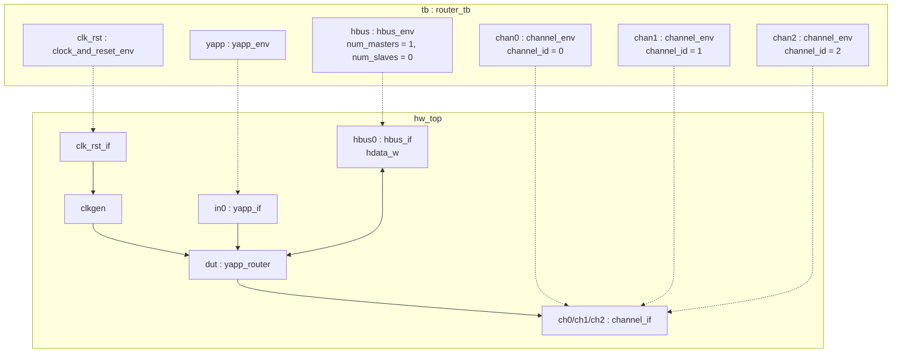

# Lab 7 — Integrating multiple UVCs

[Open on the project map →](../project-map.md#view=hierarchy&scene=h:tb){ .pm-link }


**Directory:** `labs/lab07_integ` (only `tb/`; the YAPP UVC moved to `yapp/sv`) ·
**UVCs added:** `hbus/sv`, `channel/sv`, `clock_and_reset/sv`

## Objective

Add the three "provided" UVCs — HBUS, Channel (×3) and Clock & Reset —
configure them, wire their interfaces in `hw_top` and run a test on the full
system.

## Concepts

reusing UVCs · `uvm_config_int::set` before build · several interfaces in
`hw_top` · one `set()` per virtual interface in `tb_top` · default sequences
per UVC · the `hdata_w` wire



## The provided UVCs at a glance

| UVC | Env / agent | Interface | Sequences you will use |
|---|---|---|---|
| `hbus_pkg` | `hbus_env` with `masters[0]` (driver + sequencer) and a shared `monitor` | `hbus_if` — `haddr, hen, hwr_rd, hdata, hdata_oe, **hdata_w**` | `hbus_small_packet_seq` (maxpktsize 20, enable), `hbus_large_packet_seq` (63), `hbus_read_max_pkt_seq`, `hbus_write_seq`, `hbus_read_seq` |
| `channel_pkg` | `channel_env` → `rx_agent` (driver plays the receiver, monitor, sequencer) | `channel_if` — `data, data_vld, suspend` | `channel_rx_resp_seq` (forever, random response delay) |
| `clock_and_reset_pkg` | `clock_and_reset_env` → `agent` | `clock_and_reset_if` — `clock, reset, run_clock, clock_period` + `clkgen` | `clk10_rst5_seq` |

## Solution

### 1. `tb/router_tb.sv`

```systemverilog
--8<-- "labs/lab07_integ/tb/router_tb.sv"
```

### 2. `tb/hw_top.sv`

```systemverilog
--8<-- "labs/lab07_integ/tb/hw_top.sv"
```

!!! warning "`hdata_w`, not `hdata`"
    `hbus_if.hdata` is the logic variable the master drives; `hbus_if.hdata_w`
    is the tri-state wire. Connecting the DUT's `inout hdata` to the variable
    gives a multiple-driver conflict; connect the **wire**.

### 3. `tb/tb_top.sv`

```systemverilog
--8<-- "labs/lab07_integ/tb/tb_top.sv"
```

### 4. `tb/run.f` — one incdir, one package, one interface per UVC

```
--8<-- "labs/lab07_integ/tb/run.f"
```

### 5. Tests

```systemverilog
--8<-- "labs/lab07_integ/tb/router_test_lib.sv"
```

## Run

```bash
make run TEST=base_test            # topology only -- save it, later labs need the paths
make run TEST=simple_test
make gui TEST=simple_test          # add YAPP + channel monitor transactions to the waveform
make run TEST=test_uvc_integration # optional
```

**Expected for `simple_test`:** `clk10_rst5_seq` starts the clock and holds
reset 5 cycles; `yapp_012_seq` sends three short packets; each channel
monitor prints exactly one `Channel N collected packet` whose fields equal the
YAPP packet with `addr == N`; the channel reports say `1 packets collected`
each.

**Expected for `test_uvc_integration`:** HBUS `WRITE addr=0x1000 data=0x14`
and `0x1001 data=0x01`; 88 packets; `ROUTER DROPS PACKET … length > maxpktsize`
for lengths 21 and 22, `… illegal address` for every address-3 packet; `error`
pulses in the waveform after bad-parity packets; the channel monitors together
collect 3 × 20 = 60 packets.

## Checkpoint questions

??? question "Why `uvm_config_int::set(this, "chan0", "channel_id", 0)` and not a constructor argument?"
    UVM components all share the `(name, parent)` constructor so the factory
    can create them. Per-instance values go through the configuration
    database; `channel_env` picks `channel_id` up automatically thanks to its
    `` `uvm_field_int ``.

??? question "Why no default sequence for the HBUS in `simple_test`?"
    The router's reset values (maxpktsize 63, enabled) already let short
    packets through. The HBUS stays idle; Lab 8 drives it from the
    multichannel sequence.

??? question "How can one statement configure three channel sequencers?"
    `uvm_config_wrapper::set(this, "tb.chan*.rx_agent.sequencer.run_phase", …)`:
    the instance path is a glob pattern.

??? question "Where does the reset come from now?"
    From `clock_and_reset_if`, driven by the Clock & Reset driver when
    `clk10_rst5_seq` runs. `hw_top` no longer has an `initial` block for it.

## What changed since the previous lab

```bash
diff -r labs/lab06_vif/tb labs/lab07_integ/tb
diff -r labs/lab06_vif/sv yapp/sv          # the UVC became standalone (+ later additions)
```

* `router_tb`: three channel envs, HBUS env, Clock & Reset env, their configuration
* `hw_top`: all interfaces, `clkgen` driven by the clock interface, no reset block, full DUT connection
* `tb_top`: imports and `set()` for every interface
* tests: `simple_test`, `test_uvc_integration`; older tests removed
