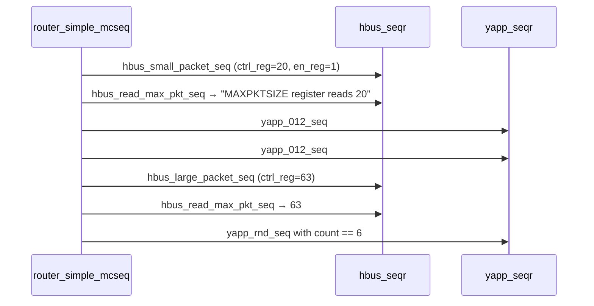

# Lab 8 — Multichannel sequences and system-level tests

[Open on the project map →](../project-map.md#view=hierarchy&node=tb.mcseqr){ .pm-link }


**Directory:** `labs/lab08_mcseq` · **New:** `tb/router_mcsequencer.sv`, `tb/router_mcseqs_lib.sv` ·
**Changed:** `router_tb.sv`, `router_test_lib.sv`, `tb_top.sv`

## Objective

Coordinate the HBUS and YAPP traffic from one place: a multichannel (virtual)
sequencer and a sequence that programs the router, sends packets, reprograms
it and sends more.

## Concepts

virtual sequencer with sub-sequencer handles · `` `uvm_declare_p_sequencer `` ·
`` `uvm_do_on `` / `` `uvm_do_on_with `` · objection on the starting phase ·
hierarchical references in `connect_phase`



## Solution

### 1. `tb/router_mcsequencer.sv`

```systemverilog
--8<-- "labs/lab08_mcseq/tb/router_mcsequencer.sv"
```

### 2. `tb/router_mcseqs_lib.sv`

```systemverilog
--8<-- "labs/lab08_mcseq/tb/router_mcseqs_lib.sv"
--8<-- "labs/lab08_mcseq/tb/mcseqs/router_mcseq_base.sv"
--8<-- "labs/lab08_mcseq/tb/mcseqs/router_simple_mcseq.sv"
```

### 3. `router_tb`: build and connect

```systemverilog
mcseqr = router_mcsequencer::type_id::create("mcseqr", this);
...
function void connect_phase(uvm_phase phase);
  // Hierarchical references, NOT configuration strings: no wildcards here
  mcseqr.hbus_seqr = hbus.masters[0].sequencer;
  mcseqr.yapp_seqr = yapp.agent.sequencer;
endfunction
```

### 4. The test

```systemverilog
class router_simple_mcseq_test extends base_test;
  ...
  function void build_phase(uvm_phase phase);
    set_type_override_by_type(yapp_packet::get_type(), short_yapp_packet::get_type());
    super.build_phase(phase);
  endfunction
  function void configure_sequences();
    set_clock_and_channel_sequences();
    uvm_config_wrapper::set(this, "tb.mcseqr.run_phase",
                            "default_sequence", router_simple_mcseq::get_type());
    // no default sequence for YAPP or HBUS: the mcseq controls them
  endfunction
endclass
```

### 5. Include order in `tb_top.sv`

```systemverilog
`include "router_mcsequencer.sv"     // router_tb has a handle of this type
`include "router_mcseqs_lib.sv"
`include "router_tb.sv"
`include "router_test_lib.sv"
```

## Run

```bash
make run TEST=router_simple_mcseq_test
```

**Expected:** in this order in the log —

```
[hbus_small_packet_seq] Executing ...
[hbus_monitor] Collected WRITE addr=0x1000 data=0x14
[hbus_monitor] Collected WRITE addr=0x1001 data=0x01
[hbus_read_max_pkt_seq] MAXPKTSIZE register reads 20
[yapp_012_seq] Executing ...  (×2, six packets, channel monitors echo them)
[hbus_monitor] Collected WRITE addr=0x1000 data=0x3f
[hbus_read_max_pkt_seq] MAXPKTSIZE register reads 63
[yapp_rnd_seq] Executing yapp_rnd_seq sequence (6 packets)
```

12 YAPP packets in total, 12 channel packets, `UVM_ERROR : 0`.

## Checkpoint questions

??? question "Why can the mcsequencer's handles not be set with `uvm_config_*`?"
    They are plain class handles assigned in SystemVerilog
    (`mcseqr.hbus_seqr = hbus.masters[0].sequencer`), so the names are
    hierarchical references checked by the compiler; wildcards have no
    meaning there.

??? question "What does `` `uvm_declare_p_sequencer `` add?"
    A member `p_sequencer` of the given type plus code that casts the
    sequence's `m_sequencer` into it when the sequence starts (and errors out
    if the sequence was started on the wrong kind of sequencer).

??? question "Who raises the objection?"
    `router_mcseq_base` on the virtual sequence's starting phase. The
    sub-sequences (`yapp_012_seq`, `hbus_*`) are children; their starting
    phase is `null`, so their own objection code is skipped.

??? question "Why six packets with `yapp_012_seq` twice rather than one sequence of six?"
    Reuse. The library already has a three-packet sequence; the multichannel
    layer composes existing sequences instead of duplicating them.

## What changed since the previous lab

```bash
diff -r labs/lab07_integ/tb labs/lab08_mcseq/tb
```
