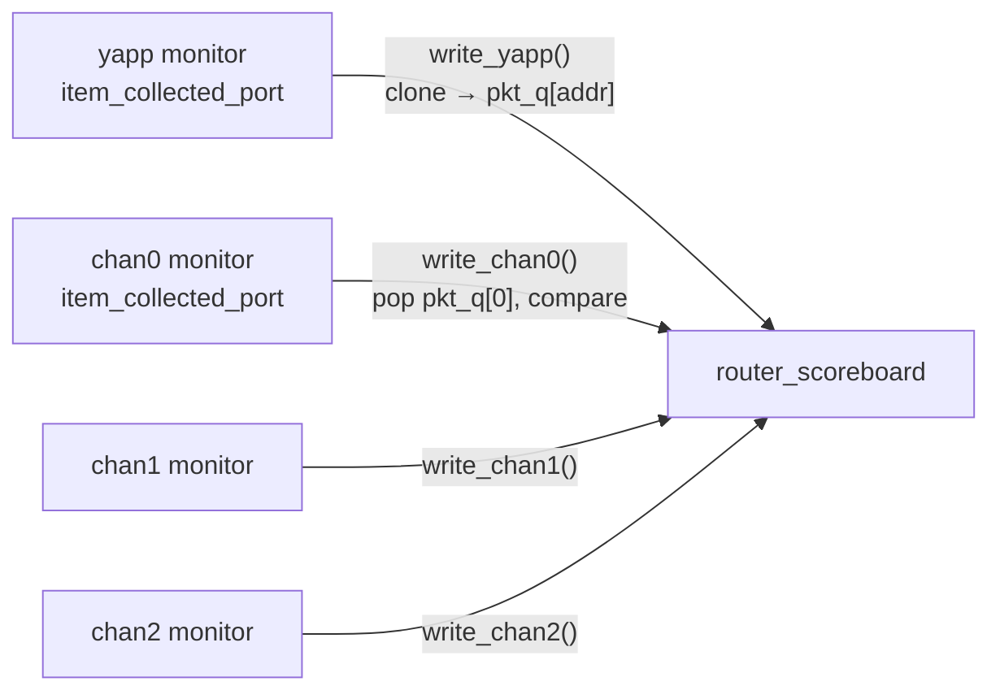

# Lab 9A — Creating a scoreboard using TLM

[Open on the project map →](../project-map.md#view=tlm&node=tb.router_module.scoreboard){ .pm-link }


**Directory:** `labs/lab09_sba` · **New:** `sv/router_scoreboard.sv`, `sv/packet_compare.sv` ·
**Changed:** `yapp_project/uvc/yapp/yapp_tx_monitor.sv` (analysis port), `tb/router_tb.sv`, `tb/tb_top.sv`, tests

## Objective

Make the tests self-checking: a scoreboard that receives every packet sent
into the router and every packet that came out, and compares.

For this first step all traffic is legal (short packets, legal addresses):
the router drops nothing.

## Concepts

`uvm_analysis_port #(T)` · `write()` · `` `uvm_analysis_imp_decl(_suffix) `` ·
`uvm_analysis_imp_suffix #(T, IMP)` · `clone()` · per-address queues ·
`report_phase`



## Solution

### 1. Analysis port in the YAPP monitor (`yapp_project/uvc/yapp/yapp_tx_monitor.sv`)

```systemverilog
uvm_analysis_port #(yapp_packet) item_collected_port;
...
function new(string name, uvm_component parent);
  super.new(name, parent);
  item_collected_port = new("item_collected_port", this);
endfunction
...
item_collected_port.write(pkt);      // after each collected packet
```

The channel monitor already had one (`yapp_project/uvc/channel/channel_rx_monitor.sv`).

### 2. The scoreboard — `sv/router_scoreboard.sv`

```systemverilog
--8<-- "labs/lab09_sba/sv/router_scoreboard.sv"
```

### 3. The comparison — `sv/packet_compare.sv` (included in the class)

```systemverilog
--8<-- "labs/lab09_sba/sv/packet_compare.sv"
```

### 4. `router_tb`: build and connect

```systemverilog
scoreboard = router_scoreboard::type_id::create("scoreboard", this);
...
yapp.agent.monitor.item_collected_port.connect(scoreboard.yapp_in);
chan0.rx_agent.monitor.item_collected_port.connect(scoreboard.chan0_in);
chan1.rx_agent.monitor.item_collected_port.connect(scoreboard.chan1_in);
chan2.rx_agent.monitor.item_collected_port.connect(scoreboard.chan2_in);
```

`tb_top.sv` includes `router_scoreboard.sv` (before `router_tb.sv`), `run.f`
gets `-incdir ../sv`.

## Run

```bash
make run TEST=router_simple_mcseq_test    # legal traffic
make run TEST=scoreboard_drop_test        # negative check (step 7)
```

**Expected, `router_simple_mcseq_test`:**

```
--- Scoreboard report ---
  packets received  : 12
  packets matched   : 12
  packets mismatched: 0
  packets unexpected: 0
  left in queue 0/1/2: 0 / 0 / 0
```

**Expected, `scoreboard_drop_test`** (no short-packet override, `maxpktsize`
= 20 during the first six packets): `yapp_packet` tables with random
lengths; `ROUTER DROPS PACKET … length > maxpktsize` for every packet longer
than 20; `UVM_ERROR … [PKT_COMPARE] Length mismatch` / `… MISMATCH` when the
next packet on that channel is compared against the dropped one; at the end
`packets received == matched + mismatched + left in queues`.

## Checkpoint questions

??? question "Why clone in `write_yapp()`?"
    `write()` passes the monitor's handle. The scoreboard stores it in a queue
    for later; if the monitor reused the object the queued packet would change.
    (Our monitors create a new object per packet anyway — the clone makes the
    scoreboard safe with *any* monitor.)

??? question "Why four imps instead of one?"
    An imp binds to one `write()` method. Four producers must be told apart, so
    `` `uvm_analysis_imp_decl(_yapp) `` etc. create imp flavours bound to
    `write_yapp()`, `write_chan0()`, …

??? question "Why a queue per address and not one queue?"
    Packets to different channels can leave the router in a different order
    than they entered (a slow receiver on channel 0 does not delay channel 1).
    Within one channel the order is preserved — a FIFO per channel models
    exactly that.

??? question "Do the numbers add up in the negative test?"
    They must: every received packet is either matched, mismatched, or still
    waiting in a queue (dropped by the router, so its channel packet never
    arrived). If not, the scoreboard lost a packet.

## Optional

`comp_equal_uvm()` in `packet_compare.sv` uses `uvm_comparer` instead of
`!=`. Swap the call in `check_channel()` to try it.

## What changed since the previous lab

```bash
diff -r labs/lab08_mcseq/tb labs/lab09_sba/tb
```
