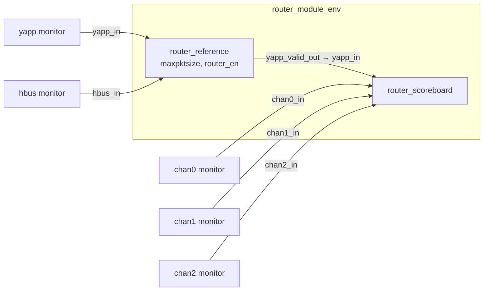

# Lab 9B — Router module UVC

**Directory:** `labs/lab09_sbb` · **New:** `sv/router_reference.sv`, `sv/router_module_env.sv`,
`sv/router_module_pkg.sv` · **Changed:** `tb/router_tb.sv`, `tb/tb_top.sv`, `run.f` ·
**Result copied to:** `router/sv`

## Objective

Turn the scoreboard into a reusable **module UVC**: an env that also contains
a reference model which knows — from the HBUS traffic — which packets the
router will drop.

## Concepts

module UVC vs interface UVC · reference model · mirroring register settings
from bus traffic · layered TLM connections · UVC package



## Solution

### 1. The reference model — `sv/router_reference.sv`

```systemverilog
--8<-- "labs/lab09_sbb/sv/router_reference.sv"
```

### 2. The env — `sv/router_module_env.sv`

```systemverilog
--8<-- "labs/lab09_sbb/sv/router_module_env.sv"
```

### 3. The package — `sv/router_module_pkg.sv`

```systemverilog
--8<-- "labs/lab09_sbb/sv/router_module_pkg.sv"
```

### 4. `router_tb`: connect through the layer

```systemverilog
router_module = router_module_env::type_id::create("router_module", this);
...
yapp.agent.monitor.item_collected_port.connect(router_module.reference.yapp_in);
hbus.monitor.item_collected_port.connect(router_module.reference.hbus_in);
chan0.rx_agent.monitor.item_collected_port.connect(router_module.scoreboard.chan0_in);
chan1.rx_agent.monitor.item_collected_port.connect(router_module.scoreboard.chan1_in);
chan2.rx_agent.monitor.item_collected_port.connect(router_module.scoreboard.chan2_in);
```

`tb_top.sv` imports `router_module_pkg` instead of including the scoreboard;
`run.f` compiles `../sv/router_module_pkg.sv` after the three UVC packages it
imports.

## Run

```bash
make run TEST=router_simple_mcseq_test
make run TEST=scoreboard_drop_test
```

**Expected:** `router_simple_mcseq_test` as in 9A (12/12). The interesting
one is **`scoreboard_drop_test`**: the same oversized packets are dropped by
the router, but now the reference model drops them too —

```
[router_reference] Packet dropped: length 47 > maxpktsize 20
...
--- Reference model report ---
  forwarded to scoreboard   : N
  dropped (oversized)       : 12 - N
--- Scoreboard report ---
  packets received  : N
  packets matched   : N
  packets mismatched: 0
  left in queue 0/1/2: 0 / 0 / 0
```

`UVM_ERROR : 0`. The test is self-checking even with illegal traffic.

## Checkpoint questions

??? question "What is the difference between an interface UVC and a module UVC?"
    An interface UVC drives and monitors *pins* (driver, sequencer, monitor,
    interface). A module UVC works on *transactions* it receives from the
    interface UVCs: reference models, scoreboards, coverage. It has no
    interface and generates no stimulus; it belongs to this DUT.

??? question "Why does the reference model mirror the registers from the monitor rather than ask the sequence?"
    Because the monitor sees what *really* happened on the bus, whatever the
    sequence intended — including register writes done by a different
    sequence, by the register model (Lab 11) or by a bug.

??? question "Why can `router_reference` reuse `uvm_analysis_imp_yapp`?"
    The `` `uvm_analysis_imp_decl(_yapp) `` macro defines a *parameterized*
    class once. `uvm_analysis_imp_yapp #(yapp_packet, router_reference)` and
    `uvm_analysis_imp_yapp #(yapp_packet, router_scoreboard)` are two
    specializations of it. Only new suffixes need a new macro call (`_hbus`).

??? question "Where should the decision rules live — reference model or scoreboard?"
    In the reference model. The scoreboard then stays a pure "compare in
    order" component that could be reused for a router with different rules.

## What changed since the previous lab

```bash
diff -r labs/lab09_sba labs/lab09_sbb
```
