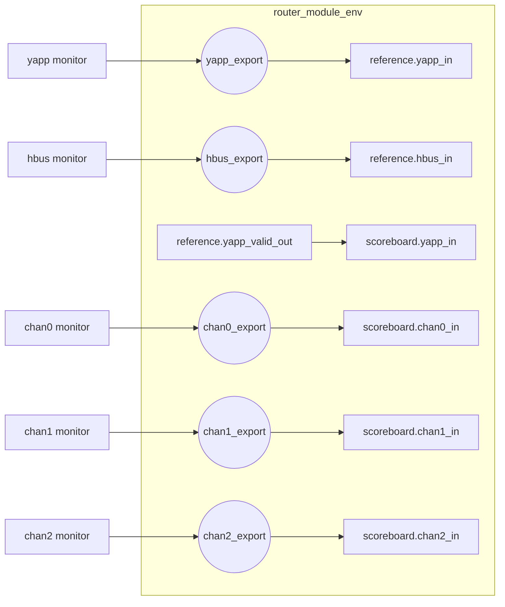

# Lab 9C — Using TLM export connectors *(optional)*

[Open on the project map →](../project-map.md#view=hierarchy&scene=h:tb.router_module){ .pm-link }


**Directory:** `labs/lab09_sbc` · **Changed:** `sv/router_module_env.sv`, `tb/router_tb.sv`

## Objective

Expose all connection points of the module UVC at the env level with
**exports**, so the testbench never reaches into the env.

## Why

An interface UVC always has its analysis ports in the monitor — you know where
to look. In a module UVC the imps can be anywhere inside. Exports put them at
the top.



## Solution

### 1. `sv/router_module_env.sv`

```systemverilog
--8<-- "labs/lab09_sbc/sv/router_module_env.sv"
```

### 2. `router_tb.connect_phase`

```systemverilog
yapp.agent.monitor.item_collected_port.connect(router_module.yapp_export);
hbus.monitor.item_collected_port.connect(router_module.hbus_export);
chan0.rx_agent.monitor.item_collected_port.connect(router_module.chan0_export);
chan1.rx_agent.monitor.item_collected_port.connect(router_module.chan1_export);
chan2.rx_agent.monitor.item_collected_port.connect(router_module.chan2_export);
```

## Run

```bash
make run TEST=router_simple_mcseq_test
make run TEST=scoreboard_drop_test
```

**Expected:** identical results to Lab 9B — this lab changes the wiring, not
the behaviour.

## Checkpoint questions

??? question "What does an export add that a port or an imp does not?"
    Nothing functionally — it is a pass-through. It adds *encapsulation*: the
    env's internal structure (where the imps live) can change without touching
    the testbench.

??? question "Why does the internal `yapp_valid_out → scoreboard.yapp_in` link stay inside?"
    It connects two components of the module UVC to each other; the outside
    world has no business with it.

??? question "Exports are constructed in `new()` — why not in `build_phase`?"
    Both work; TLM objects are not components, so they can be created in the
    constructor, and doing so guarantees they exist before anybody connects
    to them in a `connect_phase`.

## What changed since the previous lab

```bash
diff labs/lab09_sbb/sv/router_module_env.sv labs/lab09_sbc/sv/router_module_env.sv
diff labs/lab09_sbb/tb/router_tb.sv labs/lab09_sbc/tb/router_tb.sv
```
