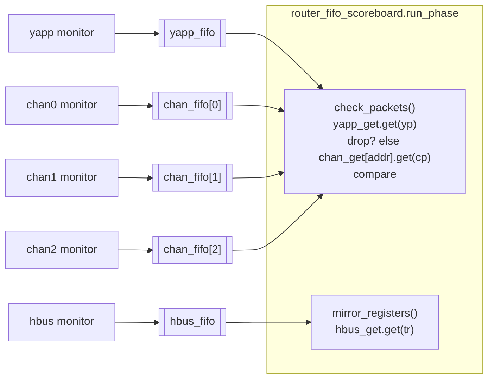

# Lab 9D — Using TLM analysis FIFOs *(optional)*

[Open on the project map →](../project-map.md#view=tlm&scene=tlm:lab09d&node=tb.fifo_sb){ .pm-link }


**Directory:** `labs/lab09_sbd` · **New:** `sv/router_fifo_scoreboard.sv` · **Changed:** `tb/router_tb.sv`

## Objective

Build the same checker as a **process** on top of `uvm_tlm_analysis_fifo`s and
blocking `get()` calls instead of `write()` callbacks.

## Concepts

`uvm_tlm_analysis_fifo #(T)` · `analysis_export` / `get_peek_export` ·
`uvm_get_port #(T)` · blocking `get()` · `fork` · `check_phase`



## Solution

### 1. `sv/router_fifo_scoreboard.sv`

```systemverilog
--8<-- "labs/lab09_sbd/sv/router_fifo_scoreboard.sv"
```

### 2. `router_tb`: FIFO scoreboard instead of the module env

```systemverilog
fifo_sb = router_fifo_scoreboard::type_id::create("fifo_sb", this);
...
yapp.agent.monitor.item_collected_port.connect(fifo_sb.yapp_export);
hbus.monitor.item_collected_port.connect(fifo_sb.hbus_export);
chan0.rx_agent.monitor.item_collected_port.connect(fifo_sb.chan_export[0]);
chan1.rx_agent.monitor.item_collected_port.connect(fifo_sb.chan_export[1]);
chan2.rx_agent.monitor.item_collected_port.connect(fifo_sb.chan_export[2]);
```

## Run

```bash
make run TEST=router_simple_mcseq_test
make run TEST=scoreboard_drop_test
```

**Expected:** `--- FIFO scoreboard report ---` with 12 received / 12 matched
(first test) or N matched + the dropped counts (second), every FIFO empty in
`check_phase`, `UVM_ERROR : 0`.

## Checkpoint questions

??? question "Why must every monitor create a new object per transaction here?"
    The FIFO stores the **handle** it is given and never clones. Reusing one
    object in the monitor would make every entry of the FIFO point to the
    same, latest packet.

??? question "What can the process style do that the callback style cannot?"
    Wait. `check_packets()` blocks on the YAPP FIFO, then blocks on the right
    channel FIFO — "first A, then B" expressed in two lines. A `write()`
    function cannot consume time or block.

??? question "Why is the HBUS handled in a parallel thread?"
    Register writes and packets arrive independently. If the main loop also
    waited for HBUS transactions it would deadlock when none come; a second
    thread keeps the mirror current without coupling the two streams.

??? question "What does `check_phase` add that `report_phase` does not?"
    `check_phase` is where end-of-test *checks* belong (errors), `report_phase`
    is for *statistics*. A non-empty FIFO at the end means a packet never came
    out — an error, not a number.

## What changed since the previous lab

```bash
diff -r labs/lab09_sbc labs/lab09_sbd
```
