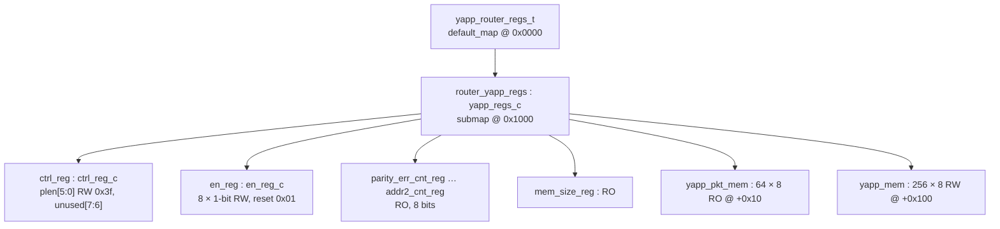

# Lab 11A — Register model: generation

[Open on the project map →](../project-map.md#view=classes&scene=uml:yapp_router_reg_pkg){ .pm-link }


**Directory:** `labs/lab11a_rm_gen` · **Files:** `yapp_router_regs.xml`, `yapp_router_reg_pkg.sv`,
`quicktest.sv`, `run.f`, `Makefile`

## Objective

Get a UVM register model of the router and inspect it: hierarchy, reset
values, access policies, address map.

## About the generation step

The course generates the model from an IP-XACT description with Cadence's
`reg_verifier`:

```
reg_verifier -domain uvmreg -top yapp_router_regs.xml -dut yapp_router_regs \
             -out_file yapp_router_regs -quicktest -cov -pkg yapp_router_reg_pkg
```

That tool is not available here, so `yapp_router_reg_pkg.sv` was **written by
hand** with the same structure and class names the manual refers to. The
IP-XACT file is kept as the single human-readable source of the register map.



## Solution

### 1. The IP-XACT file — `yapp_router_regs.xml`

??? example "yapp_router_regs.xml"
    ```xml
    --8<-- "labs/lab11a_rm_gen/yapp_router_regs.xml"
    ```

### 2. The model — `yapp_router_reg_pkg.sv`

```systemverilog
--8<-- "labs/lab11a_rm_gen/yapp_router_reg_pkg.sv"
--8<-- "labs/lab11a_rm_gen/reg/ctrl_reg_c.sv"
--8<-- "labs/lab11a_rm_gen/reg/en_reg_c.sv"
--8<-- "labs/lab11a_rm_gen/reg/ro_byte_reg_c.sv"
--8<-- "labs/lab11a_rm_gen/reg/parity_err_cnt_reg_c.sv"
--8<-- "labs/lab11a_rm_gen/reg/oversized_pkt_cnt_reg_c.sv"
--8<-- "labs/lab11a_rm_gen/reg/addr3_cnt_reg_c.sv"
--8<-- "labs/lab11a_rm_gen/reg/addr0_cnt_reg_c.sv"
--8<-- "labs/lab11a_rm_gen/reg/addr1_cnt_reg_c.sv"
--8<-- "labs/lab11a_rm_gen/reg/addr2_cnt_reg_c.sv"
--8<-- "labs/lab11a_rm_gen/reg/mem_size_reg_c.sv"
--8<-- "labs/lab11a_rm_gen/reg/yapp_pkt_mem_c.sv"
--8<-- "labs/lab11a_rm_gen/reg/yapp_mem_c.sv"
--8<-- "labs/lab11a_rm_gen/reg/yapp_regs_c.sv"
--8<-- "labs/lab11a_rm_gen/reg/yapp_router_regs_t.sv"
```

### 3. The quick test — `quicktest.sv`

```systemverilog
--8<-- "labs/lab11a_rm_gen/quicktest.sv"
```

`model.print()` is called **after** `model.reset()` so the printed mirrored
values are the reset values; `model.default_map.print()` shows the addresses.

## Run

```bash
cd labs/lab11a_rm_gen && make run_test
```

**Expected:** a tree `model (yapp_router_regs_t) → router_yapp_regs
(yapp_regs_c) → ctrl_reg … yapp_mem`, each register with its fields, access
and reset value; then the map with `ctrl_reg @0x1000`, `en_reg @0x1001`, …,
`mem_size_reg @0x100d`, `yapp_pkt_mem @0x1010`, `yapp_mem @0x1100`.

## Checkpoint questions

??? question "Access policy of `ctrl_reg`? Of `addr0_cnt_reg`?"
    `ctrl_reg` is read-write (`RW`), `addr0_cnt_reg` read-only (`RO`) — both in
    the XML (`<spirit:access>`) and in the model (`configure(..., "RW"/"RO", ...)`).

??? question "What is the model's top type?"
    `yapp_router_regs_t`. The testbench declares `yapp_router_regs_t yapp_rm;`.

??? question "Reset value of `ctrl_reg.plen`? Size of `yapp_pkt_mem`? Policy of `addr3_cnt_reg`?"
    `0x3f` (63); 64 locations of 8 bits; `RO`.

??? question "Address of `mem_size_reg`? Start of the packet memory?"
    `0x100d`; `0x1010`.

??? question "Why `plen` and not `maxpktsize`?"
    The lab's IP-XACT names the field `plen`; the project overview calls the
    same bits `maxpktsize`. The model follows the IP-XACT name so the Lab 11
    text matches; the comments say both.

## What changed since the previous lab

This lab is standalone: no DUT, no bus, no testbench.
