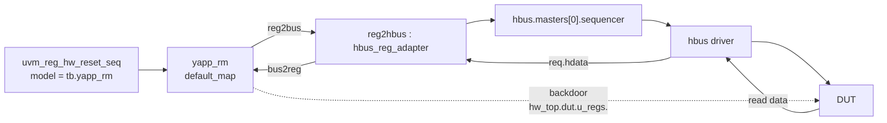

# Lab 11B — Register model: integration

[Open on the project map →](../project-map.md#view=hierarchy&node=tb.yapp_rm){ .pm-link }


**Directory:** `labs/lab11b_rm_integ` · **New in `tb/`:** `yapp_router_reg_pkg.sv` (copied from 11A) ·
**Changed:** `router_tb.sv`, `tb_top.sv`, `router_test_lib.sv`, `run.f` (`-access +rwc`)

## Objective

Put the register model into the testbench, connect its front door to the HBUS
UVC through an adapter, and run the built-in reset and memory-walk sequences.

## Concepts

`uvm_reg_block::build()` / `lock_model()` · `set_hdl_path_root()` ·
`set_auto_predict()` · `uvm_reg_adapter` · `uvm_reg_map::set_sequencer()` ·
`uvm_reg_hw_reset_seq` · `uvm_mem_walk_seq`



## Solution

### 1. `router_tb`

```systemverilog
--8<-- "labs/lab11b_rm_integ/tb/router_tb.sv"
```

Step by step in `build_phase`:

| Call | Effect |
|---|---|
| `yapp_rm = yapp_router_regs_t::type_id::create("yapp_rm")` | the model is an object, no parent |
| `yapp_rm.build()` | creates sub-block, registers, fields, memories, maps |
| `yapp_rm.lock_model()` | no more structural changes; addresses are computed |
| `yapp_rm.set_hdl_path_root("hw_top.dut.u_regs")` | backdoor paths become `hw_top.dut.u_regs.ctrl_reg`, … — `u_regs` is the `yapp_hbus_regs` instance that holds every register and memory of the router |
| `yapp_rm.default_map.set_auto_predict(1)` | the mirror follows every front-door access |
| `reg2hbus = hbus_reg_adapter::type_id::create("reg2hbus")` | the translator |

and in `connect_phase`: `yapp_rm.default_map.set_sequencer(hbus.masters[0].sequencer, reg2hbus)`.

### 2. The adapter (already in the HBUS UVC)

```systemverilog
--8<-- "yapp_project/uvc/hbus/hbus_reg_adapter.sv"
```

### 3. `tb_top`: import the package before `router_tb`

```systemverilog
import router_module_pkg::*;
import yapp_router_reg_pkg::*;     // before router_tb, which uses yapp_router_regs_t
```

### 4. The tests

```systemverilog
class uvm_reset_test extends base_test;
  ...
  task run_phase(uvm_phase phase);
    uvm_reg_hw_reset_seq reset_seq;
    super.run_phase(phase);
    phase.raise_objection(this);
    reset_seq = uvm_reg_hw_reset_seq::type_id::create("reset_seq");
    reset_seq.model = tb.yapp_rm;
    reset_seq.start(null);          // the map knows the sequencer
    phase.drop_objection(this);
  endtask
endclass
```

`uvm_mem_walk_test` is the same with `uvm_mem_walk_seq`.

### 5. `run.f`

`yapp_router_reg_pkg.sv` is compiled from `tb/`; `-access +rwc` is required
for backdoor access.

## Run

```bash
make run TEST=uvm_reset_test
make run TEST=uvm_mem_walk_test
make run TEST=uvm_mem_walk_test XRUN_OPTS="-define INJECT_ERROR"
```

With Verilator: `make sim TEST=uvm_mem_walk_test DEFINES=INJECT_ERROR` (a separate
build in `build/sim/<dir>__INJECT_ERROR/`). `make regress` runs that build too and
counts it as passed only when the walk reports the error.

**Expected:**

* `uvm_reset_test`: the topology shows `yapp_rm` under `tb` (`router_tb::do_print`
  calls `printer.print_object("yapp_rm", yapp_rm)`); the HBUS monitor logs one `READ` per register
  (`0x1000`, `0x1001`, `0x1004` … `0x100d`); `UVM_ERROR : 0`.
* `uvm_mem_walk_test`: HBUS traffic over `0x1100..0x11ff` only (`yapp_pkt_mem`
  is RO and skipped); the HBUS report says **511 writes, 255 reads**.
* with `INJECT_ERROR`: `UVM_ERROR … [uvm_mem_walk_seq] Memory … read back as
  … instead of …` at address `0x112a`.

## Checkpoint questions

??? question "Why does the register sequence start with `start(null)`?"
    A register sequence does not run on a UVM sequencer directly. It calls the
    model, whose map was told (`set_sequencer`) which sequencer and adapter to
    use for the bus traffic.

??? question "Why `provides_responses = 0` in the adapter?"
    The HBUS driver writes the read data into the *request* item
    (`req.hdata`) before `item_done()`. The map reads it back from that same
    object via `bus2reg`; no separate response item is needed.

??? question "Why 511 writes and 255 reads for a 256-location memory?"
    The walk writes `~k` to location k, then for k ≥ 1 reads back k-1 and
    rewrites it with k-1: 256 + 255 writes and 255 reads.

??? question "What does `set_auto_predict(1)` change?"
    Every front-door `write`/`read` updates the mirrored value in the model.
    Without it a separate predictor component fed by the bus monitor would be
    needed to keep the mirror in sync.

## What changed since the previous lab

```bash
diff -r labs/lab09_sbc/tb labs/lab11b_rm_integ/tb
```
