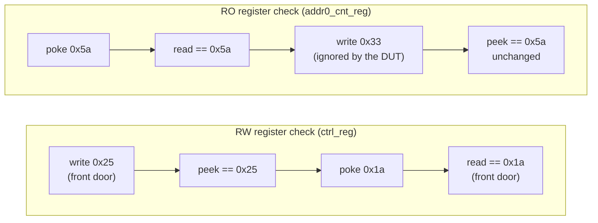

# Lab 11C — Register model: simulation

[Open on the project map →](../project-map.md#view=classes&node=cls:reg_access_test){ .pm-link }


**Directory:** `labs/lab11c_rm_sim` · **Changed:** `tb/router_test_lib.sv` (+ 4 tests)

## Objective

Write your own register stimulus: check that registers can be accessed as
specified (RW vs RO, front door vs backdoor), then check that the enable bits
and counters *behave*.

## Concepts

`write` / `read` (front door) · `peek` / `poke` (backdoor) · `predict` ·
`set_check_on_read` · introspection (`get_registers`, `get_rights`)



## Solution

```systemverilog
--8<-- "labs/lab11c_rm_sim/tb/router_test_lib.sv"
--8<-- "labs/lab11c_rm_sim/tb/tests/base_test.sv"
--8<-- "labs/lab11c_rm_sim/tb/tests/uvm_reset_test.sv"
--8<-- "labs/lab11c_rm_sim/tb/tests/uvm_mem_walk_test.sv"
--8<-- "labs/lab11c_rm_sim/tb/tests/reg_access_test.sv"
--8<-- "labs/lab11c_rm_sim/tb/tests/reg_function_test.sv"
--8<-- "labs/lab11c_rm_sim/tb/tests/reg_function_check_test.sv"
--8<-- "labs/lab11c_rm_sim/tb/tests/reg_introspection_test.sv"
```

| Test | What it does |
|---|---|
| `reg_access_test` | `check_rw_register(ctrl_reg)` and `check_ro_register(addr0_cnt_reg)` with every access logged at `UVM_NONE` |
| `reg_function_test` | `en_reg = 0x01` → `yapp_012_seq` → counters still 0; `en_reg = 0xff` → `yapp_012_seq` ×2 → `addr0/1/2 == 2`, `addr3 == 0`, parity counter == bad-parity packets seen by the monitor, oversized == 0 |
| `reg_function_check_test` *(opt.)* | same, with `set_check_on_read(1)`; `check_counter` calls `predict(expected)` before `read()` so the automatic check passes |
| `reg_introspection_test` *(opt.)* | asks the model for all registers, splits them into RW / RO queues with `get_rights()`, runs the access checks over every register |

The test gets its register handles in `connect_phase` with hierarchical
references — `regs = tb.yapp_rm.router_yapp_regs` (path from the topology
report of Lab 11B) and `yapp_seqr = tb.yapp.agent.sequencer` — and starts the
YAPP sequence explicitly with `seq.start(yapp_seqr)` inside its own objection.

## Run

```bash
make run TEST=reg_access_test
make run TEST=reg_function_test
make run TEST=reg_function_check_test
make run TEST=reg_introspection_test
```

**Expected:**

* `reg_access_test`: eight `[REG_ACCESS]` lines; the RO write produces an HBUS
  `WRITE addr=0x1009` in the monitor log but the following `peek` still
  returns `0x5a`; `UVM_ERROR : 0`.
* `reg_function_test`: `addr*_cnt_reg reads 0 as expected` ×4, then
  `addr0_cnt_reg reads 2`, `addr1_cnt_reg reads 2`, `addr2_cnt_reg reads 2`,
  `addr3_cnt_reg reads 0`, `parity_err_cnt_reg reads N` (N = bad-parity
  packets among the last six), `oversized_pkt_cnt_reg reads 0`.
* `reg_function_check_test`: same values, 0 errors. Comment out the
  `predict()` call to see the check-on-read errors the lab talks about.
* `reg_introspection_test`: `RW register: ctrl_reg @ 0x1000`, `RW register:
  en_reg @ 0x1001`, seven `RO register:` lines, then the access checks for all
  nine registers, 0 errors.

## Checkpoint questions

??? question "What happens when you write to an RO register?"
    The front-door write *does* produce an HBUS write cycle (you see it in the
    monitor); the DUT ignores it; the model's mirror does not change because
    the field policy is `RO`; the following `peek` proves the hardware value
    is unchanged.

??? question "Why do the parity-error expectations use `tb.yapp.agent.monitor.num_bad_parity`?"
    `yapp_012_seq` randomizes `parity_type` (5:1 good:bad), so the number of
    bad packets differs per seed. The monitor counts what was actually sent;
    the DUT's counter must agree.

??? question "Why does check-on-read fail for the counters without `predict()`?"
    The counters change inside the DUT without any bus traffic, so the mirror
    (last read / reset value) is stale. `predict()` loads the value the test
    expects; `read()` then compares the DUT against it.

??? question "Why do the reserved bits not get in the way here?"
    This DUT stores all 8 bits of `ctrl_reg` and `en_reg` and `poke` writes
    all 8 bits of `mem_size_reg`, so round trips are exact. On a DUT that
    hard-wires reserved bits to 0, the test values would have to avoid them
    (the lab's warning).

## What changed since the previous lab

```bash
diff labs/lab11b_rm_integ/tb/router_test_lib.sv labs/lab11c_rm_sim/tb/router_test_lib.sv
```
