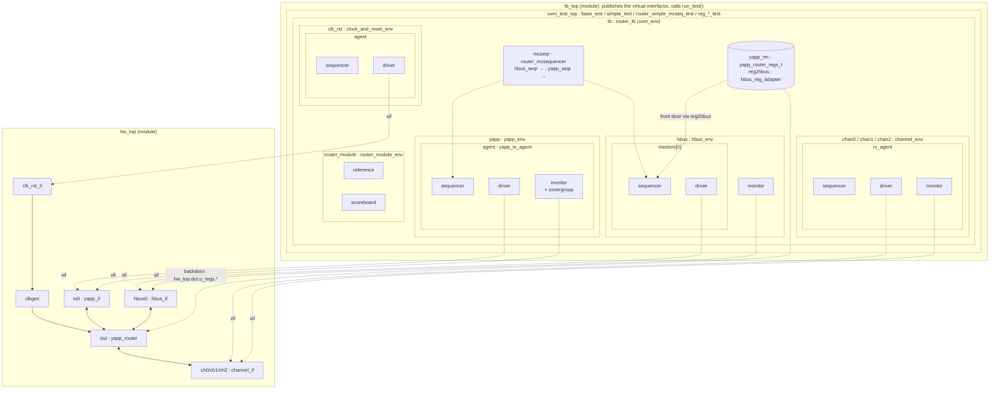
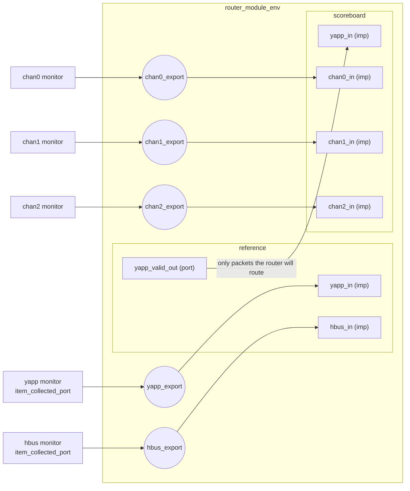
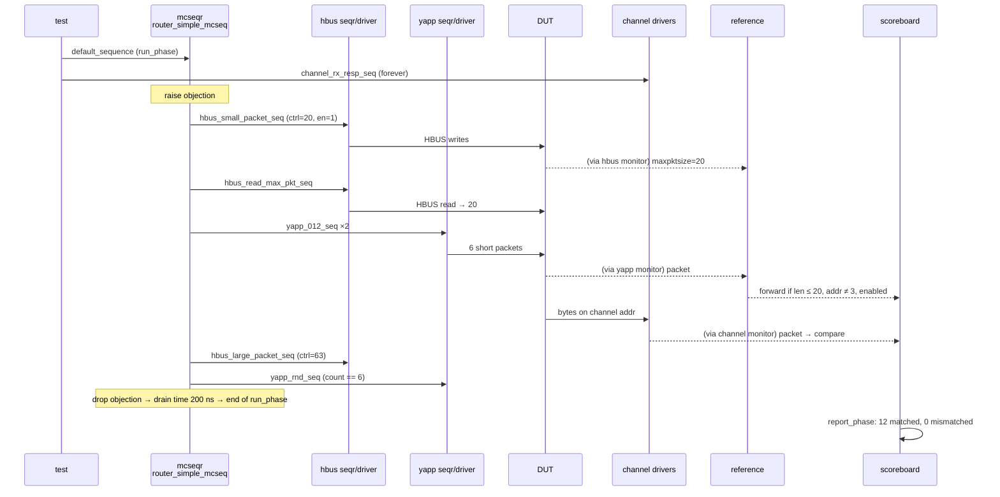

# Project architecture

[Open on the project map →](../project-map.md#view=hierarchy&scene=h:root){ .pm-link }

This is what the testbench looks like once every lab is done
(`labs/lab11c_rm_sim`). Each lab page has the sub-diagram for its own stage.

## Component tree

### Instance paths

These are the names you use in `uvm_config_*::set` calls and hierarchical
references. They come straight from `uvm_top.print_topology()`.

| Path | Type | Used for |
|---|---|---|
| `tb.yapp.agent.sequencer` | `yapp_tx_sequencer` | YAPP default sequence; `mcseqr.yapp_seqr` |
| `tb.yapp.agent.monitor` | `yapp_tx_monitor` | `item_collected_port`, coverage, `num_bad_parity` |
| `tb.chan*.rx_agent.sequencer` | `channel_rx_sequencer` | `channel_rx_resp_seq` (one wildcard for all three) |
| `tb.hbus.masters[0].sequencer` | `hbus_master_sequencer` | `mcseqr.hbus_seqr`; register map sequencer |
| `tb.hbus.monitor` | `hbus_monitor` | `item_collected_port` → reference model |
| `tb.clk_rst.agent.sequencer` | `clock_and_reset_sequencer` | `clk10_rst5_seq` |
| `tb.mcseqr` | `router_mcsequencer` | `router_simple_mcseq` |
| `tb.router_module` | `router_module_env` | exports `yapp_export`, `hbus_export`, `chan0..2_export` |
| `tb.yapp_rm.router_yapp_regs` | `yapp_regs_c` | register handles in the Lab 11 tests |

## TLM connections

* **ports** (`uvm_analysis_port`) are owned by producers (monitors). `write()`
  on a port calls `write()` on every connected imp — synchronously, in the
  producer's thread.
* **imps** (`uvm_analysis_imp_<suffix>`) are owned by consumers and bound to a
  `write_<suffix>()` method.
* **exports** forward: they let an env expose an imp that lives deeper inside.

## Data flow of one test: `router_simple_mcseq_test`

## Files of the final environment

The final environment is `yapp_project/` (`rtl/`, `uvc/`, `tb/`); the lab column says
where each file first appears. Every class has its own file, with `extern` prototypes
in the class and the method bodies after `endclass`; sequences spell out
`start_item` / `randomize` / `finish_item` instead of `uvm_do*`, and data items
implement their `do_*` methods instead of using `uvm_field_*` macros
(see [Component guides](../components/index.md)).

| File | Class / module | Lab |
|---|---|---|
| `yapp_project/uvc/yapp/yapp_packet.sv` | `yapp_packet`, `short_yapp_packet`, `parity_type_e` | 1, 4 |
| `yapp_project/uvc/yapp/yapp_tx_driver.sv` | `yapp_tx_driver` | 3, 6 |
| `yapp_project/uvc/yapp/yapp_tx_sequencer.sv` | `yapp_tx_sequencer` | 3 |
| `yapp_project/uvc/yapp/yapp_tx_monitor.sv` | `yapp_tx_monitor` (+ analysis port, covergroup) | 3, 6, 9A, 10 |
| `yapp_project/uvc/yapp/yapp_tx_agent.sv`, `yapp_env.sv` | `yapp_tx_agent`, `yapp_env` | 3, 4 |
| `yapp_project/uvc/yapp/yapp_tx_seqs.sv` | the sequence library | 3, 5, 7, 10 |
| `yapp_project/uvc/yapp/yapp_if.sv` | `yapp_if` | 6 |
| `yapp_project/uvc/hbus/*`, `yapp_project/uvc/channel/*`, `yapp_project/uvc/clock_and_reset/*` | the provided UVCs | 7 |
| `yapp_project/tb/router_tb.sv` | `router_tb` | 2 → 11B |
| `yapp_project/tb/router_test_lib.sv` + `tests/` | the tests, one class per file | 2 → 11C |
| `yapp_project/tb/hw_top.sv`, `tb_top.sv` | top modules | 6, 7 |
| `yapp_project/tb/router_mcsequencer.sv`, `router_mcseqs_lib.sv` + `mcseqs/` | virtual sequencer and sequences | 8 |
| `yapp_project/uvc/router/router_scoreboard.sv`, `router_reference.sv`, `router_module_env.sv`, `router_fifo_scoreboard.sv` | router module UVC | 9A–9D |
| `yapp_project/tb/yapp_router_reg_pkg.sv` + `reg/` | register model | 11A |
| `yapp_project/rtl/yapp_router.sv`, `yapp_input_fsm.sv`, `yapp_output_channel.sv`, `yapp_fifo.sv`, `yapp_hbus_regs.sv`, `yapp_error_timer.sv` (`yapp_router.f`) | the DUT, one module per file | — |
