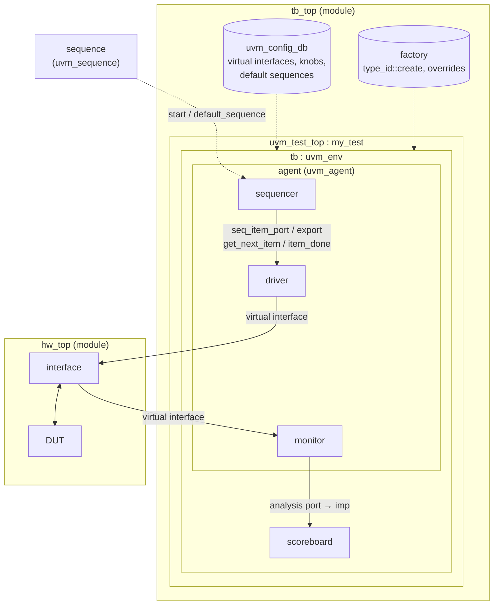
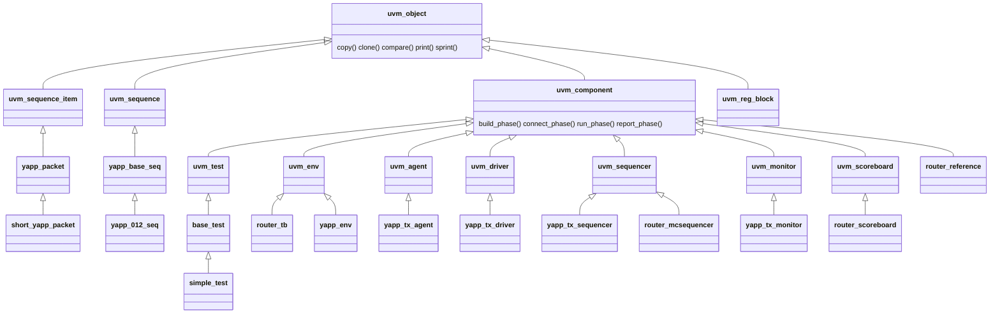

# UVM — the big picture

UVM is a class library plus a set of conventions for building **reusable,
layered testbenches**. The point of the layers is separation of concerns:

* **tests** say *what* to do (which sequences, which configuration),
* **sequences** say *which transactions* to generate,
* **drivers** say *how a transaction becomes pin wiggles*,
* **monitors** turn pin wiggles back into transactions,
* **scoreboards and reference models** decide whether the DUT did the right
  thing,
* **the environment** wires all of it together and is reused unchanged by
  every test.

## A generic UVM testbench

Reading the diagram:

* Everything inside `uvm_test_top` is a **component**: it has a name, a parent
  and goes through the **phases** (`build`, `connect`, `run`, `report`, ...).
* A **sequence** is *not* a component. It is an object that is started on a
  sequencer and produces **sequence items** (transactions).
* The two halves of the testbench — the class-based UVM side and the
  module-based hardware side — meet at the **interface**: the UVM side holds a
  **virtual interface** handle that was published in `uvm_config_db`.

## The class hierarchy you will use

| Base class | Use it for | Has a parent? | Goes through phases? |
|---|---|---|---|
| `uvm_sequence_item` | a transaction (packet, bus access) | no | no |
| `uvm_sequence #(ITEM)` | a generator of transactions | no | no (runs inside `run_phase` of its sequencer) |
| `uvm_driver #(ITEM)` | transaction → pins | yes | yes |
| `uvm_monitor` | pins → transaction | yes | yes |
| `uvm_sequencer #(ITEM)` | arbitration between sequences, hands items to the driver | yes | yes |
| `uvm_agent` | driver + sequencer + monitor for **one** interface | yes | yes |
| `uvm_env` | a group of agents and analysis components | yes | yes |
| `uvm_test` | the top of the component tree; configures the env | yes | yes |
| `uvm_scoreboard` | checking | yes | yes |

## Concepts and where the labs introduce them

| Concept | One-line summary | Lab |
|---|---|---|
| Data item methods | `do_print` / `do_copy` / `do_compare` / `do_pack` behind `print()`, `copy()`, `clone()`, `compare()`, `pack()` (the course uses `` `uvm_field_* `` macros for the same thing) | [1](../labs/lab01.md) |
| Phases | `build` (top-down) → `connect` → `end_of_elaboration` → `start_of_simulation` → **`run`** (time passes) → `extract` → `check` → `report` | [2](../labs/lab02.md), [3](../labs/lab03.md) |
| `run_test()` | creates the test named by `+UVM_TESTNAME` and starts phasing | [2](../labs/lab02.md) |
| Agent, active/passive | `is_active` decides whether a driver and sequencer are built | [3](../labs/lab03.md) |
| Default sequence | `uvm_config_wrapper::set(..., "run_phase", "default_sequence", type)` | [3](../labs/lab03.md) |
| Factory | `type_id::create()` + `set_type_override_by_type()` | [4](../labs/lab04.md) |
| Configuration | `uvm_config_int::set/get`, `check_config_usage()` | [4](../labs/lab04.md), [7](../labs/lab07.md) |
| Sequences | `body()`, `start_item` / `randomize() with` / `finish_item`, `seq.start(sequencer, this)` for nesting | [5](../labs/lab05.md) |
| Objections | `raise_objection` / `drop_objection` keep `run_phase` alive; drain time | [5](../labs/lab05.md), [6](../labs/lab06.md) |
| Virtual interface | `uvm_config_db #(virtual yapp_if)` | [6](../labs/lab06.md) |
| Virtual sequencer | a sequencer that only holds handles to other sequencers | [8](../labs/lab08.md) |
| TLM analysis | `uvm_analysis_port` → `uvm_analysis_imp` / `export` / `tlm_analysis_fifo` | [9A](../labs/lab09a.md)–[9D](../labs/lab09d.md) |
| Coverage | covergroup sampled in the monitor | [10](../labs/lab10.md) |
| Register model | `uvm_reg`, maps, adapter, front/backdoor | [11](../labs/lab11a.md) |

Go deeper: [Phases and objections](phases.md) · [Factory and configuration](factory-config.md) · [TLM connections](tlm.md).
