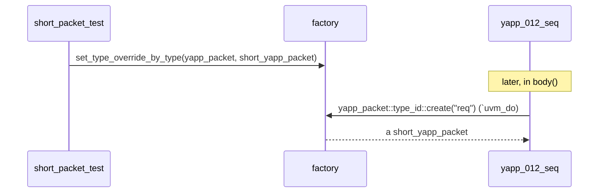

# Factory and configuration

Both mechanisms exist for one reason: a **test** must be able to change what
the **environment** does *without editing the environment*.

## The factory

`type_id::create()` asks the factory for an object of the requested type. The
factory may answer with a **different, derived** type if an override is in
place.



Rules of the game:

1. **Register** the class with the factory: `` `uvm_object_utils(T) `` /
   `` `uvm_component_utils(T) `` (Lab 1, 2).
2. **Create** through the factory, never with `new()` directly, for anything a
   test might want to replace: `` T::type_id::create("name", this) `` for
   components (Lab 4), `` `uvm_create `` / `` `uvm_do `` for sequence items.
3. **Override** from the test, before the object is created:

```systemverilog
function void build_phase(uvm_phase phase);
  set_type_override_by_type(yapp_packet::get_type(), short_yapp_packet::get_type());
  super.build_phase(phase);     // the testbench is built after the override
endfunction
```

The override is global for the whole simulation: every `yapp_packet` the
sequences generate becomes a `short_yapp_packet` — the sequences never know.
That is how `exhaustive_seq_test` sends short packets with a library that was
written for full-size ones.

!!! tip "Why a derived class can replace the base class everywhere"
    `short_yapp_packet` only *adds* constraints. Everything that works with a
    `yapp_packet` handle (the driver, the monitor, the scoreboard) keeps
    working, because a derived object **is a** base object.

## Configuration

`uvm_config_db #(T)::set(context, instance_path, field, value)` stores a value
under a hierarchical name; `get()` retrieves it. The course uses three typed
shorthands:

| Typedef | T | Used for |
|---|---|---|
| `uvm_config_int` | `int` | `is_active`, `channel_id`, `num_masters`, `recording_detail` |
| `uvm_config_wrapper` | `uvm_object_wrapper` | the **default sequence** type of a sequencer phase |
| `yapp_vif_config` (and friends) | `virtual yapp_if` | virtual interfaces |

```systemverilog
// in a test, BEFORE the env is built
uvm_config_int::set(this, "tb.yapp.agent", "is_active", UVM_PASSIVE);
uvm_config_int::set(this, "tb.chan0", "channel_id", 0);
uvm_config_wrapper::set(this, "tb.chan*.rx_agent.sequencer.run_phase",
                        "default_sequence", channel_rx_resp_seq::get_type());

// in tb_top (module, context = null): wildcards reach driver AND monitor
yapp_vif_config::set(null, "*.tb.yapp.*", "vif", hw_top.in0);

// in the consumer
if (!yapp_vif_config::get(this, "", "vif", vif))
  `uvm_error("NOVIF", "vif not set")
```

How a component receives a setting:

* **automatically**, for fields declared with `` `uvm_field_* `` macros —
  `super.build_phase()` looks them up (that is how `is_active` and
  `channel_id` arrive);
* **explicitly**, with `get()` (virtual interfaces).

### `check_config_usage()`

Called in `check_phase` of the test, it lists every setting that nobody read.
In Lab 4 `set_config_test` made the agent passive, so the sequencer was never
built and the `default_sequence` setting of `base_test` became unused. The fix
in this repository: `base_test` puts its sequence configuration in a virtual
function `configure_sequences()` that the passive test overrides with an empty
body — no stray settings, no warnings.

## Factory vs configuration — which one?

| Want to change... | Use |
|---|---|
| the **type** of something (packet, driver, scoreboard) | factory override |
| a **value** (a knob, a mode, a handle, a sequence to run) | configuration |
| the **structure** (is there a driver?) | configuration of `is_active`, read in `build_phase` |
