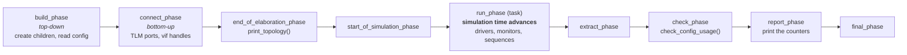

# Phases and objections

## The phases

Every `uvm_component` runs through the same ordered list of phases. The
**function** phases take no simulation time; `run_phase` is a **task** and is
where the clock ticks.



| Phase | Direction | What the course puts there |
|---|---|---|
| `build_phase` | top-down (test first, leaves last) | `super.build_phase(phase)`, configuration *before* `type_id::create()` of the children |
| `connect_phase` | bottom-up | `driver.seq_item_port.connect(sequencer.seq_item_export)`, analysis port → imp, `uvm_config_db::get` of virtual interfaces, hierarchical handles of the virtual sequencer |
| `end_of_elaboration_phase` | bottom-up | `uvm_top.print_topology()` in the test |
| `start_of_simulation_phase` | bottom-up | the optional "who runs first" experiment of Lab 3 |
| `run_phase` | parallel for all components | driver loop, monitor loop, default sequences, drain time |
| `check_phase` | bottom-up | `check_config_usage()`, "are the FIFOs empty?" (Lab 9D) |
| `report_phase` | bottom-up | every component prints its statistics |

!!! question "Lab 3: which `start_of_simulation_phase` runs first, which last — and why?"
    The bottom-up phases are executed from the leaves to the root: the
    driver / monitor / sequencer first, then the agent, the YAPP env, the
    testbench, and the test last. `build_phase` is the only top-down one
    because a parent must exist before it can create its children.

## Why `run_phase` ends when it ends: objections

`run_phase` finishes as soon as **nobody objects** to it ending. A component or
sequence that still has work to do raises an objection and drops it when done:

```systemverilog
task run_phase(uvm_phase phase);
  phase.raise_objection(this);
  ...                                // do the work
  phase.drop_objection(this);
endtask
```

In this project the **sequences** own the objections. `yapp_base_seq` raises
one in `pre_body()` and drops it in `post_body()`, so every sequence of the
library keeps the simulation alive exactly as long as it runs:

```systemverilog
task pre_body();
  uvm_phase phase = `YAPP_STARTING_PHASE;      // starting_phase / get_starting_phase()
  if (phase != null) phase.raise_objection(this, get_type_name());
endtask
```

`starting_phase` is only set for a sequence that the sequencer starts as its
**default sequence**; for a sub-sequence (`seq_1.start(m_sequencer, this)`) it is `null`,
hence the test. The multichannel sequence (Lab 8) and the HBUS/Clock sequences
use the same pattern. The channel response sequence deliberately does **not**
raise one: a receiver must never keep the simulation running on its own.

### Drain time

When the last objection drops, packets may still be inside the router. The
test adds a **drain time**: the phase waits that long after the last drop
before it ends.

```systemverilog
task run_phase(uvm_phase phase);
  uvm_objection obj = phase.get_objection();
  obj.set_drain_time(this, 200ns);
endtask
```



```mermaid
gantt
    dateFormat X
    axisFormat %s
    title run_phase of simple_test (time in ns, schematic)
    section clk_rst
    clk10_rst5_seq (objection)      :0, 60
    section yapp
    yapp_012_seq (objection)        :60, 300
    section channels
    channel_rx_resp_seq (no objection, forever) :0, 500
    section phase
    drain time 200 ns               :300, 500
    run_phase ends                  :milestone, 500, 0
```

## Phase-related pitfalls seen in the labs

* Reading the configuration (`uvm_config_int::get(this, "", "is_active", …)`)
  **after** creating the children — the value arrives too late to decide
  whether a driver exists. In this repository the `get()` calls come right
  after `super.build_phase(phase)`, before any `create`.
* Calling `uvm_config_*::set` **after** creating the component that reads it
  (Lab 4 `set_config_test`).
* No drain time → the last packet never leaves the router and the scoreboard
  reports packets left in its queues (Lab 6).
* A `forever` loop in `run_phase` without an objection is fine (drivers,
  monitors); a `forever` loop **with** an objection never lets the test end.
