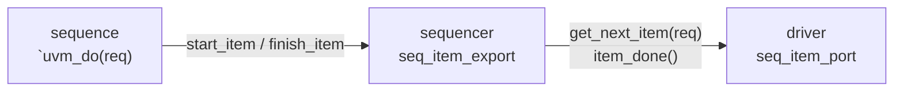
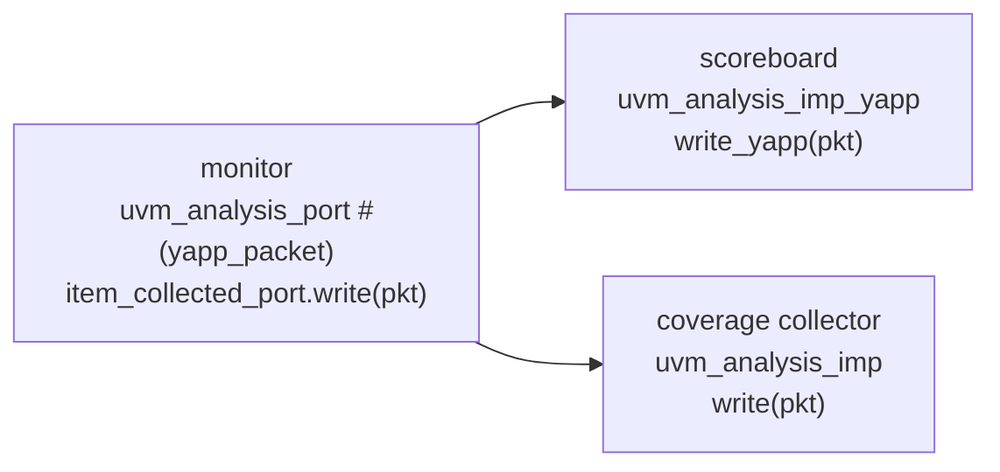
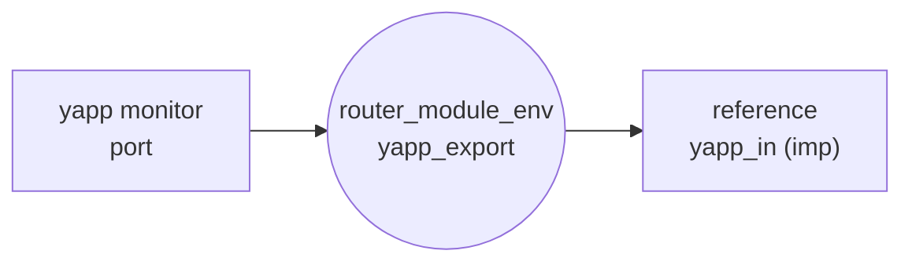
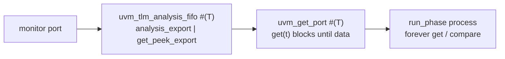

# TLM connections

**Transaction-Level Modelling** ports let components exchange *objects*
instead of signals. UVM has many flavours; the course uses four.

## Driver ↔ sequencer: `seq_item_port`



* `uvm_driver` already has `seq_item_port`; `uvm_sequencer` already has
  `seq_item_export`. The agent connects them (Lab 3).
* `get_next_item()` **blocks** until a sequence offers an item;
  `item_done()` unblocks the sequence's `finish_item()`. One item at a time,
  in order.

## Monitor → analysis components: port / imp



* A **port** can be connected to any number of imps (0 included).
  `write()` is a function: it calls every imp **synchronously**.
* An **imp** must implement `write()`. When one component needs several imps
  (the scoreboard listens to YAPP *and* three channels) the
  `` `uvm_analysis_imp_decl(_suffix) `` macro creates a flavour whose method is
  `write_suffix()`:

```systemverilog
`uvm_analysis_imp_decl(_yapp)                       // outside the class
`uvm_analysis_imp_decl(_chan0)

class router_scoreboard extends uvm_scoreboard;
  uvm_analysis_imp_yapp  #(yapp_packet,    router_scoreboard) yapp_in;
  uvm_analysis_imp_chan0 #(channel_packet, router_scoreboard) chan0_in;
  function void write_yapp (yapp_packet p);    ... endfunction
  function void write_chan0(channel_packet p); ... endfunction
```

!!! warning "The handle is shared"
    `write()` passes a **handle**. If the consumer stores it, it must
    `clone()` first, or create a new object per transaction on the producer
    side — otherwise the next packet overwrites the stored one.
    The scoreboard clones (Lab 9A); every monitor in this repository also
    creates a fresh object per transaction, which is what Lab 9D requires.

## Export: forwarding a connection point



An **export** is a pass-through. It lets `router_module_env` show one set of
connection points at its boundary while the imps stay inside the reference
model and the scoreboard (Lab 9C). The testbench then connects
`monitor.port → env.export` and never looks inside the env.

## Analysis FIFO: decoupling with a buffer



Instead of reacting inside a `write()` callback, the consumer **pulls** in its
own process (Lab 9D). This makes it natural to wait for *two* things in order
("first the YAPP packet, then the matching channel packet") and to use time
and blocking calls, which a function cannot do.

## Connecting the pieces

| Producer side | Consumer side | Connect call (in the parent's `connect_phase`) |
|---|---|---|
| `uvm_analysis_port #(T)` | `uvm_analysis_imp_x #(T, C)` | `port.connect(imp)` |
| `uvm_analysis_port #(T)` | `uvm_analysis_export #(T)` | `port.connect(export)` and inside the env `export.connect(imp)` |
| `uvm_analysis_port #(T)` | `uvm_tlm_analysis_fifo #(T)` | `port.connect(fifo.analysis_export)` |
| `uvm_get_port #(T)` | `uvm_tlm_analysis_fifo #(T)` | `get_port.connect(fifo.get_peek_export)` |
| `uvm_driver::seq_item_port` | `uvm_sequencer::seq_item_export` | `driver.seq_item_port.connect(sequencer.seq_item_export)` |

Always connect **from the port to the export/imp** (`port.connect(target)`),
and always in a `connect_phase` — the components must exist first.
